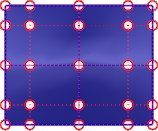
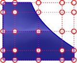
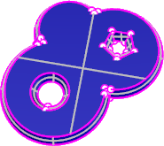
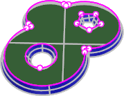
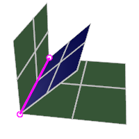
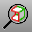

---
---

{: #kanchor1986}{: #kanchor1987}{: #kanchor1988}{: #kanchor1989}{: #kanchor1990}{: #kanchor1991}{: #kanchor1992}{: #kanchor1993}{: #kanchor1994}{: #kanchor1995}{: #kanchor1996}{: #kanchor1997}{: #kanchor1998}{: #kanchor1999}{: #kanchor2000}
# ShowEdges
 [Where can I find this command?](javascript:void(0);) Toolbars
 [Analyze](analyze-toolbar.html)  [Edge Tools](edge-tools-toolbar.html)  [Geometry Fix](geometry-fix-toolbar.html)  [Surface Tools](surface-tools-toolbar.html) 
Menus
Surface and Analyze
Edge Tools
Show Edges
The ShowEdges command highlights edges of surfaces, polysurfaces, and meshes.
Surface edges can be either trimmed or untrimmed.
Untrimmed edge
An edge that is not the result of a trim curve on the surface. The natural edge or outer bounds of a surface. The underlying surface will not extend past an untrimmed edge.

Untrimmed surface with [control points](controlpoint.html) on.
Trimmed edge
If trimmed, the underlying surface will generally extend past the edge.

Trimmed surface with control points on.
Steps
 [Select](select-objects.html) objects.The edges highlight and the ends of edges are marked with point display markers in the color you selected.Edge Analysis options
Show
All edges
Displays all surface, polysurface, and mesh edges.

Naked edges
Displays open edges in surfaces, polysurfaces, and meshes.
A surface, polysurface, or mesh edge that is not connected to another edge. Solid objects have no naked edges.

Non-manifold edges
Displays edges of polysurfaces or meshes that have more than one face joined to a single edge.

 **Zoom** 
Zoom to include the selected edges.
Zoom options
All
Zooms to include all naked edges.
Current
Zooms to the first edge in the selection. This useful if you zoom out with the mouse and want to zoom back in.
Next
Zooms to the next edge in the selection. If the selected objects have only one naked edge, this option is not displayed.
Previous
Zooms to the previous edge in the selection. If the selected objects have only one naked edge, this option is not displayed.
Mark
Marks the ends of the edge with point objects. If theAlloption was previously selected, all naked edges are marked.
Edge color
Sets the display color for the edges.

 **Add Objects** 
Adds objects to the edge display.
 **Remove Objects** 
Removes objects from the edge display.

# ShowEdgesOff
{: #showedgesoff}
 [Where can I find this command?](javascript:void(0);) Toolbars
 [Analyze](analyze-toolbar.html)  [Edge Tools](edge-tools-toolbar.html)  [Geometry Fix](geometry-fix-toolbar.html)  [Surface Tools](surface-tools-toolbar.html) 
Menus
Analyze
Edge Tools
Show Edges
The ShowEdgesOff command turns off edge display and closes the Edge Analysis control.

## ZoomNaked
{: #zoomnaked}
 [Where can I find this command?](javascript:void(0);) Toolbars
 [Edge Tools](edge-tools-toolbar.html) 
Menus
 [Not on menus.](menuwhattodo.html) 
The ZoomNaked command finds and marks naked edges.
Steps
 [Select](select-objects.html) objects.The active view zooms to display the first naked edge.ZoomNaked options
All
Zooms to all naked edges.
Current
Zooms to the current naked edge. This useful if you zoom out with the mouse and want to zoom back in.
Next
Zooms to the next naked edge. If the selected objects have only one naked edge, this option is not displayed.
Previous
Zooms to the previous naked edge. If the selected objects have only one naked edge, this option is not displayed.
Mark
Marks the current naked edge by adding [point objects](point.html) at each end. If theAlloption was previously selected, all naked edges are marked.

## ZoomNonManifold
{: #zoomnonmanifold}
 [Where can I find this command?](javascript:void(0);) Toolbars
 [Not on toolbars.](toolbarwhattodo.html) 
Menus
 [Not on menus.](menuwhattodo.html) 
The ZoomNonManifold command finds and marks [non-manifold edges](non-manifold-edges.html) on selected objects.
ZoomNonManifold options
All
Zooms to all non-manifold edges.
Current
Zooms to the current non-manifold edge. This useful if you zoom out with the mouse and want to zoom back in.
Next
Zooms to the next non-manifold edge. If the selected objects have only one naked edge, this option is not displayed.
Previous
Zooms to the previous non-manifold edge. If the selected objects have only one naked edge, this option is not displayed.
Mark
Marks the current non-manifold edge by adding [point objects](point.html) at each end. If theAlloption was previously selected, all non-manifold edges are marked.
See also
 [Analyze objects](sak-analysis.html) 
 [Manage object visibility](sak-visibility.html) 
&#160;
&#160;
Rhinoceros 6 © 2010-2015 Robert McNeel &amp; Associates.11-Nov-2015
 [Open topic with navigation](showedges.html) 

