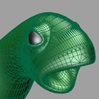
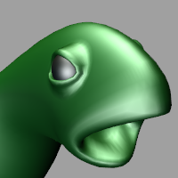

---
---

{: #kanchor1146}
# ShowRenderMesh
 [Where can I find this command?](javascript:void(0);) Toolbars
 [Not on toolbars.](toolbarwhattodo.html) 
Menus
 [Not on menus.](menuwhattodo.html) 
The ShowRenderMesh command displays the render mesh for selected objects.

Steps
 [Select](select-objects.html) objects.
# HideRenderMesh
{: #hiderendermesh}
 [Where can I find this command?](javascript:void(0);) Toolbars
 [Not on toolbars.](toolbarwhattodo.html) 
Menus
 [Not on menus.](menuwhattodo.html) 
The HideRenderMesh command hides the render mesh displayed with the ShowRenderMesh command.

Steps
 [Select](select-objects.html) objects.
# ToggleRenderMesh
{: #togglerendermesh}
 [Where can I find this command?](javascript:void(0);) Toolbars
 [Not on toolbars.](toolbarwhattodo.html) 
Menus
 [Not on menus.](menuwhattodo.html) 
The ToggleRenderMesh command turns on the display of render meshes if they are off and turns off the display of render meshes if they are on.
Steps
 [Select](select-objects.html) objects.See also
 [Set viewport display modes](sak-displaymodes.html) 
&#160;
&#160;
Rhinoceros 6 © 2010-2015 Robert McNeel &amp; Associates.11-Nov-2015
 [Open topic with navigation](showrendermesh.html) 

