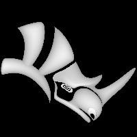

---
---

{: #kanchor2025}
# ShowZBuffer
 [Where can I find this command?](javascript:void(0);) Toolbars
 [Not on toolbars.](toolbarwhattodo.html) 
Menus
 [Not on menus.](menuwhattodo.html) 
The ShowZBuffer command toggles the display of a greyscale z-buffer bitmap with the same dimensions as the viewport.

Each pixel is given a greyscale value that relates directly to the distance between the camera and that pixel (in the scene). The closest pixel becomes white and the furthest pixel becomes black.
Typical uses of a z-buffer map are creating depth-of-field effects and creation of bump or displacement maps in post-production software such as Photoshop.
The [ViewCaptureToFile](viewcapture.html#viewcapturetofile) and [ViewCaptureToClipboard](viewcapture.html#viewcapturetoclipboard) commands can be used to capture the contents of ShowZBuffer.
To turn the display off
Run the command again.See also
 [Set viewport display modes](sak-displaymodes.html) 
&#160;
&#160;
Rhinoceros 6 © 2010-2015 Robert McNeel &amp; Associates.11-Nov-2015
 [Open topic with navigation](showzbuffer.html) 

