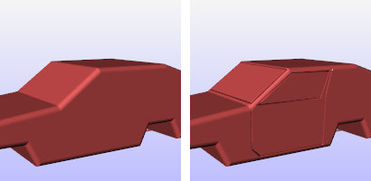
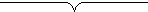
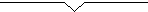

---
---

# Shut Lining
{: #kanchor2813}
{: #kanchor2812}
 [Where can I find this command?](javascript:void(0);) Toolbars
 [Popup](popup-toolbar.html)  [Properties](properties-toolbar.html)  [Standard](standard-toolbar.html) 
Menus
Edit and Panels
Object Properties
Shortcut
F3
Shut lining constructs a shut-line (parting line) display mesh for surfaces, polysurfaces, or meshes.

Simple car model without shut lining (left) and with shut lining (right).
Note
A shut line is the clearance gap between two adjacent surfaces such as between the door opening and body panel of an automobile or where a lid fits into the body of a tea kettle. [Shut Lining](#) settings appears as an object property of the surface.Surfaces inside [blocks](block.html) cannot be selected.Steps
 [Select](select-objects.html) objects to shut line and press [Enter](enter-key.html) .Select curves that define the shut line and press [Enter](enter-key.html) .Press [Enter](enter-key.html) to apply shut lining.Shutlining properties
Manages shut lining (parting line)&#160; [properties](properties.html) for the selected objects.
On
Turns the shut lining on and off.
Curves
Name
Specifies the names of the shut lining curves on the selected surface.
 **Add** 
Adds additional shut line curves.
 **Remove** 
Removes curves from shut line process.
Curve properties
Radius
Specifies the thickness of the shut line radius. The radius is the measured from the curve to the surface of the shut line.
Profile
RoundGroove
Displays the shut line as a round groove.

Filleted
Displays the shut line as a filleted groove.

SharpGroove
Displays the shut line as a sharp groove.

Pull curve to object
Curves are [pulled](arraypolar.html) onto the object before making a shut line.
Raised
Raises the profile instead of making an indented line.
Faceted
Toggles between smoothly shaded shut line and a [flat-shaded](flatshade.html) shut line.
AutoUpdate
All changes to Shut Lining settings are instantly applied to object. Clear the check box to make multiple changes without having to wait for shut lining process to finish.
See also
 [Use materials and textures](sak-materialsandtextures.html) 
&#160;
&#160;
Rhinoceros 6 © 2010-2015 Robert McNeel &amp; Associates.11-Nov-2015
 [Open topic with navigation](shutlining.html) 

