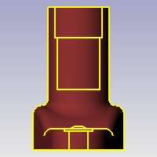

---
---

{: #kanchor2031}
# Silhouette
 [Where can I find this command?](javascript:void(0);) Toolbars
 [Curve From Object](curve-from-object-toolbar.html) 
Menus
Curve
Curve From Objects
Silhouette
The Silhouette command creates outline curves from a selected surface, extrusion, polysurface, or mesh object.
To create two-dimensional curves from the silhouettes, use the [ProjectToCPlane](projecttocplane.html) command.

Steps
 [Select](select-objects.html) a surface or polysurface.Note
When you are looking at a model, thevisual edgeof the model is where the model stops and the background begins. This visual edge is sometimes called the silhouette or horizon of the model.The silhouette direction is based on the current view. For example, if you look at a doughnut from the top, the silhouette is two circles. If you look at a doughnut from the side, the silhouette is an oval.Command-line options
InternalEdges
The InternalEdges option also converts interior edges to curves.
See also
 [Create curves from other objects](sak-curvefromobject.html) 
&#160;
&#160;
Rhinoceros 6 © 2010-2015 Robert McNeel &amp; Associates.11-Nov-2015
 [Open topic with navigation](silhouette.html) 

