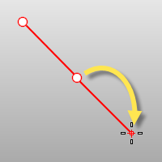

---
---

{: #kanchor2035}{: #kanchor2036}
# Slab
 [Where can I find this command?](javascript:void(0);) Toolbars
 [Extrude Solid](extrude-solid-toolbar.html) 
Menus
Solid
Slab
 [&#160;History enabled](historyenabled.html) 
&#160; [Extrusions enabled](extrusionsenabled.html) 
The Slab command offsets a curve, extrudes and caps the result to create a solid.
Steps
 [Select](select-objects.html) a curve.The Slab command uses the construction plane in the view where you pick the offset as the ground plane. The Slab command offsets the curve to create a base for the slab and then extrudes the base to make a solid with mitered corners.Pick a side to offset. [Pick](pick-location.html) a distance.Pick the height.Your browser does not support the video tag.Command-line options
Distance
Sets the offset distance.
Loose
TheCornerandToleranceoptions are not shown and do not affect the output. Polycurves are offset as a group of separate curve segments, and there is no corner trimming or filling.
ThroughPoint
Offsets through a picked point instead of at a distance.
BothSides
The BothSides option draws the object on both sides of the start point, creating the object twice as long as you indicate.

The BothSides option demonstrated with the [Line](line.html) command.
InCPlane
The curve is offset in the plane of the original curve. This option offsets the curve in the plane of the current construction plane instead.
See also
 [Create solid objects](sak-solid.html) 
&#160;
&#160;
Rhinoceros 6 © 2010-2015 Robert McNeel &amp; Associates.11-Nov-2015
 [Open topic with navigation](slab.html) 

