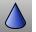
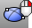
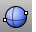

---
---

# Solid Creation toolbar
{: #kanchor2377}
 [To open a toolbar](javascript:void(0);) Toolbars can be opened as a free-standing group or added to the current group.
To open a toolbar as a free-standing group
Click theOptionsicon in any toolbar group.On the menu, clickShow Toolbar, and then select the toolbar name from the list.To open a toolbar as a new tab in the current group
Click theOptionsicon in the toolbar group where you want to add the new tab.On the menu, clickShow or Hide Tabs, and then select the toolbar name from the list. [Box](box.html) 
Draws a solid box.
Link to [Box toolbar](box-toolbar.html) 
 [Cone](cone.html) 
Draw a solid cone.
 [Cylinder](cylinder.html) 
Draw a solid cylinder.
 [Ellipsoid](ellipsoid.html) 
Draw a solid ellipsoid.
Link to [Ellipsoid toolbar](ellipsoid-toolbar.html) 
 [Ellipsoid](ellipsoid.html), [Diameter](ellipsoid.html#diameter) 
Draw a solid ellipsoid by diameter.
 [Ellipsoid, *FromFoci* ](ellipsoid.html) 
Draw a solid ellipsoid from foci.
 [ExtrudeCrv](extrudecrv.html) 
Drive closed planar curves in a straight line.
 [ExtrudeSrf](extrudesrf.html) 
Drive surface edges in a straight line to create a solid.
Link to [Extrude Solid toolbar](extrude-solid-toolbar.html) 
 [Paraboloid](paraboloid.html) 
Draw a parabolic capped solid.
 [Pipe, *Cap, Flat* ](pipe.html) 
Create a surface with a circular profile around a curve with flat caps.
 [Pipe, *Cap, Rounded* ](pipe.html) 
Create a surface with a circular profile around a curve with round caps.
 [Pyramid](pyramid.html) 
Draw a solid pyramid.
 [Sphere](sphere.html) 
Draw a solid sphere.
Link to [Sphere toolbar](sphere-toolbar.html) 
 [Sphere, *Diameter* ](sphere.html) 
Draw a solid sphere by 2 points on diameter.
 [TruncatedCone](truncatedcone.html) 
Draw a solid cone whose apex is truncated by a plane.
 [Torus](torus.html) 
Draw a torus (donut shape).
 [TruncatedPyramid](truncatedpyramid.html) 
Draw a pyramid whose apex is truncated by a plane.
 [Tube](tube.html) 
Draw a closed cylinder with a concentric cylindrical hole.
&#160;
&#160;
Rhinoceros 6 © 2010-2015 Robert McNeel &amp; Associates.11-Nov-2015
 [Open topic with navigation](solid-creation-toolbar.html) 

