---
---

# Solids Sidebar toolbar
{: #kanchor2380}
 [To open a toolbar](javascript:void(0);) Toolbars can be opened as a free-standing group or added to the current group.
To open a toolbar as a free-standing group
Click theOptionsicon in any toolbar group.On the menu, clickShow Toolbar, and then select the toolbar name from the list.To open a toolbar as a new tab in the current group
Click theOptionsicon in the toolbar group where you want to add the new tab.On the menu, clickShow or Hide Tabs, and then select the toolbar name from the list. [Box](box.html) 
Draws a solid box.
Link to [Box toolbar](box-toolbar.html) 
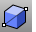 [Box, *Diagonal* ](box.html#box-diagonal) 
Draws a solid box from diagonal corners.
 [Cancel](cancel.html) 
Cancel the current command and deselects objects.
 [Cancel, *All* ](cancel.html) 
Turns off [Points](pointson.html), [CurvatureGraph](curvaturegraph.html), [EMap](emap.html), [Zebra](zebra.html), [MoveUVN](moveuvn.html), [CurvatureAnalysis](curvatureanalysis.html), and deselects objects.
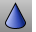 [Cone](cone.html) 
Draw a cone.
 [Cylinder](cylinder.html) 
Draw a cylinder.
 [Ellipsoid](ellipsoid.html) 
Draw a solid ellipsoid.
Link to [Ellipsoid toolbar](ellipsoid-toolbar.html) 
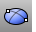 [Ellipsoid,Diameter](ellipsoid.html#diameter) 
Draws a solid ellipsoid by diameter.
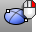 [Ellipsoid, *FromFoci* ](ellipsoid.html#fromfoci) 
Draws a solid ellipsoid from foci.
 [Explode](explode.html) 
Break objects down into components.
 [ExtractSrf](extractsrf.html) 
Separate or duplicate a polysurface face.
 [ExtrudeCrv](extrudecrv.html) 
Drive closed planar curves in a straight line.
 [ExtrudeSrf](extrudesrf.html) 
Drive surface edges in a straight line to create a solid.
Link to [Extrude Solid toolbar](extrude-solid-toolbar.html) 
 [Join](join.html) 
Connect curves, surface edges, or surfaces to form a single object.
 [Move](move.html) 
Move objects from one location to another.
Link to [Transform](transform-toolbar.html) toolbar
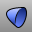 [Paraboloid](paraboloid.html) 
Draw a parabolic surface or capped solid.
 [Pipe, *Cap, Flat* ](pipe.html) 
Create a surface with a circular profile around a curve with flat caps.
 [Pipe, *Cap, Rounded* ](pipe.html) 
Create a surface with a circular profile around a curve with round caps.
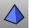 [Pyramid](pyramid.html) 
Draw a pyramid.
 [Sphere](sphere.html) 
Draw a solid sphere.
Link to [Sphere toolbar](sphere-toolbar.html) 
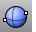 [Sphere, *Diameter* ](sphere.html) 
Draw a solid sphere by 2 points on diameter.
 [Split](split.html) 
Divide objects using other objects as cutters.
 [TruncatedCone](truncatedcone.html) 
Draw a cone whose apex is truncated by a plane.
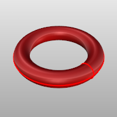 [Torus](torus.html) 
Draw a torus (donut shape).
 [Trim](trim.html) 
Cut and delete selected portions of an object at the intersection with another object.
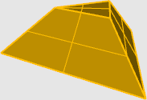 [TruncatedPyramid](truncatedpyramid.html) 
Draw a pyramid whose apex is truncated by a plane.
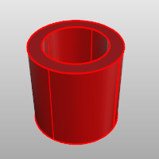 [Tube](tube.html) 
Draw a closed cylinder with a concentric cylindrical hole.
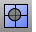 [Untrim](trim.html#untrim) 
Remove trim curves from trimmed surfaces.
&#160;
&#160;
Rhinoceros 6 © 2010-2015 Robert McNeel &amp; Associates.11-Nov-2015
 [Open topic with navigation](solids-sidebar-toolbar.html) 

