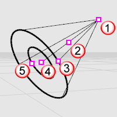

---
---

{: #kanchor2059}{: #kanchor2060}{: #kanchor2061}{: #kanchor2062}
# Spotlight
{: #top}
 [Where can I find this command?](javascript:void(0);) Toolbars
 [Lights](lights-toolbar.html)  [Render](render-tools-toolbar.html)  [Tools](render-tools-toolbar.html)  [Standard](standard-toolbar.html) 
Menus
Render
Create Spotlight
The Spotlight command inserts a light object into the model that directs a narrow beam of light with falloff.
The spotlight object appears as a cone shape. Its light appears only in full renderings of the targeted objects.
Use the [Properties](properties.html) command to set the light's color and on or off state. Darker colors, like gray, light the scene less.

Location point (1), dolly point (2), radius control (3), target point (4), hotspot control (5).
Steps
 [Pick](pick-location.html) the center and radius of the base circle.See the [Circle](circle.html) command for option descriptions. [Pick](pick-location.html) the end of the light.Command-line options
Direction constraint options
Direction constraints restrict the direction of the circle.
None
The center can be anywhere in 3-D space.
The second point can be placed anywhere using [elevator mode](cursor-constraints.html#elevator-mode), [object snaps](object-snaps.html) or other [modeling aids](modeling-aids.html).
Vertical
Draws an object perpendicular to the construction plane.
 [Pick](pick-location.html) the center and a radius or diameter.

AroundCurve
Draws a circle perpendicular to a curve.
 [Select](select-objects.html) a curve and [pick](pick-location.html) the center of the circle on the curve and aRadiusorDiameter.

Note
Turn on the spotlight's control points and move or drag the control points to edit the spotlight's direction, length, beam angle, hotspot angle, and position.To move the light without changing its direction, move the *dolly point* (the control point at the midpoint between the cone tip and the center of the cone base).Spotlights with narrower cones produce more detail than spotlights with wider cones.The cone for the spotlight represents the direction of the light, not the range of the light.The brightness of the light from the spotlight remains constant, even as you move away from the tip of the cone.The length and width of the spotlight together do control the shape of the infinite cone in space that is illuminated by the spotlight.Objects near the center axis line of the cone are illuminated the most brightly. That bright full illumination continues for half of the width of the cone, and then slowly drops off to nothing at the very outside of the cone.Spotlight hardness controls the fully illuminated region. You can either shrink it or expand it so that there is no drop-off at all. The easiest way to see what this does it is to create a plane with a single spotlight shining on it, and then play with the spotlight hardness parameter to see what it does.See also
 [DirectionalLight](directionallight.html) 
Insert a light with parallel rays pointing in a direction.
 [LinearLight](linearlight.html) 
Insert a tubular light.
 [PointLight](pointlight.html) 
Insert an omni-directional light.
 [RectangularLight](rectangularlight.html) 
Insert a rectangular directional light.
 [Lights](lights.html) 
Open the Lights panel.
 [Render](render.html) 
Render the objects using the current renderer.
 [Add lights](sak-lights.html) 
&#160;
&#160;
Rhinoceros 6 © 2010-2015 Robert McNeel &amp; Associates.11-Nov-2015
 [Open topic with navigation](spotlight.html) 

