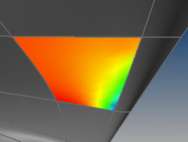
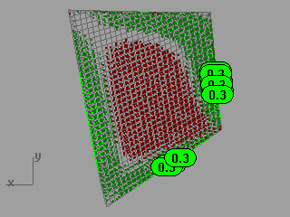
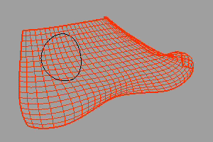
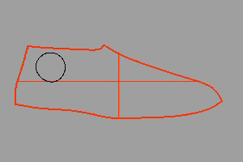
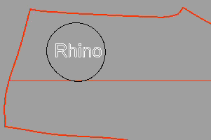
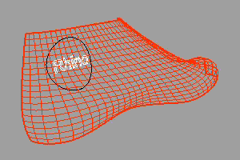

---
---

{: #kanchor2063}{: #kanchor2064}
# Squish
 [Where can I find this command?](javascript:void(0);) Toolbars
 [Not on toolbars.](toolbarwhattodo.html) 
Menus
 [Not on menus.](menuwhattodo.html) 
The Squish command flattens a non-developable (curved in two directions) 3-D mesh or [NURBS](http://www.rhino3d.com/nurbs) surface into a flat 2-D pattern.
The Squish command marks areas of compression with a red point cloud and areas of stretching with a green point cloud and displays statistics about the amount of compression or stretch. Up to ten text dots mark the locations with the most dramatic deformation. The number in the text dot is the percentage of change in length.

Report
Area
Change in area from original.
Compression
The material will be compressed when the 2-D pattern is deformed into the 3-D shape. The percentages are an estimate of how much of the pattern will be compressed.
Expansion
The material will be stretched when the 2-D pattern is deformed into the 3-D shape. The percentages are an estimate of how much of the pattern will be stretched.
Command-line options
SplitSeams
Allows a mesh to be split at a seam so it can be flattened. This is good for closed surfaces like cylindrical shapes.
PreserveBoundary
Avoids distorting boundary lengths.
Deformation
Choose an option depending on your bias for stretching or compressing, and the ability to specify custom deformation settings.
Free
No preference for compression or stretching.
StretchMostly
Strong bias for expansion when the pattern is deformed into the 3-D shape.
StretchOnly
Absolutely no compression when the pattern is deformed into the 3-D shape.
CompressMostly
Strong bias for compression when the pattern is deformed into the 3-D shape.
CompressOnly
Absolutely no expansion when the pattern is deformed into the 3-D shape.
CustomA/CustomB/CustomC
Custom deformations.
TheCustomoption lets you set the parameters used by the custom deformations. There are four parameters you can set.
BndStretch
BndCompress
InteriorStretch
InteriorCompress
The default value for these parameters is 1 and they can be set to any positive number. A larger value reduces the amount of the specified deformation compared to what happens when all four parameters are equal. For example, if you want to severely limit interior expansion, you could do something like:
BndStretch=1
BndCompress=1
InteriorStretch=1
InteriorCompress=100
If you want to preserve boundary lengths you could use the settings:
BndStretch=10
BndCompress=10
InteriorStretch=1
InteriorCompress=1
CustomSetup
Specifies settings used by the CustomA/CustomB/CustomC options.
Material
Describes the type of material that will be used for manufacture.
Rigid
Minimizes stresses when forming the 3-D surface from the 2-D pattern when a rigid material will be used for manufacture.
Floppy
Limits geometric distortion as much as possible when a pliable material will be used for manufacture.
Outside
Up
The outside of the 3-D surface is up in the 2-D pattern.
Down
The outside of the 3-D surface is down in the 2-D pattern.
Decorate
Adds the red and green point clouds and text dots to the model.
Limitations
Does NOT unroll, unfold, or peel.Does not work great on developable surfaces. Use the [UnRollSrf](unrollsrf.html) command. [Technical details and caveats](javascript:void(0);) Squish is an algorithm that works on meshes. Squish flattens the mesh by "minimizing the changes in facet area and changes in facet edge lengths" between the 3&#8209;D mesh and the 2&#8209;D mesh, subject to some constraints.
For example, if A,B,C are the corners of a 3&#8209;D triangle and a,b,c are the corresponding corners of the 2&#8209;D triangle, the changes in edge length are
d1 = |Distance(A,B) - Distance(a,b)|
d2 = |Distance(B,C) - Distance(b,c)|
d3 = |DIstance(C,A) - Distance(c,a)|
da = |Area(A,B,C) - area(a,b,c)|
DL = d1+d2+d3
DL2 = d12+ d22+ d32
DA = da
DA2 = da2
D = some combination of DL, DL2, DA and DA2
The "minimizing the changes in area and or edge lengths" above meanscreate the 2&#8209;D mesh so that "D" is as small as possible.
In practice, there are thousands of facets and many ways to minimize D, most of which don't make practical sense. So Squish constrains the answer to prevent the 2&#8209;D mesh from folding back onto itself and forcing certain 3&#8209;D points end up in specified 2&#8209;D locations.
A trimmed [NURBS](http://www.rhino3d.com/nurbs) surface is squished by squishing a dense mesh of the surface.
The squish options determine how DA, DA2, D1 and D2 are combined and allow for more complicated ways to calculate of DA, DA2, D1, and D2 and to allow for a bias towards stretching or compression.
However, the Squish algorithm is much too simple to even begin to model the true physical properties of most materials that come in sheets, particularly those that where material thickness plays a role and those that can compress or stretch any appreciable amount,
In short, if a sheet of material is expensive, cutting it is expensive, or bending it is expensive, or related issues in the manufacturing process are time critical or money critical, then consider using Squish to give you an initial hint about the shape of a pattern, but real material and manufacturing expertise will have to be used to create a pattern that will work on the shop floor.

# Related commands

## SquishBack
{: #squishback}
 [Where can I find this command?](javascript:void(0);) Toolbars
 [Not on toolbars.](toolbarwhattodo.html) 
Menus
 [Not on menus.](menuwhattodo.html) 
The SquishBack command returns curves and points on the 2-D pattern to the original squished 3&#8209;D shape.
Steps
Select 2-D object.Select curves and points on the pattern.Example
For example, suppose we wanted to put a “Rhino” brand name in the black circle on this 3-D [NURBS](http://www.rhino3d.com/nurbs) model of a shoe last.

First use the Squish command to generate a 2-D pattern of the last.

Then use the TextObject command to create the white “Rhino” text as curves on the 2-D pattern.

Finally, use the SquishBack command to “unsquish” the white Rhino text onto the 3-D last.

## SquishInfo
{: #squishinfo}
 [Where can I find this command?](javascript:void(0);) Toolbars
 [Not on toolbars.](toolbarwhattodo.html) 
Menus
 [Not on menus.](menuwhattodo.html) 
The SquishInfo command provides information about the settings used to squish the object.
See also
 [Smash](smash.html) 
Flatten a surface without restriction to single-directional curvature.
 [UnrollSrf](unrollsrf.html) 
Flatten (develop) a surface or polysurface with curvature in one direction to a planar surface.
 [Flatten curves and surfaces](sak-flatten.html) 
&#160;
&#160;
Rhinoceros 6 © 2010-2015 Robert McNeel &amp; Associates.11-Nov-2015
 [Open topic with navigation](squish.html) 

