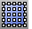

---
---

{: #kanchor2069}{: #kanchor2070}
# SrfPtGrid
 [Where can I find this command?](javascript:void(0);) Toolbars
 [Surface Creation](surface-creation-toolbar.html)  [Surface Sidebar](surface-sidebar-toolbar.html) 
Menus
Surface
Point Grid
The SrfPtGrid command draws a surface from a grid of points that lie on the surface.
Steps
Type the number of points in each row.Type the number of points in each column.Type the point coordinates.You must type the grid [control point](controlpoint.html) coordinates one at a time and in order. This command is most useful when you have an ordered grid of control points in a text file and use it in conjunction with the [ReadCommandFile](rhinoscripting.html#readcommandfile) command.Command-line options
Closed
Closes the surface in one or both directions. The created surface closes in the direction whose point count is being requested.
Degree
Specifies the [degree](degree.html) of the curve (or surface).
When drawing a high-degree curve, the output curve will not be the degree you request unless there is at least one more [control point](controlpoint.html) than the degree.
KeepPoints
Retains the point objects.
Example
The example is a command file to create an approximate cylinder. To see this example perform, select the following text, copy it, and run the [Paste](paste.html) command.
! _SrfPtGrid_KeepPoints3_Closed60,-5,04.33,-2.5,04.33,2.5,00,5,0-4.33,2.5,0-4.33,-2.5,00,-5,54.33,-2.5,54.33,2.5,50,5,5-4.33,2.5,5-4.33,-2.5,50,-5,104.33,-2.5,104.33,2.5,100,5,10-4.33,2.5,10-4.33,-2.5,10
See also
 [Create surfaces](sak-surface.html) 
&#160;
&#160;
Rhinoceros 6 © 2010-2015 Robert McNeel &amp; Associates.11-Nov-2015
 [Open topic with navigation](srfptgrid.html) 

