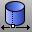

---
---

{: #kanchor2071}{: #kanchor2072}{: #kanchor2073}
# SrfSeam
 [Where can I find this command?](javascript:void(0);) Toolbars
 [Surface Tools](surface-tools-toolbar.html) 
Menus
Surface
Surface Edit Tools
Adjust Closed Surface Seam
The SrfSeam command changes the location on a closed surface where the start and end edges of the surface meet.
Steps
 [Select](select-objects.html) a closed surface.The seam of the surface is indicated by a curve.Click to pick a new location for the seam point.Command-line options
Options are only available if the surface is closed in two directions (such as a torus).
U
Changes the seam in the u&#160;direction.
V
Changes the seam in the v&#160;direction.
Both
Changes the seam in both u and v&#160;directions.
See also
 [Edit surfaces](sak-surfacetools.html) 
&#160;
&#160;
Rhinoceros 6 © 2010-2015 Robert McNeel &amp; Associates.11-Nov-2015
 [Open topic with navigation](srfseam.html) 

