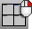
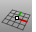
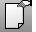
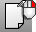
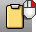
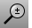

---
---

# Standard toolbar
{: #kanchor2382}
 [To open a toolbar](javascript:void(0);) Toolbars can be opened as a free-standing group or added to the current group.
To open a toolbar as a free-standing group
Click theOptionsicon in any toolbar group.On the menu, clickShow Toolbar, and then select the toolbar name from the list.To open a toolbar as a new tab in the current group
Click theOptionsicon in the toolbar group where you want to add the new tab.On the menu, clickShow or Hide Tabs, and then select the toolbar name from the list. [4View](new-viewport-arrangements.html#4view) 
Set up a four-viewport workspace.
Link to [Viewport Layout toolbar](viewport-layout-toolbar.html) 
 [4View](new-viewport-arrangements.html#4view) and [Zoom Extents](zoom.html) 
Set up a four-viewport workspace and zoom extents in all.
 [CopyToClipboard](copytoclipboard.html) 
Copy objects to the Clipboard.
 [CPlane](cplane.html) 
Set the construction plane in the active viewport.
Link to [Construction Planes toolbar](cplanes-toolbar.html) 
 [Cut](cut.html) 
Delete objects and place them in the Clipboard.
 [Dim](dim.html) 
Draw horizontal or vertical linear dimensions.
Link to [Dimension toolbar](dimension-toolbar.html) 
 [DocumentProperties](documentproperties.html) 
Manage the settings for the current model.
 [Options](options.html) 
Manage global options: [3D mouse](3dconnexion.html), [alerter](alerter.html), [aliases](aliases.html), [appearance](appearance.html), [context menu](context-menu.html), [display modes](view-displaymode-options.html), [files](files.html), [general](general.html), [idle processor](idleprocessor.html), [keyboard](keyboard.html), [libraries](libraries.html), [licenses](licenses.html), [modeling aids](modeling-aids.html), [mouse](mouse.html), [plug-ins](plug-ins.html), [render](rendering.html), [RhinoScript](rhinoscript.html), [selection menu](selection-menu.html), [toolbars](toolbars.html), [updates and statistics](updates-and-statistics.html), [view](view.html).
 [Help](help.html) 
Open the Help topic for the current command.
Link to [Help toolbar](help-toolbar.html) 
 [Hide](hide.html) 
Conceal objects from view.
Link to [Visibility toolbar](visibility-toolbar.html) 
 [Show](hide.html#show) 
Redisplay all hidden objects.
 [Layer](layer.html) 
Manage layer properties.
Link to [Layer toolbar](layer-toolbar.html) 
 [Layer, *Visible=No* ](layer.html) 
Close the layer dialog box.
 [Lock](lock.html) 
Lock objects so they cannot be selected for editing.
Link to [Lock toolbar](lock-toolbar.html) 
 [Unlock](lock.html#unlock) 
Unlock all locked objects.
 [New](new.html) 
Create a new model based on a template.
 [Open](open.html) 
Open an existing model file.
 [Import](import.html) 
Merge objects from another model file.
 [Options](options.html) 
Manage global options: [3D mouse](3dconnexion.html), [alerter](alerter.html), [aliases](aliases.html), [appearance](appearance.html), [context menu](context-menu.html), [display modes](view-displaymode-options.html), [files](files.html), [general](general.html), [idle processor](idleprocessor.html), [keyboard](keyboard.html), [libraries](libraries.html), [licenses](licenses.html), [modeling aids](modeling-aids.html), [mouse](mouse.html), [plug-ins](plug-ins.html), [render](rendering.html), [RhinoScript](rhinoscript.html), [selection menu](selection-menu.html), [toolbars](toolbars.html), [updates and statistics](updates-and-statistics.html), [view](view.html).
Link to [Tools toolbar](tools-toolbar.html) 
 [Pan](pan.html) 
Shift the location of the view camera and target parallel to the view plane.
 [Paste](paste.html) 
Insert objects from the Clipboard.
 [Paste](paste.html) + [ChangeToCurrentLayer](layer.html#changetocurrentlayer) 
Insert objects from the Clipboard to the current layer.
 [Print](print.html) 
Print the current viewport or layouts.
 [Properties](properties.html) 
Object, material, texture mapping, decals.
Link to [Properties toolbar](properties-toolbar.html) 
 [Properties](properties.html) 
Close Properties panel.
 [Render](render.html) 
Render the objects using the current renderer.
Link to [Render toolbar](render-tools-toolbar.html) 
 [Render Settings (Document Properties)](rhino-render.html) 
Manage the render settings for the current model.
 [RotateView](rotateview.html) 
Rotate the view camera around the target.
 [RotateCamera](rotatecamera.html) 
Rotate the view target around the camera.
 [Save](save.html) 
Save the current model.
Link to [File toolbar](file-toolbar.html) 
 [Export](export.html) 
Save selected objects to a new file.
 [SelAll](selection-commands.html#selall) 
Select all objects.
Link to [Select toolbar](select-toolbar.html) 
 [SetView, *World Right* ](setview.html#worldright) 
Change the view to the world right view.
Link to [Set View toolbar](set-view-toolbar.html) 
 [Shade](shade.html) 
Temporarily shade the current viewport.
 [Shade, *All* ](shade.html) 
Temporarily shade all viewports.
 [Shaded viewport display mode](view-displaymode-options.html#shaded) 
Set the viewport to opaque shaded mode.
Link to [Display toolbar](display-toolbar.html) 
 [Wireframe viewport display mode](view-displaymode-options.html#wireframe) 
Set the viewport display to unshaded wireframe.
 [ShowOsnap](object-snaps.html#showosnap) 
Turn the Osnap control on.
Link to [Object Snap toolbar](object-snap-toolbar.html) 
 [Spotlight](spotlight.html) 
Insert a light cone object.
Link to [Lights toolbar](lights-toolbar.html) 
 [Undo](undo.html) 
Undo the last action.
Link to [Undo toolbar](undo-toolbar.html) 
 [Redo](undo.html#redo) 
Reverse the last Undo.
 [UndoView](undoview.html) 
Undo the last view change.
Link to [View toolbar](view-toolbar.html) 
 [RedoView](undoview.html#redoview) 
Reverse the last UndoView.
 [Zoom](zoom.html) 
Move the viewport camera so the area defined by a window selection fills the viewport.
 [Zoom Dynamic](zoom.html#dynamic) 
Zooms the view as you drag the mouse.
 [Zoom Extents](zoom.html#extents) 
Zooms the view to show all objects.
 [Zoom Extents All](zoom.html#all) 
Zooms the view to show all objects in all viewports.
 [Zoom Selected](zoom.html#selected) 
Zooms the view to show all selected objects.
 [Zoom Selected All](zoom.html#all) 
Zooms all viewports to show all selected objects.
&#160;
&#160;
Rhinoceros 6 © 2010-2015 Robert McNeel &amp; Associates.11-Nov-2015
 [Open topic with navigation](standard-toolbar.html) 

