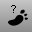

---
---

# Step Size toolbar
{: #kanchor2383}
 [To open a toolbar](javascript:void(0);) Toolbars can be opened as a free-standing group or added to the current group.
To open a toolbar as a free-standing group
Click theOptionsicon in any toolbar group.On the menu, clickShow Toolbar, and then select the toolbar name from the list.To open a toolbar as a new tab in the current group
Click theOptionsicon in the toolbar group where you want to add the new tab.On the menu, clickShow or Hide Tabs, and then select the toolbar name from the list. [WalkAbout,step size small](walkabout.html) 
Sets the WalkAbout step size to small steps.
 [WalkAbout,step size medium small](walkabout.html) 
Sets the WalkAbout step size to medium-small steps.
 [WalkAbout,step size medium](walkabout.html) 
Sets the WalkAbout step size to medium steps.
 [WalkAbout,step size medium large](walkabout.html) 
Sets the WalkAbout step size to medium-large steps.
 [WalkAbout,step size large](walkabout.html) 
Sets the WalkAbout step size to large steps.
 [WalkAbout,step size custom](walkabout.html) 
Sets the WalkAbout step size to a custom size.
&#160;
&#160;
Rhinoceros 6 © 2010-2015 Robert McNeel &amp; Associates.11-Nov-2015
 [Open topic with navigation](step-size-toolbar.html) 

