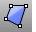
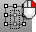
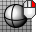
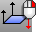
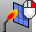

---
---

# STL Tools toolbar
{: #kanchor2384}
 [To open a toolbar](javascript:void(0);) Toolbars can be opened as a free-standing group or added to the current group.
To open a toolbar as a free-standing group
Click theOptionsicon in any toolbar group.On the menu, clickShow Toolbar, and then select the toolbar name from the list.To open a toolbar as a new tab in the current group
Click theOptionsicon in the toolbar group where you want to add the new tab.On the menu, clickShow or Hide Tabs, and then select the toolbar name from the list. [3DFace](3dface.html) 
Draw a single mesh face.
 [FlatShade](flatshade.html) 
Shade objects without smoothing between mesh faces.
 [HidePt](hide.html#hidept) 
Conceal control and edit points.
 [ShowPt](hide.html#showpt) 
Redisplay all hidden control points and edit points.
 [Invert](selection-commands.html#invert) + [HidePt](hide.html#hidept) 
Hide unselected control points
 [Join](join.html) 
Connect curves, surface edges, or surfaces to form a single object.
 [Open](open.html) 
Open an existing model file.
 [Import](import.html) 
Merge objects from another model file.
 [PointsOn](pointson.html) 
Display curve and surface control points.
 [PointsOff](pointson.html#pointsoff) 
Turn off [control](pointson.html), [edit](pointson.html#editpton), and [solid](pointson.html#solidpton) points display.
 [Save](save.html) 
Save the current model.
Link to [File toolbar](file-toolbar.html) 
 [SaveAs](save.html#saveas) 
Save the current model with a different name, close the current model, and open the new model.
 [SelNakedMeshEdgePt](selection-commands.html#selnakedmeshedgept) 
Select unwelded vertices on mesh edges.
 [Shaded viewport display mode](view-displaymode-options.html#shaded) 
Set the viewport to opaque shaded mode.
Link to [Display toolbar](display-toolbar.html) 
 [Wireframe viewport display mode](view-displaymode-options.html#wireframe) 
Set the viewport display to unshaded wireframe.
 [UnifyMeshNormals](unifymeshnormals.html) 
Change the normal direction mesh faces so they all point in a consistent direction.
 [Flip](flip.html) 
Reverse the normal direction of a curve, surface, or mesh.
 [Weld](weld.html) 
Remove creases from a mesh by merging coincident mesh vertices.
Link to [Welding toolbar](welding-toolbar.html) 
 [TriangulateMesh](triangulatemesh.html) 
Split each quadrangular mesh face into two triangles.
&#160;
&#160;
Rhinoceros 6 © 2010-2015 Robert McNeel &amp; Associates.11-Nov-2015
 [Open topic with navigation](stl-tools-toolbar.html) 

