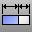

---
---

{: #kanchor2076}
# Stretch
 [Where can I find this command?](javascript:void(0);) Toolbars
 [Deformation Tools](deformation-tools-toolbar.html) 
Menus
Transform
Stretch
 [&#160;History enabled](historyenabled.html) 
The Stretch command scales selected areas of an object in one direction.
Steps
 [Select](select-objects.html) objects. [Pick](pick-location.html) the start of the stretch axis.See the [Line](line.html) command for option descriptions.Pick the end of the stretch axis.Type the stretch factor or pick a point to stretch to.Your browser does not support the video tag.Command-line options
Copy
The Copy option specifies whether or not the objects are copied. A plus signappears at the cursor when copy mode is on.
The [RememberCopyOptions](remembercopyoptions.html) command determines whether the selected option is used as the default.
Rigid
The Rigid option specifies that individual objects will not be deformed as they are transformed.
The illustration shows the Rigid option with the Bend command.

Original objects (left), Rigid=No (center), Rigid=Yes (left).
Yes
Individual objects will not change, only their positions will change.
No
Individual objects are transformed as well as their positions.
Length
Specify the new overall length for the stretch axis.
See also
 [Use Universal Deformation Technology](sak-udt.html) 
&#160;
&#160;
Rhinoceros 6 © 2010-2015 Robert McNeel &amp; Associates.11-Nov-2015
 [Open topic with navigation](stretch.html) 

