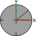
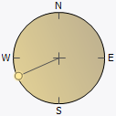
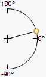
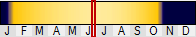
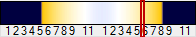
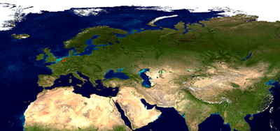

---
---

{: #kanchor2079}{: #kanchor2080}{: #kanchor2081}
# Sun
 [Where can I find this command?](javascript:void(0);) Toolbars
 [Not on toolbars.](toolbarwhattodo.html) 
Menus
Panels and Render
Sun
The Sun command opens the Sun panel.
The Sun panel controls the sun and sunlight preview in rendered viewports.
 [Panel options](panel-options.html) 
Sun Options
On
Turns on the sun. The sun is a strong directional light whose location and direction is determined by the [Sun Position](#sunposition), [Date and Time](#sun-datetime), and [Location](#sun-location) settings. The sun position can also be controlled manually.
Manual control{: #manual-control}
Sun angles are taken direction from the [Sun Position](#sunposition) settings which become editable. The [Date and Time](#sun-datetime) and [Location](#sun-location) settings are hidden.
North
Specifies what angle (measured counter-clockwise from the positive x&#160;direction) is considered to beNorthin the model. By default, this is the world positive y&#160;direction (90 degrees).

Enter a direction angle, or drag the North control to set the direction.Import
Opens a previously saved sun setting from a .rsun file.
Save As
Saves the current sun settings to a .rsun file.
{: #sunposition}Sun Position
In [Manual control](#manual-control) mode, sets the sun's direction.
Azimuth
Specifies the sun's direction in angle degrees from north (0).

Altitude
Specifies the sun's height in the sky in angle degrees from the equator (0).

{: #sun-datetime}Date and Time
Specifies the date and time for the sun angle calculator.
Year
Specifies the date. As you move the slider or enter a date in the edit box, the texture dynamically updates to reflect the change. The slider bar colors indicate the relative brightness of the sun at the specified date.

Time
Specifies the time. As you move the slider or enter a time in the edit box, the texture dynamically updates to reflect the change. The slider bar colors indicate the relative brightness of the sun at the specified time.

 **Now** 
Sets the time and date from your computer’s clock.
Daylight saving
Adjusts the time to daylight savings (summer) time.
___ mins
Sets the amount of time adjustment for daylight savings time for the specific time zone.
{: #sun-location}Location
Specifies the location and the Time Zone on Earth which is typically set from the closest city to the selected location.

Click and drag the map to pan.Pick a location on the map.The cursor jumps to the nearest city.City list
Sets the location from a city list.
 **Here** 
Sets the time to the current system location.
Find place
Specifies a city in the city list.
Lat
Specifies the location's latitude.
Long
Specifies the location's longitude.
Time zone
Specifies the location's time zone.
Command-line options
To access hidden command-line options
Type ahyphenin front of the command name:-Sun.ShowPanel
Options
On
Import
Import settings from a Rhino Sun file (.rsun)
Save
Save settings to a Rhino Sun file (.rsun)
See also
 [Lights](lights.html) 
Open the Lights panel.
&#160;
&#160;
Rhinoceros 6 © 2010-2015 Robert McNeel &amp; Associates.11-Nov-2015
 [Open topic with navigation](sun.html) 

