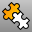
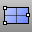
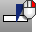
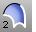

---
---

# Surface Sidebar toolbar
{: #kanchor2387}
 [To open a toolbar](javascript:void(0);) Toolbars can be opened as a free-standing group or added to the current group.
To open a toolbar as a free-standing group
Click theOptionsicon in any toolbar group.On the menu, clickShow Toolbar, and then select the toolbar name from the list.To open a toolbar as a new tab in the current group
Click theOptionsicon in the toolbar group where you want to add the new tab.On the menu, clickShow or Hide Tabs, and then select the toolbar name from the list. [Cancel](cancel.html) 
Cancel the current command and deselects objects.
 [Cancel, *All* ](cancel.html) 
Turns off [Points](pointson.html), [CurvatureGraph](curvaturegraph.html), [EMap](emap.html), [Zebra](zebra.html), [MoveUVN](moveuvn.html), [CurvatureAnalysis](curvatureanalysis.html), and deselects objects.
 [CutPlane](cutplane.html) 
Create planar surfaces through objects at specified locations.
 [Drape](drape.html) 
Create a surface through the intersections of objects and points projected toward the construction plane.
 [EdgeSrf](edgesrf.html) 
Create a surface from two, three, or four curves.
 [Explode](explode.html) 
Break objects down into components.
 [ExtractSrf](extractsrf.html) 
Separate or duplicate a polysurface face.
 [ExtrudeCrv](extrudecrv.html) 
Drive closed planar curves in a straight line.
Link to [Extrude toolbar](extrude-toolbar.html) 
 [ExtrudeCrvAlongCrv](extrudecrvalongcrv.html) 
Drive closed planar curves along a path curve.
 [ExtrudeCrvAlongCrv, *SubCurve* ](extrudecrvalongcrv.html) 
Drives closed planar curves along a sub curve.
 [ExtrudeCrvTapered](extrudecrvtapered.html) 
Drive closed planar curves in a straight line tapering at an angle.
 [ExtrudeCrvToPoint](extrudecrvtopoint.html) 
Drive closed planar curves tapering to a point.
 [Fin](fin.html) 
Extrude a curve on a surface in the surface normal direction.
 [Heightfield](heightfield.html) 
Create a surface based on gray-scale color values in an image file.
 [Join](join.html) 
Connect curves, surface edges, or surfaces to form a single object.
 [Loft](loft.html) 
Fit a surface through profile curves that define the surface shape.
 [Move](move.html) 
Move objects from one location to another.
Link to [Transform](transform-toolbar.html) toolbar
 [NetworkSrf](networksrf.html) 
Fit a surface through a network of crossing curves.
 [Patch](patch.html) 
Fit a surface through curves and point objects.
 [Picture](picture.html) 
Draw a rectangular planar surface with a bitmap texture.
 [PlanarSrf](planarsrf.html) 
Create a planar surface from planar curves.
 [Plane](plane.html) 
Draw a rectangular planar surface.
Link to [Plane toolbar](plane-toolbar.html) 
 [Plane, *3Point* ](plane.html) 
Draw a rectangular planar surface from three points.
 [PlaneThroughPt](planethroughpt.html) 
Fit a rectangular planar surface through points.
 [Plane, *Vertical* ](plane.html) 
Draw a rectangular planar surface vertical to the construction plane.
 [Revolve](revolve.html) 
Create a surface by revolving a profile curve around an axis.
 [RailRevolve](railrevolve.html) 
Revolve a profile curve around an axis and along a rail curve.
 [Ribbon](ribbon.html) 
Offset a curve and create a ruled surface between the curves.
 [Split](split.html) 
Divide objects using other objects as cutters.
 [Split,Isocurve](split.html#isocurve) 
Divide objects using isocurves as cutters.
 [SrfPt](srfpt.html) 
Draw a surface from three or four corner points.
 [SrfPtGrid](srfptgrid.html) 
Draw a surface from a grid of points that lie on the surface.
 [Sweep1](sweep1.html) 
Fit a surface through profile curves and one edge curve.
 [Sweep2](sweep2.html) 
Fit a surface through profile curves and two edge curves.
 [Trim](trim.html) 
Cut and delete selected portions of an object at the intersection with another object.
 [Untrim](trim.html#untrim) 
Remove trim curves from trimmed surfaces.
&#160;
&#160;
Rhinoceros 6 © 2010-2015 Robert McNeel &amp; Associates.11-Nov-2015
 [Open topic with navigation](surface-sidebar-toolbar.html) 

