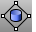
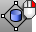
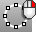
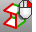

---
---

# Surface Tools toolbar
{: #kanchor2388}
 [To open a toolbar](javascript:void(0);) Toolbars can be opened as a free-standing group or added to the current group.
To open a toolbar as a free-standing group
Click theOptionsicon in any toolbar group.On the menu, clickShow Toolbar, and then select the toolbar name from the list.To open a toolbar as a new tab in the current group
Click theOptionsicon in the toolbar group where you want to add the new tab.On the menu, clickShow or Hide Tabs, and then select the toolbar name from the list. [BlendSrf](blendsrf.html) 
Create a blend surface between two surfaces with continuity control.
 [ChamferSrf](chamfersrf.html) 
Create a ruled surface between two surface edges.
 [ChangeDegree](changedegree.html) 
Change the degree of the polynomial that defines the curve or surface by adding or subtracting control points between knot spans, while maintaining the knot structure.
 [ConnectSrf](connectsrf.html) 
Extend surface edges to meet and trims the surfaces to each other.
 [CurvatureAnalysis](curvatureanalysis.html) 
Evaluate surface curvature using false-color analysis.
Link to [Surface Analysis toolbar](surface-analysis-toolbar.html) 
 [CurvatureAnalysisOff](curvatureanalysis.html#curvatureanalysisoff) 
Turn off curvature analysis display.
 [CurvatureGraph](curvaturegraph.html) 
Evaluate curve or surface curvature with a graph.
 [CurvatureGraphOff](curvaturegraph.html#curvaturegraphoff) 
Turn off curvature graph display.
 [Dir](dir.html) 
Display and edit an object's normal direction.
 [Flip](flip.html) 
Reverse the normal direction of a curve, surface, or mesh.
 [DivideAlongCreases](dividealongcreases.html) 
Divide a surface into separate parts at kinks.
 [EndBulge](endbulge.html) 
Adjust the shape of a curve at its end or a surface near an untrimmed edge.
 [ExtendSrf](extendsrf.html) 
Lengthen a surface by a value.
 [FilletSrf](filletsrf.html) 
Create a constant-radius round surface between two surfaces.
 [FitSrf](fitsrf.html) 
Reduce the number of surface control points.
 [MakePeriodic](makeperiodic.html) 
Remove the kink from the start/end of a curve or surface.
 [MakeNonPeriodic](makeperiodic.html#makenonperiodic) 
Insert a kink at the start/end of a curve or surface.
 [MakeUniform](makeuniform.html) 
Make the object knot vectors uniform without changing the control point locations.
 [MakeUniformUV](makeuniform.html#makeuniformuv) 
Make the surface knots uniform in u or v&#160;direction.
 [MatchSrf](matchsrf.html) 
Adjust a surface edge to have continuity with another surface edge.
 [MatchSrf, *Multiple Matches* ](matchsrf.html) 
Allows selection of more than one edge to match.
 [MergeSrf](mergesrf.html) 
Combine two surfaces at untrimmed edges.
 [OffsetSrf](offsetsrf.html) 
Copy a surface parallel to the original.
 [PointsOn](pointson.html) 
Display curve and surface control points.
Link to [Point Edit toolbar](point-edit-toolbar.html) 
 [PointsOff](pointson.html#pointsoff) 
Turn off [control](pointson.html), [edit](pointson.html#editpton), and [solid](pointson.html#solidpton) points display.
 [Rebuild](rebuild.html) 
Reconstruct curves, surfaces, and extrusion objects to a specified degree and control point number.
 [RebuildEdges](rebuildedges.html) 
Restore surface edges to their surface.
 [RebuildUV](rebuilduv.html) 
Reconstruct surfaces to a specified control point number in the u or v&#160;directions.
 [RemoveEdge](trim.html#removeedge) 
Untrim selected surface edges.
 [RemoveMultiKnot](insertknot.html#removemultiknot) 
Remove multiple knots from curves and surfaces.
 [SetSurfaceTangent](setsurfacetangent.html) 
Set the tangent direction of an untrimmed surface.
 [ShowEdges](showedges.html) 
Highlight edges of surfaces and polysurfaces. Displays the Edge Analysis control.
Link to [Edge Tools toolbar](edge-tools-toolbar.html) 
 [ShowEdgesOff](showedges.html#showedgesoff) 
Turn off edge display.
 [ShrinkTrimmedSrf](shrinktrimmedsrf.html) 
Contract the underlying untrimmed surface close to trimming boundaries.
 [ShrinkTrimmedSrfToEdge](shrinktrimmedsrf.html#shrinktrimmedsrftoedge) 
Contract the underlying untrimmed surface as close as possible to the trimming boundaries.
 [Smash](smash.html) 
Flatten a surface without restriction to single-directional curvature.
 [SplitEdge](splitedge.html) 
Divide a surface edge.
 [MergeEdge](mergeedge.html) 
Combine adjacent edges of the same surface.
 [SrfSeam](srfseam.html) 
Change the location where the start and end edges meet on a closed surface.
 [Symmetry](symmetry.html) 
Mirror a copy of a curve or surface with continuity.
 [TweenSurfaces](tweensurfaces.html) 
Create intermediate surfaces between two input surfaces.
 [UnrollSrf](unrollsrf.html) 
Flatten (develop) a surface or polysurface with curvature in one direction to a planar surface.
 [FlattenSrf](flattensrf.html) 
Project surface edges onto the construction plane to create planar curves.
 [Untrim](trim.html#untrim) 
Remove trim curves from trimmed surfaces.
 [UnTrim, *KeepTrimObjects* ](trim.html#keeptrimobjects) 
Remove trim curves and joined surfaces keeping the trimmed objects.
 [VariableChamferSrf](variablechamfersrf.html) 
Create a chamfer surface between surface edges with varying distance values.
 [VariableFilletSrf](variablefilletsrf.html) 
Create a round tangent surface between two surface edges with varying radius values.
 [VariableBlendSrf](variableblendsrf.html) 
Create a blend surface between surface edges with varying radius values.
 [VariableOffsetSrf](variableoffsetsrf.html) 
Copy a surface specified varying distances from the original surface.
&#160;
&#160;
Rhinoceros 6 © 2010-2015 Robert McNeel &amp; Associates.11-Nov-2015
 [Open topic with navigation](surface-tools-toolbar.html) 

