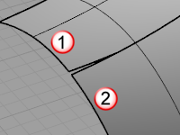

---
---

{: #kanchor2091}{: #kanchor2092}{: #kanchor2093}{: #kanchor2094}
# Sweep2
 [Where can I find this command?](javascript:void(0);) Toolbars
 [Surface Creation](surface-creation-toolbar.html)  [Surface Sidebar](surface-sidebar-toolbar.html) 
Menus
Surface
Sweep 2 Rails
 [&#160;History enabled](historyenabled.html) 
&#160; [Crease splitting enabled](creasesplttingenabled.html) 
The Sweep2 command fits a surface through a series of profile curves that define the surface shape and two curves that define the surface edges.
Steps
 [Select](select-objects.html) two curves as the rails.Select cross-section curves in the order in which the surface will pass through them.Select open curves near the same ends. For closed curves, adjust the curve seams.Your browser does not support the video tag.Tips
Make the degree and structure of the rail curves match each other.Place cross-section curves so the endpoints are on the ends of the rails or on edit points of the rails.Turn on [edit points](pointson.html#editpton) and use [Point](object-snaps.html#osnap-point) object snap to place the section curves between matching edit points on the rails.If only one section curve is used, the entire length of the rails are used for the surface, regardless of the settings.Section curves can have differing structures. The surface takes the complexity of the most complex one.To use same shape curve in the whole sweep, with control over where the sweep ends, use the [Orient](orient.html) commands to create a scaled copy of the shape curve and place its ends at the places on the rail curves where you want the sweep to stop.
### Command-line options
ChainEdges(rails only)
Select connected edges based on the curve continuity of the connection between segments.
To chain-select objects
Inside a command that accepts chain selection, typechain. [Select](select-objects.html) first chain segment.Chain options
AutoChain
Selecting a curve or surface edge automatically selects all curve segments connected with the level of [continuity](continuity-descriptions.html) set by theChainContinuityoption.
ChainContinuity
Controls the level of [continuity](continuity-descriptions.html) required between segments to be selected with theAutoChainoption.
Direction
Forward
Selects curves in the positive curve [direction](dir.html#normaldirection).
Backward
Selects curves in the negative curve [direction](dir.html#normaldirection).
Both
Selects curves in both the positive and negative curve [direction](dir.html#normaldirection).
GapTolerance
If the gap between two edges/curves is less than this value, the chain selection will ignore the gap and will select the next segment.

AngleTolerance
WhenContinuityis set toTangency, if the angle between two edges/curves is less than this value, the chain selection will consider the criteria for continuity met and will select the next segment.

Undo
Undo last segment selection.
Next
Select next segment.
All
Select all segments.
Point(cross-sections only)
ThePointoption creates a surface that begins or ends at a point. Use this option only at the start or end of the curve series.
To drag seams(closed cross-section curves only)
Select a seam point marker, and move it along the closed curve.Continue to adjust the seam points until they line with each other and the closed curves all have the same direction, and then press [Enter](enter-key.html) .Your browser does not support the video tag.Adjust seam options
Flip
Reverses the curve direction.
Automatic
Attempts to align the seam points and directions without intervention.
Natural
Moves the seam points to the way they were at the beginning of the command.
Sweep 2 Rail Options dialog box
Cross-section curve options
Do not simplify
Creates the sweep without doing anything to the shape curves.
Rebuild with ___ control points
Rebuilds the shape curve [control points](controlpoint.html) before creating the sweep. Shape curves reconstruct with non-rational curves, so as to enable the continuity option.
Refit within ___
Refits the shape curves before creating the sweep. Shape curves are reconstructed with non-rational curves, so the continuity option can be enabled.
Preserve first shape
When you are matching edge tangency or curvature, your surface may pull away from your profile curves. This option forces the surface shape to match the first profile curve.
Your browser does not support the video tag.Preserve last shape
When you are matching edge tangency or curvature, your surface may pull away from your profile curves. This option forces the surface shape to match the last profile curve.
Maintain height
Removes the association between the height scaling from the width scaling. By default, shape curves normally scale in both the height and width dimensions.
On
Your browser does not support the video tag.Off
Your browser does not support the video tag.Rail curve options
Continuity is only enabled if the rails are surface edges and the shape curves are non-rational, that is, all [control-point](controlpoint.html) weights are 1. Exact arcs and ellipse segments are rational.
Only continuity options that the curve structure (point count and rational/non rational) supports will be available.
Your browser does not support the video tag.Position / Tangency / Curvature(Surface edges as rails only)
Sets the [continuity](continuity-descriptions.html) for the edge match.
Closed sweep
Creates a closed surface, continuing the surface past the last curve around to the first curve. This option is only available after you select two cross-section curves.
Simple sweep
Creates surfaces using exact input. This option generates simpler surfaces in cases when the curves are perfectly set up. The surface inherits the structure of the input curves.
Place more sections to doSimple sweep. The sections must be placed at the edit points of the two rails.
On(single cross-section curve)
Your browser does not support the video tag.On(multiple cross-section curves)
Your browser does not support the video tag.Off
Your browser does not support the video tag. **Add Slash** 
Adds additional cross-section alignments to control how the surface is created between sections.
Your browser does not support the video tag. **Preview** 
Click to display a preview of the output. If you change the settings, click **Preview** again to refresh the display.
See also
 [Sweep1](sweep1.html) 
Fit a surface through profile curves and one edge curve.
 [Loft](loft.html) 
Fit a surface through profile curves that define the surface shape.
 [NetworkSrf](networksrf.html) 
Fit a surface through a network of crossing curves.
 [Create surfaces](sak-surface.html) 
&#160;
&#160;
Rhinoceros 6 © 2010-2015 Robert McNeel &amp; Associates.11-Nov-2015
 [Open topic with navigation](sweep2.html) 

