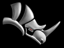

---
---

{: #kanchor2401}{: #kanchor2402}{: #kanchor2403}{: #kanchor2404}
# Technical Support
 [Rhino Web Site](http://www.rhino3d.com)  [Technical support](http://discourse.mcneel.com/) Classroom [training](http://www.rhino3d.com/training.htm) Rhino [books and tutorials](http://www2.rhino3d.com/resources/default.asp?category=14)  [Plug-in](http://www.rhino3d.com/resources/) applicationsDownload the latest [service release](http://download.mcneel.com/rhino/sr.asp) Download [The Zoo](http://wiki.mcneel.com/zoo/home) network license managerTools for [developers](http://www.rhino3d.com/developer.htm)  [Get more help](sak-help.html) Why the name Rhinoceros?
The Rhino Legend

Early in the development process, "Rhino" was used as a prototype name. Rhinoceros knickknacks and pictures started accumulating in the office. By the time the product was in beta testing, the name stuck.
Seattle artist [Frank Woll](http://www.frankwoll.com/) designed the Rhinoceros logo. Frank began using Rhino during its first beta phase for his painting, sculpture, and jewelry design. Frank's work follows in the tradition of Northwest Coastal Native American form. Mikko Oksanen's model of the logo is included with Rhino as a sample.
OpenEXR License
Copyright (c) 2002, Industrial Light &amp; Magic, a division of Lucas Digital Ltd. LLC.
All rights reserved.
Redistribution and use in source and binary forms, with or without modification, are permitted provided that the following conditions are met:
Redistribution of source code must retain the above copyright notice, this list of conditions and the following disclaimer.Redistribution in binary form must reproduce the above copyright notice, this list of conditions and the following disclaimer in the documentation and/or other materials provided with the distribution.Neither the name of Industrial Light &amp; Magic nor the names of its contributors may be used to endorse or promote products derived from this software without specific prior written permission.This software is provided by the copyright holders and contributors "as is" and any express or implied warranties, including, but not limited to, the implied warranties of merchantability and fitness for a particular purpose are disclaimed. In no event shall the copyright owner or contributors be liable for any direct, indirect, incidental, special, exemplary, or consequential damages (including, but not limited to, procurement of substitute goods or services; loss of use, data, or profits; or business interruption) however caused and on any theory of liability, whether in contract, strict liability, or tort (including negligence or otherwise) arising in any way out of the use of this software, even if advised of the possibility of such damage.
Citations
Wikipedia® is a registered trademark of the [Wikimedia Foundation, Inc.](http://www.wikimediafoundation.org/), a non-profit organization.
Webopedia is part of the [internet.com](http://www.internet.com/home-d.html) network of Web sites owned and managed by QuinStreet Inc.
 [AutoDesk trademarks](http://www.autodesk.com/company/legal-notices-trademarks/trademarks).
&#160;
&#160;
Rhinoceros 6 © 2010-2015 Robert McNeel &amp; Associates.11-Nov-2015
 [Open topic with navigation](technicalsupport.html) 

