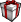
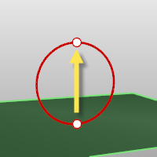

---
---

{: #kanchor71}{: #kanchor72}{: #kanchor73}{: #kanchor74}{: #kanchor75}{: #kanchor76}{: #kanchor77}{: #kanchor78}{: #kanchor79}{: #kanchor80}{: #kanchor81}{: #kanchor82}{: #kanchor83}
# Texture Mapping
 [Where can I find this command?](javascript:void(0);) Toolbars
 [Popup](popup-toolbar.html)  [Properties](properties-toolbar.html)  [Standard](standard-toolbar.html) 
Menus
Edit and Panels
Object Properties
Shortcut
F3
Texture mapping properties manage texture map projections for selected surfaces, polysurfaces, and meshes.
Mapping is a process of defining how to represent a 2&#8209;D image on a 3&#8209;D model. Mapping transforms a 2&#8209;D source image into an image buffer called atexture.
Atexturecan be applied to the surface of a 3&#8209;D model to add color, texture, or other surface detail like glossiness, reflectivity, or transparency.
The problem of how to represent the texture in 3-D rendering can be overcome by means of uv&#8209;mapping. U and V are the coordinates of the texture corresponding to X and Y. Think ofuas one direction on a piece of graph paper (side to side). Think ofvas the other direction (up and down).
Any time an image is applied in a material and then applied that material to a model, uv&#8209;texture mapping is used.

## Mapping channel
A mapping channel holds a set of texture-mapping parameters. Each mapping channel is identified by a number. An object can have any number of channels and therefore can hold any number of texture mapping types.
Textures in materials can be assigned a channel number. When the textures are applied to an object, the texture is applied using the matching channel number on the object. Texture channels default to channel&#160;1.
If an object has no applied texture mapping, [surface](#surface-mapping) mapping is used to map the texture.
Properties Panel
Unwrap
Unwraps the texture for editing.
See: [Unwrap](#unwrap).
Custom Mapping
Add a [custom mapping](#applycustommapping) channel.
Surface Mapping
Add a [surface mapping](#applysurfacemapping) channel. The default texture mapping method for surfaces and polysurfaces is set by the control point structure of the surfaces.
Planar Mapping
Add [a planar mapping](#applyplanarmapping) channel.
Box Mapping
Add a [box mapping](#applyboxmapping) channel.
Spherical Mapping
Add a [spherical mapping](#applysphericalmapping) channel.
Cylindrical Mapping
Add a [cylindrical mapping](#applycylindricalmapping) channel.
Delete Mapping
Delete a mapping channel.
Match Mapping
 [Match the mapping](#matchmapping) to another object's mapping.
Edit Channel *(Use multiple mapping channels only)* 
Allows changing the channel number.
Show Mapping
Display the [mapping widgets](#mappingwidget) for the object.
Hide Mapping
Hide the [mapping widgets](#mappingwidget) for all objects.
UVEditor
Opens the UV Editor.
See: [UVEditor](#uveditor).
Use multiple mapping channels
Allows more than one mapping channel for a single object. The channel numbers can be changed by using the edit channel icon. These mapping channel numbers are used in the texture map settings for an objects material to control which mapping channel is used for that texture.
Channels
#
The mapping channel number.
Type
The mapping type.
Name
The name of the mapping.
Name
The name of the mapping.
Type
The mapping type.
{: #surface-mapping}Surface
Surface mapping stretches the texture over the object.
In this example, a variable radius fillet connects two planar surfaces and all are joined into one polysurface. The default surface mapping method uses the control point structure of each individual surface to orient the checkered texture map applied to the material. Notice how the checker texture does not match across seams in the polysurface.
See: [ApplySurfaceMapping](#applysurfacemapping).

Planar
Planar mapping projects a 2-D plane onto the side of an object.
See: [ApplyPlanarMapping](#applyplanarmapping).

Box
Box mapping projects a 3-D box onto the sides and top of an object.
See: [ApplyBoxMapping](#applyboxmapping).

Box(sides only)
Box mapping sides of an object only, does not cap the mapping to the top and bottom surfaces.
See: [ApplyBoxMapping](#applyboxmapping).

Spherical
Spherical mapping wraps the object around a sphere. The top edge of the texture shrinks into the top pole and the bottom edge into the bottom pole.
See: [ApplySphericalMapping](#applysphericalmapping).

Cylindrical
Cylindrical mapping an image around an object like a cylinder the left and right edge will join each other.
See: [ApplyCylindricalMapping](#applycylindricalmapping).

Capped cylindrical
Capped cylindrical mapping also maps the image to the top and bottom of the objects.
See: [ApplyCylindricalMapping](#applycylindricalmapping).

Custom
Add a [custom mapping](#applycustommapping) channel.
Custom surface objects control the mapping of textures over any other object.
This process is limited to single surfaces as the surface control point structure is used to control the applied mapping. Here, the surface in front of the polysurface was selected when prompted for the custom object in the command line.
Custom Mapping Steps
 [Select](select-objects.html) the custom mapping object.Custom object
Use an object to determine the mapping.
See: [ApplyCustomMapping](#applycustommapping).

Projection
When a mesh is texture mapped, some UV(W) values have to be assigned to each vertex from another object – either a primitive like a sphere or a custom object like another mesh or surface.
Each [mesh vertex](meshvertex.html) is assigned a parameter from the other object’s UV space.
Closest point
Finds the closest point on the primitive from the point on the mesh.
Ray
Ray draws a line from the mesh along its normal until it hits the primitive.
Texture space

Single texture space (left), divided texture space (right).
Single
Specifies that the texture will be mapped individually over each independent space.
Divided
Specifies that distinct regions of the texture will be used for each space, matching parts of the mapped object to the six independent texture spaces.
XYZ position
Sets the center point of the texture mapping widget in world coordinates.

Default position (left), position moved to a different location (right).
Pick button
Click to pick a location on the screen.
XYZ rotation
Sets the rotation of the texture in world space.

Default rotation (left), x&#160;rotation 60 degrees (right).
XYZ size
The texture size.
Lock
When the mapping widget has been re-sized with unequal scaling, the scaling is locked to the specified aspect ratio.
1,1,1
Sets the texture size to 1 in all three directions.
x=y=z
Sets the texture size to be equal in all three directions.
&gt;[ ]&lt;
Fits the texture to the object as established by the original mapping.
 **Size to image aspect** 
Sets the size to the aspect ratio of the image.
UVW offset
The amount the texture is offset from the origin of the UVW texture space.
UVW repeat
The number of times the texture repeats across the object in UVW texture space.
Lock
When Lock is checked, the repeat values for u, v, and w change together so that they stay in the same relationship to each other.
When Lock is unchecked, the repeat values can be changed independently of each other.
Example:
If Lock is off, and you enter 1, 2, 3 in the UVW boxes, you will get one repeat in u, two repeats in v, and three repeats in w.
If you then check Lock, and change the 1 to a 2, the values will change to 2, 4, 6. If you then change the 6 to 60, you will get 20, 40, 60.
UVW rotation
The rotation angle of the texture over the object in UVW texture space.

# Related commands

## ApplyBoxMapping
{: #kanchor84}
{: #applyboxmapping}
 [Where can I find this command?](javascript:void(0);) Toolbars
 [Texture mapping](texture-mapping-toolbar.html) 
Menus
 [Not on menus.](menuwhattodo.html) 
The ApplyBoxMapping command adds a box texture mapping channel to an object and sets the mapping type to [box](#applyboxmapping).

Object with box mapping widget on.
Steps
 [Select objects](selection-commands.html#select-object-basics), and press [Enter](enter-key.html) .Draw the mapping widget.See the [Box](box.html) command for option descriptions.Enter a [mapping channel](mapping-channels.html) number, or press [Enter](enter-key.html) to accept the default value.ApplyBoxMapping command-line options
BoundingBox{: #kanchor85}
The BoundingBox option uses the object bounding box to determine the box location.
Your browser does not support the video tag.BoundingBox options
See the [BoundingBox](boundingbox.html) command for detailed option descriptions.
CoordinateSystem
The coordinate system for the bounding box.
CPlane
 [Construction plane coordinates.](unit-systems.html#construction-plane-coordinates) 
World
 [World coordinates.](unit-systems.html#world-coordinates) 
3Point
 [Pick](pick-location.html) three points to establish a coordinate system.
Capped
Applies the mapping to all six sides of the box.

## ApplyCylindricalMapping
{: #kanchor86}
{: #applycylindricalmapping}
 [Where can I find this command?](javascript:void(0);) Toolbars
 [Texture mapping](texture-mapping-toolbar.html) 
Menus
 [Not on menus.](menuwhattodo.html) 
The ApplyCylindricalMapping command adds a texture mapping channel to an object and sets the mapping type to [cylindrical](#applycylindricalmapping).

Surface mapping (left), cylindrical mapping (right).
Steps
 [Select objects](select-objects.html), and press [Enter](enter-key.html) .Draw the mapping widget cylinder.See the [Circle](circle.html) command for option descriptions.Enter a [mapping channel](mapping-channels.html) number, or press [Enter](enter-key.html) to accept the default value.Command-line options
Direction constraint options
Direction constraints restrict the direction of the circle.
None
The center can be anywhere in 3-D space.
 [Pick](pick-location.html) the second point anywhere using [elevator mode](cursor-constraints.html#elevator-mode), [object snaps](object-snaps.html) or other [modeling aids](modeling-aids.html) .Vertical
Draws an object perpendicular to the construction plane.
 [Pick](pick-location.html) the center and a radius or diameter.AroundCurve
Draws a circle perpendicular to a curve.
 [Select](select-objects.html) a curve and [pick](pick-location.html) the center of the circle on the curve and aRadiusorDiameter.Solid
The Solid option fills the base with a surface to form a closed solid.
BoundingBox{: #kanchor87}
The BoundingBox option uses the object bounding box to determine the box location.
Your browser does not support the video tag.BoundingBox options
See the [BoundingBox](boundingbox.html) command for detailed option descriptions.
CoordinateSystem
The coordinate system for the bounding box.
CPlane
 [Construction plane coordinates.](unit-systems.html#construction-plane-coordinates) 
World
 [World coordinates.](unit-systems.html#world-coordinates) 
3Point
 [Pick](pick-location.html) three points to establish a coordinate system.
Capped
TheCappedoption applies the mapping to all the top and bottom of the cylinder.

## ApplyCustomMapping
{: #kanchor88}
{: #applycustommapping}
 [Where can I find this command?](javascript:void(0);) Toolbars
 [Not on toolbars.](toolbarwhattodo.html) 
Menus
 [Not on menus.](menuwhattodo.html) 
The ApplyCustomMapping command adds a custom texture mapping channel to an object.

No mapping or surface mapping (left), custom mapping object (center), result of custom mapping.
A specified mesh or [NURBS](http://www.rhino3d.com/nurbs) surface or polysurface acts as the mapping for the selected objects. The mapping object is preserved in the mapping table so deleting the mapping object does not affect the mapping on the target object.
Steps
 [Select](select-objects.html) target objects. [Select](select-objects.html) the custom mapping surface or mesh.Enter a [mapping channel](mapping-channels.html) number, or press [Enter](enter-key.html) to accept the default value.
## ApplyPlanarMapping
{: #kanchor89}
{: #applyplanarmapping}
 [Where can I find this command?](javascript:void(0);) Toolbars
 [Texture mapping](texture-mapping-toolbar.html) 
Menus
 [Not on menus.](menuwhattodo.html) 
The ApplyPlanarMapping command adds a texture mapping channel to an object and sets the mapping type to [planar](#applyplanarmapping).
Steps
 [Select objects](select-objects.html), and press [Enter](enter-key.html) .Draw the mapping widget.See the [Rectangle](rectangle.html) command for option descriptions.Enter a [mapping channel](mapping-channels.html) number, or press [Enter](enter-key.html) to accept the default value.Command-line options
BoundingBox{: #kanchor90}
The BoundingBox option uses the object bounding box to determine the box location.
Your browser does not support the video tag.BoundingBox options
See the [BoundingBox](boundingbox.html) command for detailed option descriptions.
CoordinateSystem
The coordinate system for the bounding box.
CPlane
 [Construction plane coordinates.](unit-systems.html#construction-plane-coordinates) 
World
 [World coordinates.](unit-systems.html#world-coordinates) 
3Point
 [Pick](pick-location.html) three points to establish a coordinate system.
Planar UV
The U and V coordinates are taken from the plane size, and the W coordinate is taken as the distance from the plane along the normal.
Planar UVW
The U and V coordinates are taken from the plane size, the W coordinate is always zero.

## ApplySphericalMapping
{: #kanchor91}
{: #applysphericalmapping}
 [Where can I find this command?](javascript:void(0);) Toolbars
 [Texture mapping](texture-mapping-toolbar.html) 
Menus
 [Not on menus.](menuwhattodo.html) 
The ApplySphericalMapping command adds a texture mapping channel to an object and sets the mapping type to [spherical](#applysphericalmapping).
Steps
 [Select objects](selection-commands.html#select-object-basics), and press [Enter](enter-key.html) .Draw the mapping widget sphere.See the [Sphere](sphere.html) command for base sphere drawing options.Enter a [mapping channel](mapping-channels.html) number, or press [Enter](enter-key.html) to accept the default value.Command-line options
BoundingBox{: #kanchor92}
The BoundingBox option uses the object bounding box to determine the box location.
Your browser does not support the video tag.BoundingBox options
See the [BoundingBox](boundingbox.html) command for detailed option descriptions.
CoordinateSystem
The coordinate system for the bounding box.
CPlane
 [Construction plane coordinates.](unit-systems.html#construction-plane-coordinates) 
World
 [World coordinates.](unit-systems.html#world-coordinates) 
3Point
 [Pick](pick-location.html) three points to establish a coordinate system.

## ApplySurfaceMapping
{: #kanchor93}
{: #applysurfacemapping}
 [Where can I find this command?](javascript:void(0);) Toolbars
 [Texture mapping](texture-mapping-toolbar.html) 
Menus
 [Not on menus.](menuwhattodo.html) 
The ApplySurfaceMapping command adds a texture mapping channel to an object and sets the mapping type to [surface](#applysurfacemapping).

## ExtractUVMesh
{: #extractuvmesh}
 [Where can I find this command?](javascript:void(0);) Toolbars
 [Not on toolbars.](toolbarwhattodo.html) 
Menus
 [Not on menus.](menuwhattodo.html) 
The ExtractUVMesh command creates separate mesh objects extracted from the flattened UV meshes of a model.

## MappingWidget
{: #mappingwidget}
 [Where can I find this command?](javascript:void(0);) Toolbars
 [Render Tools](render-tools-toolbar.html)  [Texture Mapping](texture-mapping-toolbar.html) 
Menus
 [Not on menus.](menuwhattodo.html) 
The MappingWidget command turns on the mapping widgets for the selected objects.

The box mapping widget:
Shows graphically how the texture mapping is bound to an object using a primitive (box, cylinder, sphere, or plane).Can be dragged, moved, rotated, and scaled by normal Rhino commands.Can have its control points turned on to re-size it.Steps
 [Select](select-objects.html) objects.Type the mapping channel number or press [Enter](enter-key.html).
## MappingWidgetOff
{: #mappingwidgetoff}
 [Where can I find this command?](javascript:void(0);) Toolbars
 [Render Tools](render-tools-toolbar.html)  [Texture Mapping](texture-mapping-toolbar.html) 
Menus
 [Not on menus.](menuwhattodo.html) 
The MappingWidgetOff command turns off the mapping widgets for selected objects.

## MatchMapping
{: #matchmapping}
 [Where can I find this command?](javascript:void(0);) Toolbars
 [Not on toolbars.](toolbarwhattodo.html) 
Menus
 [Not on menus.](menuwhattodo.html) 
The MatchMapping command changes the texture mapping properties of a selected object to duplicate a specified object.
You can also use the [Match Mapping](#matchmapping) button in Texture Mapping Properties.

## RemoveMappingChannel
{: #removemappingchannel}
 [Where can I find this command?](javascript:void(0);) Toolbars
 [Texture Mapping](texture-mapping-toolbar.html) 
Menus
 [Not on menus.](menuwhattodo.html) 
The RemoveMappingChannel command removes the specified mapping channels from an object.
Steps
 [Select](select-objects.html) objects.Type the mapping channel number.
## Unwrap
{: #unwrap}
 [Where can I find this command?](javascript:void(0);) Toolbars
 [Not on toolbars.](toolbarwhattodo.html) 
Menus
 [Not on menus.](menuwhattodo.html) 
The Unwrap command projects the texture coordinates of the selected objects to a specified region of space.
The render meshes for the selection are flattened and that flattened mesh is used as the mapping space for applying textures.

Surface mapping texture coordinates and the texture assigned to the objects are projected onto the world xy&#160;plane.
Steps
Select surface edges.Seams are allowed to separate during the flattening/unwrapping. Select a non-self-intersecting loop on the object.In many cases, particularly with closed objects, unwrapping will not be possible without the specification of seams.Command-line options
Chain
 [Chain select](selection-commands.html#selchain) the seams.
PreviousSeamSelection
Reselect the previous set of seams.
Apply
Applies the seam selection.
Edit
Opens the [UV Editor](#uveditor).
Cancel
Cancels the command.

## UVEditor
{: #uveditor}
 [Where can I find this command?](javascript:void(0);) Toolbars
 [Not on toolbars.](toolbarwhattodo.html) 
Menus
 [Not on menus.](menuwhattodo.html) 
The UVEditor command edits meshes that affect the texture coordinates of the original object. The texture meshes can be joined and split, and their control points edited.
Steps
 [Select objects](select-objects.html) .Draw a rectangular region on the world xy plane.See the [Rectangle](rectangle.html) command for detailed option descriptions.The [packed](packtextures.html) surface mapping texture coordinates are projected onto the world xy plane, and the texture assigned to the object is drawn in the same region.
The texture coordinates are represented as a collection of *texture meshes*.
When the texture meshes are edited, the texture changes on the object.

If an interior surface seam is selected in the polysurface prior to unwrapping, that seam will separate in the resulting flattened mapping meshes.

While the editor is open, control points for the mapping mesh objects can be turned on, and modeling commands such as [Scale1D](scale1d.html), [SetPt](setpt.html), and [CageEdit](cageedit.html) can be used to adjust the mapping mesh.

Unwrap Textures
Texture transparency
Sets the transparency of the texture in the viewport for visibility.
Highlight selected
Highlights the surface mesh when the projected mesh is selected.
Show wireframe
Shows the mesh wireframe on the object even when in a viewport display mode that does not support mesh wires.
Texture
Use material
Displays the texture associated with the diffuse channel of the material assigned to the object being unwrapped.
Use texture
Displays a specified texture from the [texture palette](texturepalette.html).
See also
 [Render](render.html) 
Render the objects using the current renderer.
 [Use materials and textures](sak-materialsandtextures.html) 
 [Wikipedia: Texture Mapping](http://en.wikipedia.org/wiki/Texture_mapping) 
 [About.com: Surfacing 101 - Texture Mapping](http://3d.about.com/od/3d-101-The-Basics/a/Surfacing-101-Texture-Mapping.htm) 
&#160;
&#160;
Rhinoceros 6 © 2010-2015 Robert McNeel &amp; Associates.11-Nov-2015
 [Open topic with navigation](texturemapping.html) 

