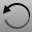
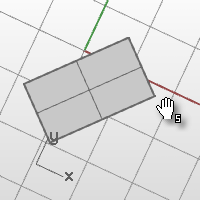

---
---

{: #kanchor2183}
# TiltView
 [Where can I find this command?](javascript:void(0);) Toolbars
 [View](view-toolbar.html) 
Menus
View
 [Viewport title](rhino-window.html#viewport-title-menu) 
Set Camera
Tilt View
The TiltView command rotates the view around the axis formed by the line between the view camera and target.
Your browser does not support the video tag.Steps
Click and drag in a viewport to tilt the view.When the cursor moves near the right and left viewport edges, a snapping mode is enabled. The view rotation snaps in five-degree increments. The keyboard shortcut, [Shift](shift-key.html) + [Alt](alt-key.html) + [Right mouse button](mouse-buttons.html) displays an "s" to indicate the snap mode is on.
Command-line options
Angle
Specifies the angle for tilting the view.
The Angle option gives a one-time tilt, not a drag.
Left
Rotates the view anti-clockwise.
 [Ctrl](ctrl-key.html) + [Shift](shift-key.html) +PageUp
Right
Rotates the view clockwise.
 [Ctrl](ctrl-key.html) + [Shift](shift-key.html) +PageDn
See also
 [Navigate in the viewports](sak-navigate.html) 
&#160;
&#160;
Rhinoceros 6 © 2010-2015 Robert McNeel &amp; Associates.11-Nov-2015
 [Open topic with navigation](tiltview.html) 

