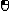
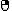
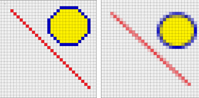
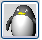
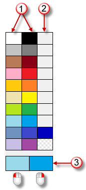
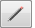
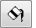
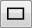
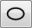
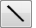

---
---

{: #kanchor3081}{: #kanchor3082}{: #kanchor3083}{: #kanchor3084}{: #kanchor3085}{: #kanchor3086}{: #kanchor3087}{: #kanchor3088}{: #kanchor3089}{: #kanchor3090}
# Toolbar button editor
Add a new toolbar button
 [Right-click](mouse-buttons.html) the toolbar's title tab or click the option/gear icon, and on the menu, clickNew button.A placeholder image displays on the button.{: #openbuttoneditor}Edit a toolbar button
Move the cursor over the toolbar button.Press and hold [Shift](shift-key.html) .Click the [right mouse button](mouse-buttons.html) .Appearance
Inherit appearance from tab
When checked, the button style is inherited from the settings in the [Toolbar Properties](toolbars.html#toolbar-properties) dialog box.
Image only
Displays the image only.

Text only
Displays the text only.

Both image and text
Displays both the image and the text.

Text
The text used on the button with theText onlyandBoth image and textoptions.
Image
Edit
Opens the [Edit Bitmap](#edit-bitmap) dialog box.
Left mouse button /Right mouse button
Tooltip
The text that appears in the tooltip for the button.
Set renderer to PenguinRender
The mouse icon appears automatically if there is text in either box.
Command
The command macro for the [left](mouse-buttons.html) and [right](mouse-buttons.html) mouse buttons.
See: [Rhino Scripting](rhinoscripting.html).
{: #link}Linked toolbar
Name
(No link)
Unlinks the child toolbar.
&lt;Toolbar name&gt;
The name of the child toolbar.
Float to top
Makes the last used button in the child toolbar to appear as the link button in the parent toolbar. This is useful if you want to change the toolbar button that appears in the parent toolbar as the link button or if you want the last button you used to appear as the link button.
If you normally use one button in a linked toolbar and rarely use the others, you probably want the one you use most to always appear on the link button. In this case, clearFloat to Top.

## Edit Bitmap
{: #edit-bitmap}
You can clear the image, draw with the paint tools, capture a portion of the screen, or import a bitmap created with a paint program.
File menu
Import Bitmap
Import an image from a file.
Import Bitmap to Fit
Opens an image file and fits the contents to the button size.
Export Bitmap
Export the current image to a file.
Export All Sizes Bitmap
Exports all of the bitmap sizes created.
Import All Sizes Bitmap
Imports all three bitmap sizes from a file created withExport All Sizes Bitmapor a compatible file.
Edit menu
Undo
Undoes the last action.
Redo
Reverts the last undone action.
Copy
Copies the image to the Clipboard.
Paste
Pastes an image from the Clipboard.
Paste to fit
Pastes an image from the Clipboard to fit the current size.
This is useful for creating various bitmap sizes.
Clear
The button image fills with the default background color.
Grab
Copies a rectangle from the screen.
Grab steps
Move the cursor square over a portion of the screen.Click the [left mouse button](mouse-buttons.html) .Shift
Shifts the image in the drawing area.
You can also use the keyboard arrow keys to shift the image.
Left
Shifts image left one pixel.
Right
Shifts image right one pixel.
Up
Shifts image up one pixel.
Down
Shifts image down one pixel.
Rotate
Rotates the image.
90° Clockwise
90° Counter-Clockwise
180°
Flip
Mirrors the image horizontally or vertically
Horizontal
Vertical
Antialiasing
Sets theLineandEllipsetools anti-aliasing. When checked anti-aliasing is used for these tools

Antialiasing off (left) and on (right).
Rectangle and Ellipse Fill Mode
Draw with the left or right mouse button.
Outline
When drawing with the left mouse button, the [left mouse button color](#current-colors) is used for the outline, when drawing with the right mouse button, the [right mouse button color](#current-colors) is used for the outline.
Filled
When drawing with the left mouse button, the [right mouse button color](#current-colors) is used for the fill, when drawing with the right mouse button, the [left mouse button color](#current-colors) is used for the fill.
Filled with Outline
When drawing with the left mouse button, the [left mouse button color](#current-colors) is used for the outline and the [right mouse button color](#current-colors) is used for the fill.
When drawing with the right mouse button, the [right mouse button color](#current-colors) is used for the outline and the [left mouse button color](#current-colors) is used for the fill.
Image to edit
Specifies the image size. Three sizes are available.
To create three similar buttons
Copythe image from one button and usePaste to Fitto create the other sizes.16x16
24x24
32x32
Bitmap Drawing Tools
Preview
Displays the button in actual size.
Color palette
Standard color palette.
Click colors with left or right mouse button to set the color for that button.
Custom Colors
Double-click to display the [Select Color](#select-color) dialog box.
Click colors with left or right mouse button to set the color for that button.
{: #current-colors}Current colors
Current left and right mouse button colors.

Drawing area
Enlarged view of your bitmap. Use this area to edit your bitmap.
Drawing tools
Pencil
Edits the bitmap in the drawing area pixel by pixel.
Fill
Fills a single-color area with the selected color.
Rectangle
Draws an outline or filled rectangle.
Ellipse
Draws an outline or filled ellipse.
Line
Draws a straight line.
Color dropper
Click in the drawing area to select a color from the image.
{: #select-color}Select Color
From the Color List
In theSelect Colordialog box, from theNamed Colorslist, select a color.From the color selector
Drag the marker around the wheel to define the hue.Drag the marker horizontally in the square to define the saturation level.Drag the marker vertically in the square to define the brightness value.To set transparency for the color
Drag the transparency slider at the right.Or type a value in the Alpha channel (A) box.See also
 [Using toolbars and buttons](using-toolbars.html) 
&#160;
&#160;
Rhinoceros 6 © 2010-2015 Robert McNeel &amp; Associates.11-Nov-2015
 [Open topic with navigation](toolbar-button-editor.html) 

