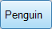
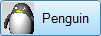
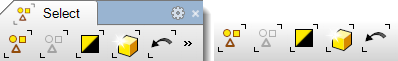
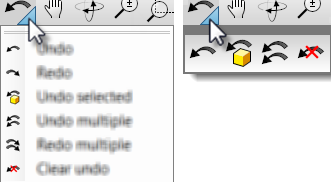

---
---

{: #kanchor2763}{: #kanchor2764}{: #kanchor2765}{: #kanchor2766}{: #kanchor2767}{: #kanchor2768}{: #kanchor2769}{: #kanchor2770}
# Toolbars Sizes and Styles
 [Where can I find this command?](javascript:void(0);) Toolbars
 [Properties](properties-toolbar.html)  [Standard](standard-toolbar.html)  [Tools](tools-toolbar.html) 
Menus
Tools
Options
The Toolbar Sizes and Styles options manage the toolbar tab and button appearance.
Tab Display Style
Floating
Tab style used when toolbars are floating.
Text
Displays the text only.

Image
Displays the image only.

Text + Image
Displays both the image and the text.

Docked Top/Bottom
Tab style used when toolbars are docked at the top or bottom of the screen.
Text
Displays the text only.

Image
Displays the image only.

Text + Image
Displays both the image and the text.

Docked Side
Tab style used when toolbars are docked at the side of the screen.
Text
Displays the text only.

Image
Displays the image only.

Text + Image
Displays both the image and the text.

Hide single tab when docked
Hides the tab when single toolbar is docked. This saves room.

Toolbar tab (left), toolbar tab hidden (right).
Button Options
Button size
Small
16x16 pixels.
Medium
24x24 pixels.
Large
32x32 pixels.
Cascade delay
____ *(in milliseconds)* 
Cascade as menu

Cascade as menu=Yes (left), Cascade as menu=No (right).
Visibility{: #visibility}
{: #sidebars}Sidebar visible
Displays the sidebar toolbar.
The sidebar is a special group that can populated with any existing group according to the currently active tab.
In the default workspace, if you click the Curve Tools, Solid Tools, Drafting, and other tabs in the Standard group across the top, the Sidebar docked on the left is populated with the contents appropriate to the active tab.
Last used buttons visible
Displays the most-recently-used buttons toolbar. The MRU Toolbar is a special toolbar that populates itself with toolbar buttons as they are used. The toolbar is limited to 20.
Other
Lock docked windows{: #lock-docked-windows}
Locks toolbars and panels when they are docked. When this option is on, toolbars and panels cannot be undocked or docked and the gripper bars are removed.
 **Restore Defaults** 
Restores the default system values. All custom toolbar settings in the default workspace will be lost. Restarting Rhino is required for this reset.
To save options for use on other computers
 [OptionsExport](optionsexport.html) 
Save [Options](options.html) settings to a file.
 [OptionsImport](optionsexport.html#optionsimport) 
Restore [Options](options.html) settings from a file.
See also
 [Options](options.html) 
Manage global options: [3D mouse](3dconnexion.html), [alerter](alerter.html), [aliases](aliases.html), [appearance](appearance.html), [context menu](context-menu.html), [display modes](view-displaymode-options.html), [files](files.html), [general](general.html), [idle processor](idleprocessor.html), [keyboard](keyboard.html), [libraries](libraries.html), [licenses](licenses.html), [modeling aids](modeling-aids.html), [mouse](mouse.html), [plug-ins](plug-ins.html), [render](rendering.html), [RhinoScript](rhinoscript.html), [selection menu](selection-menu.html), [toolbars](toolbars.html), [updates and statistics](updates-and-statistics.html), [view](view.html).
&#160;
&#160;
Rhinoceros 6 © 2010-2015 Robert McNeel &amp; Associates.11-Nov-2015
 [Open topic with navigation](toolbars-sizes-and-styles.html) 

