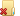
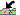
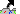
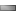
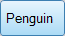
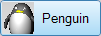
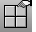

---
---

{: #kanchor2008}{: #kanchor2009}{: #kanchor2010}{: #kanchor2011}{: #kanchor2012}{: #kanchor2013}{: #kanchor2014}{: #kanchor2015}{: #kanchor2016}{: #kanchor2017}{: #kanchor2018}{: #kanchor2019}{: #kanchor2020}{: #kanchor2021}{: #kanchor2022}{: #kanchor2023}{: #kanchor2024}
# Toolbars
 [Where can I find this command?](javascript:void(0);) Toolbars
 [Properties](properties-toolbar.html)  [Standard](standard-toolbar.html)  [Tools](tools-toolbar.html) 
Menus
Tools
Options
Toolbars options manage the toolbars and toolbar buttons.
The Toolbars Options page shows the contents of the toolbar layout. The toolbar layout holds the toolbars, the buttons in them, and the screen position of each toolbar. It also determines whether the toolbar is hidden or showing.

### File menu
New
Creates a new toolbar collection file (.rui).
Open
Opens an existing toolbar collection file (.rui).
Close
Closes the selected toolbar collection.
Close All
Closes all toolbar collections.
Save
Saves the selected toolbar collection.
Save As{: #saveas-toolbar}
Saves the selected toolbar collection as a different file.
Save All
Saves all toolbar collections.
Properties
Opens the RUI File Properties dialog box.
Import Toolbars
Import toolbars from another collection.
Export Groups
Export toolbar groups.

### Edit menu
{: #edit-menu}
New Group
Create new toolbar group.
New Toolbar
Create a new toolbar.
Delete
Deletes the selected toolbar.
Properties
Opens the Toolbar Properties dialog box.

### Tools menu
{: #tools-menu}
Workspace Editor
Opens the [Workspace Editor](workspace-editor.html).
Macro Library
Opens the [Macro Library](macro-library.html).
Files
Lists the active toolbar collections.
Toolbars
Lists the toolbars in the active toolbar collection.
Click a toolbar name to open the toolbar.Right-click to open the [Edit menu](#edit-menu) .{: #toolbar-properties}Toolbar Properties
Group Name
The name of the group the toolbar belongs to.
Tab
The name of the toolbar tab. It is possible to have only one tab in a group.
Text
The text that appears on the toolbar tab.
Edit bitmap
Opens the [Bitmap Editor](toolbar-button-editor.html).
{: #toolbar-button-appearance}Toolbar button appearance
Image only
Displays the image only.

Text only
Displays the text only.

Both image and text
Displays both the image and the text.

Sidebar
Assigns a Sidebar toolbar.
The sidebar is a special group that can populated with any existing group according to the currently active tab.
In the default workspace, if you click the Curve Tools, Solid Tools, Drafting, and other tabs in the Standard group across the top, the Sidebar docked on the left is populated with the contents appropriate to the active tab.
 **Restore Defaults** 
Restores the default system values. All custom toolbar settings in the default workspace will be lost. Restarting Rhino is required for this reset.

## Toolbar Groups
{: #toolbar-groups}
Groups are containers for one or more toolbars that display as tabs. Floating a toolbar automatically makes a group of one.
Single-tab groups can hide the tab.

# Related commands

## Toolbar
 [Where can I find this command?](javascript:void(0);) Toolbars
 [Tools](tools-toolbar.html) 
Menus
Tools
Toolbar Layout
The Toolbar command opens the Toolbars Options page.

## ShowToolbar
{: #showtoolbar}
 [Where can I find this command?](javascript:void(0);) Toolbars
 [Not on toolbars.](toolbarwhattodo.html) 
Menus
 [Not on menus.](menuwhattodo.html) 
The ShowToolbar command opens a specified toolbar. See: [Toolbars Sizes and Styles Options](toolbars-sizes-and-styles.html) &gt; [Visibility](toolbars-sizes-and-styles.html#visibility).
Steps
Type the name of a toolbar.Use the [Toolbar](#) command to view the list of toolbars in the toolbar layout.
## ToolbarLock
{: #toolbarlock}
 [Where can I find this command?](javascript:void(0);) Toolbars
 [Not on toolbars.](toolbarwhattodo.html) 
Menus
 [Toolbar options menu](customize-toolbars.html) 
Lock Docked Windows
The ToolbarLock command locks docked toolbars and panels. See: [Toolbars Sizes and Styles Options](toolbars-sizes-and-styles.html) &gt; [Lock docked windows](toolbars-sizes-and-styles.html#lock-docked-windows).

## ToolbarReset
{: #toolbarreset}
 [Where can I find this command?](javascript:void(0);) Toolbars
 [Not on toolbars.](toolbarwhattodo.html) 
Menus
 [Not on menus.](menuwhattodo.html) 
The ToolbarReset command restores toolbars to the default layout.
All toolbar (.rui) files are closed and Rhino must be restarted to complete the process. On restart, a new default toolbar file is unpacked from files installed with Rhino installer and opened.
To save options for use on other computers
 [OptionsExport](optionsexport.html) 
Save [Options](options.html) settings to a file.
 [OptionsImport](optionsexport.html#optionsimport) 
Restore [Options](options.html) settings from a file.
See also
 [Options](options.html) 
Manage global options: [3D mouse](3dconnexion.html), [alerter](alerter.html), [aliases](aliases.html), [appearance](appearance.html), [context menu](context-menu.html), [display modes](view-displaymode-options.html), [files](files.html), [general](general.html), [idle processor](idleprocessor.html), [keyboard](keyboard.html), [libraries](libraries.html), [licenses](licenses.html), [modeling aids](modeling-aids.html), [mouse](mouse.html), [plug-ins](plug-ins.html), [render](rendering.html), [RhinoScript](rhinoscript.html), [selection menu](selection-menu.html), [toolbars](#), [updates and statistics](updates-and-statistics.html), [view](view.html).
&#160;
&#160;
Rhinoceros 6 © 2010-2015 Robert McNeel &amp; Associates.11-Nov-2015
 [Open topic with navigation](toolbars.html) 

