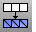

---
---

{: #kanchor2187}{: #kanchor2188}{: #kanchor2189}{: #kanchor2190}{: #kanchor2191}{: #kanchor2192}{: #kanchor2193}
# TriangulateMesh
 [Where can I find this command?](javascript:void(0);) Toolbars
 [Mesh Tools](mesh-tools-toolbar.html)  [STL Tools](stl-tools-toolbar.html) 
Menus
 [Not on menus.](menuwhattodo.html) 
The TriangulateMesh command splits all planar quadrangular polygon mesh faces into two triangular mesh faces.
See also
 [Edit mesh objects](sak-meshtools.html) 
&#160;
&#160;
Rhinoceros 6 © 2010-2015 Robert McNeel &amp; Associates.11-Nov-2015
 [Open topic with navigation](triangulatemesh.html) 

