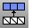

---
---

{: #kanchor2194}
# TriangulateNonPlanarMeshQuads
 [Where can I find this command?](javascript:void(0);) Toolbars
 [Not on toolbars.](toolbarwhattodo.html) 
Menus
 [Not on menus.](menuwhattodo.html) 
The TriangulateNonPlanarMeshQuads command splits all non-planar quadrangular polygon mesh faces into two triangular mesh faces.
Triangulate Non Planar Quads options
Distance
Any quadrangle where the distance of the quad's fourth point from the plane defined by the quad's first three points is greater than or equal to theDistancevalue will be triangulated.
Angle
Any quadrangle where the angle between the plane normals of the face triangles if it were triangulated is greater than or equal to theAnglevalue will be triangulated.
Increment
The value by which theDistanceandAngleedit boxes are increased or decreased with the spinner controls.
 **Select Face** 
Select a mesh face to set theDistanceandAnglevalues.
Split method
Shortest diagonal
Divide along the short diagonal.
Longest diagonal
Divide along the long diagonal.
Minimize area
Minimize resulting area.
Maximize area
Maximize resulting area.
Minimum angle
Minimize angle between triangle normals.
Maximum angle
Maximize angle between triangle normals.
See also
 [QuadrangulateMesh](quadrangulatemesh.html) 
Merge mesh triangles into quadrangles.
 [TriangulateRenderMeshes](triangulaterendermeshes.html) 
Split each quadrangular polygon render mesh face into two triangles.
 [Edit mesh objects](sak-meshtools.html) 
&#160;
&#160;
Rhinoceros 6 © 2010-2015 Robert McNeel &amp; Associates.11-Nov-2015
 [Open topic with navigation](triangulatenonplanarmeshquads.html) 

