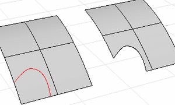
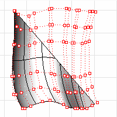
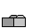
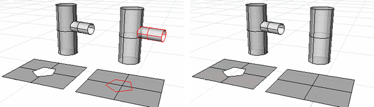
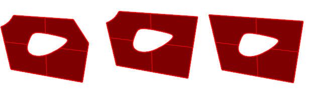
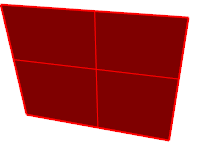
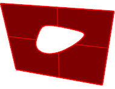
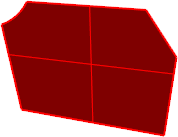

---
---

{: #kanchor1863}{: #kanchor1864}{: #kanchor1865}{: #kanchor1866}
# Trim
 [Where can I find this command?](javascript:void(0);) Toolbars
 [Curve Drawing](curve-drawing-toolbar.html)  [Geometry Fix](geometry-fix-toolbar.html)  [Main1](main1-toolbar.html)  [Solids Sidebar](solids-sidebar-toolbar.html)  [Surface Sidebar](surface-sidebar-toolbar.html) 
Menus
Edit
Trim
Shortcut
 [Ctrl](ctrl-key.html) +T
The Trim command cuts and deletes selected portions of an object at the intersection with another object.

Steps
 [Select](select-objects.html) the cutting objects.Infinite Plane: TypeIPfor [InfinitePlane](infiniteplane.html) options.
Select the parts of objects to trim away.Command-line options
ExtendLines
Determines whether or not when line objects are used as cutting objects, imaginary extensions of the line are used. This makes it unnecessary to manually extend lines that do not intersect the objects to trim.
UseApparentIntersections
Determines whether or not curves are trimmed in relation to the view. They do not need to intersect in 3-D space. They only need to appear to intersect in the active viewport.
This option does not apply to surfaces.
Note
If it is difficult to select the parts to trim off, use the [Split](split.html) command and then delete the unwanted parts.Use the [Untrim](#untrim) command to remove a trimming boundary from a surface.When trimming a surface with a curve in a [plan](setview.html#plan) parallel view like the default Top, Front, and Right view, the cutting curve is projected on the surface in the view direction.When trimming a surface with a planar curve in an angled parallel or a perspective view like the default Perspective view, the cutting curve is projected on the surface in a direction perpendicular to the curve plane.When trimming a surface with a 3-D curve in an angled parallel or a perspective view, the cutting curve is pulled on the surface by closest points.Line
Draw a temporary line to use for the cutting object.
Trimmed Surfaces
A trimmed surface has two parts: a surface that underlies everything that defines the geometric shape, and trimming curves that either trim away the outside portion of the surface or cut holes in its interior.
Those trimming curves exist on the underlying surface. The underlying surface may be larger than the trim curves, but you won't see the underlying surface because Rhino doesn't draw anything for the part of the surface that is outside the trim curves.
Only the underlying surface defines the actual geometry of the shape. The trim curves do not define a surface -- they only mark which part of the surface is to be considered trimmed away.
If you have a trim curve that runs diagonally across a surface, the trim curve itself doesn't have any real relationship to the [control-point](controlpoint.html) structure of the surface. You can see this if you select such a trimmed surface and turn its control points on. You'll see the control points for the whole underlying surface, which doesn't necessarily have any connection with the trim curves.

You can remove the trim curves and get back to the underlying surface using the [Untrim](#untrim) commands to remove holes or outside boundaries.
When you have a trimmed surface whose underlying surface is much larger than the outside trimming boundary, you can use the [ShrinkTrimmedSrf](shrinktrimmedsrf.html) command to shrink the surface back so that it is only large enough to hold the trimming boundaries and doesn't have a large extra unused area.

# Related commands

## Untrim
{: #untrim}
 [Where can I find this command?](javascript:void(0);) Toolbars
 [Surface Tools](surface-tools-toolbar.html)  [Geometry Fix](geometry-fix-toolbar.html) 
Surface
Surface Edit Tools
Untrim
The Untrim command removes trim curves and surfaces joined at trim curves from a surface.
&#160; [Crease splitting enabled](creasesplttingenabled.html) 
Steps
 [Select](select-objects.html) the edge boundary of a trimmed surface.Command-line options
{: #keeptrimobjects}KeepTrimObjects
Determines whether or not the original trimming objects and joined geometry are separated and retained or deleted.

KeepTrimObjects=Yes (left); KeepTrimObjects=No (right).
AllSimilar
Removes all trimming curves on the edge of a trimmed surface, or if a hole edge is selected, all holes on the same face will be deleted.

Original object (left), AllSimilar=No, (center), AllSimilar=Yes (right).

## RemoveEdge
{: #removeedge}
 [Where can I find this command?](javascript:void(0);) Toolbars
 [Surface Tools](surface-tools-toolbar.html) 
Menus
Surface
Edge Tools
Remove Edge
The RemoveEdge command retrims the selected trimmed surface edge with a line, extensions of the adjacent edges, or a curve.
Steps
 [Select](select-objects.html) surface edges to delete.Command-line options
KeepTrimObjects
Determines whether or not the original trimming objects are retained.
Mode
ReplaceWithLine
Replace the edge with a line between the edge end points.
Your browser does not support the video tag.ExtendSideEdges
The two surrounding edges extend.
The edges must meet within surface boundary to give successful results.
Your browser does not support the video tag.SelectCurve
Edges will be replaced using the selected curve to retrim.

## UntrimAll
{: #untrimall}
 [Where can I find this command?](javascript:void(0);) Toolbars
 [Not on toolbars.](toolbarwhattodo.html) 
Menus
Surface
Surface Edit Tools
Untrim All
Detach All
&#160; [Crease splitting enabled](creasesplttingenabled.html) 
The UntrimAll command untrims all trimming curves on an object, both edges and holes in one operation.

## UntrimBorder
{: #untrimborder}
 [Where can I find this command?](javascript:void(0);) Toolbars
 [Not on toolbars.](toolbarwhattodo.html) 
Menus
Surface
Surface Edit Tools
Untrim Border
Detach Border
The UntrimBorder command untrims the exterior border leaving holes trimmed.

## UntrimHoles
{: #untrimholes}
 [Where can I find this command?](javascript:void(0);) Toolbars
 [Not on toolbars.](toolbarwhattodo.html) 
Menus
Surface
Surface Edit Tools
Untrim Holes
Detach Holes
The UntrimHoles command untrims interior holes leaving exterior borders trimmed.

See also
 [Split and trim curves and surfaces](sak-splittrim.html) 
&#160;
&#160;
Rhinoceros 6 © 2010-2015 Robert McNeel &amp; Associates.11-Nov-2015
 [Open topic with navigation](trim.html) 

