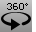

---
---

{: #kanchor2203}{: #kanchor2204}{: #kanchor2205}{: #kanchor2206}
# Turntable
 [Where can I find this command?](javascript:void(0);) Toolbars
 [Set View](set-view-toolbar.html)  [View](view-toolbar.html) 
Menus
View
 [Viewport title](rhino-window.html#viewport-title-menu) 
Set Camera
Turntable
The Turntable command continuously rotates a view around the viewport target point.
Steps
Control the speed and direction with the dialog box controls.Your browser does not support the video tag.Turntable options
Slider/edit box
Specifies the speed of the rotation.
Positive speed values rotate the view counter/anti- clockwise.
Negative speed values rotate the view clockwise.
To access hidden command-line options
Type ahyphenin front of the command name:-Turntable.Duration
Specifies the time in seconds that the command will run. You can set Duration or Revolutions, not both.
Speed
Specifies the speed of the rotation.
Positive speed values rotate the view counter/anti- clockwise.
Negative speed values rotate the view clockwise.
Revolutions
Specifies the number of revolutions. You can set Duration or Revolutions, not both.
See also
 [Navigate in the viewports](sak-navigate.html) 
&#160;
&#160;
Rhinoceros 6 © 2010-2015 Robert McNeel &amp; Associates.11-Nov-2015
 [Open topic with navigation](turntable.html) 

