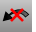

---
---

# Undo toolbar
{: #kanchor2394}
 [To open a toolbar](javascript:void(0);) Toolbars can be opened as a free-standing group or added to the current group.
To open a toolbar as a free-standing group
Click theOptionsicon in any toolbar group.On the menu, clickShow Toolbar, and then select the toolbar name from the list.To open a toolbar as a new tab in the current group
Click theOptionsicon in the toolbar group where you want to add the new tab.On the menu, clickShow or Hide Tabs, and then select the toolbar name from the list. [ClearUndo](clearundo.html) 
Clear the undo buffer to free memory.
 [Undo](undo.html) 
Undo the last action.
 [Redo](undo.html#redo) 
Reverse the last Undo.
 [UndoSelected](undo.html#undoselected) 
Reverse recent changes for a single object only.
 [UndoMultiple](undo.html#undomultiple) 
Display a list of recent commands to reverse.
 [RedoMultiple](undo.html#redomultiple) 
Reverse the Undo command multiple times.
&#160;
&#160;
Rhinoceros 6 © 2010-2015 Robert McNeel &amp; Associates.11-Nov-2015
 [Open topic with navigation](undo-toolbar.html) 

