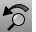

---
---

{: #kanchor1849}{: #kanchor1850}{: #kanchor1851}{: #kanchor1852}{: #kanchor1853}{: #kanchor1854}{: #kanchor1855}
# UndoView
 [Where can I find this command?](javascript:void(0);) Toolbars
 [Set View](set-view-toolbar.html)  [Standard](standard-toolbar.html)  [View](view-toolbar.html) 
Menus
View
Undo View Change
Shortcut
Home
The UndoView command reverses recent view changes.

# RedoView
{: #redoview}
 [Where can I find this command?](javascript:void(0);) Toolbars
 [Set View](set-view-toolbar.html)  [Standard](standard-toolbar.html)  [View](view-toolbar.html) 
Menus
View
Redo View Change
Shortcut
End
The RedoView command steps back through view changes activated by the UndoView command.
See also
 [Navigate in the viewports](sak-navigate.html) 
&#160;
&#160;
Rhinoceros 6 © 2010-2015 Robert McNeel &amp; Associates.11-Nov-2015
 [Open topic with navigation](undoview.html) 

