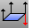

---
---

{: #kanchor2209}{: #kanchor2210}{: #kanchor2211}{: #kanchor2212}
# UnifyMeshNormals
 [Where can I find this command?](javascript:void(0);) Toolbars
 [Mesh Tools](mesh-tools-toolbar.html)  [STL Tools](stl-tools-toolbar.html) 
Menus
Mesh
Mesh Repair Tools
Unify Normals
The UnifyMeshNormals command changes the normal direction of the faces in a mesh object so they all point in a consistent direction.
This helps repair meshes for rapid prototype printing.
Note
Some STL/SLA printers have problems if meshes contain many long, thin facets. These can slow the printer's slicing process down, produce odd printed results, and run the printer out of memory.The [MeshRepair](meshrepair.html) command may be useful when tuning up meshes for STL/SLA printing.Steps
 [Select](select-objects.html) a single unjoined mesh.The normals of all the faces of the mesh will now point to one side of the mesh.TheUnifyMeshNormalscommand changes the direction of the surface normals of a mesh object so all normals face the same direction. This command is useful for tidying up your mesh objects for export into 3D Studio. [View &gt; Display Modes Options](view-displaymode-options.html) let you display the front and back faces in different colors. This will show you whether the normals need to be unified.Note
IfUnifyMeshNormalsdoesn't seem to affect your mesh, explode it. Once the normals are correct, re-join the meshes.A polygon can have two types of normals: vertex normals and a face normal.All polygons have a face normal direction, but many polygon meshes do not have vertex normals. For example, [3DFace](3dface.html) objects, mesh primitives, and polygon meshes imported in formats other than 3DM and 3DS do not have vertex normals.In general, the order of the vertices in a polygon determines the face normal direction. The order of the vertices should be either clockwise or counterclockwise. You can determine the normal direction from the vertices using the right-hand rule.You use theUnifyMeshNormalscommand primarily to make sure that the vertex order of all polygons in welded mesh is the same.Example
 [Import an STL file](stereolithography-stl-import-export.html) with holes in it. [Fill the holes](fillmeshholes.html) in the mesh. [Weld](weld.html) the mesh setting the welding angle to 180 to make sure all vertices get welded.UseUnifyMeshNormals.Turn on one sided rendering and shade the model to see if the mesh face normals point in or out.If you see inside the mesh, normals point the wrong way.Use the [Flip](flip.html) command to change the mesh normal direction if necessary. [Export](export.html) in desired format.See also
 [Edit mesh objects](sak-meshtools.html) 
 [White paper: Scan, Cleanup, Remodel](http://download.rhino3d.com/download.asp?id=ScanCleanupRemodel) 
&#160;
&#160;
Rhinoceros 6 © 2010-2015 Robert McNeel &amp; Associates.11-Nov-2015
 [Open topic with navigation](unifymeshnormals.html) 

