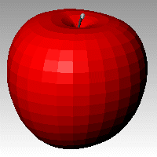
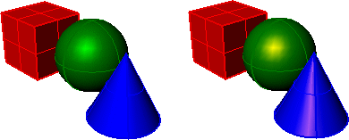
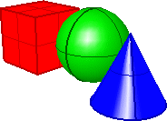

---
---

{: #kanchor2818}
# Custom Object Attributes
 [Where can I find this command?](javascript:void(0);) Toolbars
 [Properties](properties-toolbar.html)  [Standard](standard-toolbar.html)  [Tools](tools-toolbar.html) 
Menus
Tools
Options
Custom Object Attributes controls render attributes of individual objects regardless of the viewport properties.
Basic parameters
Flat shading
Shades the current viewport with no smoothing so the individual render mesh faces are visible.
See: [FlatShade](flatshade.html).

Override object's color
Click the color swatch to select a [color](select-color.html).
Gloss color
Click the color swatch to select a [color](select-color.html).

Gloss color matches object color (left) and highlight color orange (right).
Gloss intensity
Specifies the strength of the gloss color.
Gloss finish
Specifies the range from matte to shiny.
Transparency
Specifies the transparency of the object finish.
Luminosity
Makes the color appear to glow.

Maps
Texture
Specify a file name.
%
The percentage of influence of the image file on the map texture.
Transparency
Specify a file name.
%
The percentage of influence of the image file on the map transparency.
Environment
Specify a file name.
%
The percentage of influence of the image file on the map environment.
To save options for use on other computers
 [OptionsExport](optionsexport.html) 
Save [Options](options.html) settings to a file.
 [OptionsImport](optionsexport.html#optionsimport) 
Restore [Options](options.html) settings from a file.
See also
 [Display Modes](view-displaymode-options.html) 
&#160;
&#160;
Rhinoceros 6 © 2010-2015 Robert McNeel &amp; Associates.11-Nov-2015
 [Open topic with navigation](view-displaymode-custom-object-attributes.html) 

