---
---

# Display Modes
 [Where can I find this command?](javascript:void(0);) Toolbars
 [Properties](properties-toolbar.html)  [Standard](standard-toolbar.html)  [Tools](tools-toolbar.html) 
Menus
Tools
Options
View
Display Modes
TheDisplay modes optionsmanage the appearance of the viewport display modes.
The built-in display modes are:
{: #wireframe} [Wireframe](view-displaymodes-wireframe.html) {: #kanchor1055}{: #kanchor1056}
Sets the viewport display to unshaded wireframe.
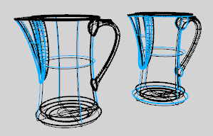
{: #shaded} [Shaded](view-displaymodes-shaded.html) {: #kanchor1057}{: #kanchor1058}
Sets the viewport to opaque shaded mode. Shaded mode uses a mesh to shade surfaces using the layer colors.

{: #rendered} [Rendered](view-displaymodes-rendered.html) {: #kanchor1059}{: #kanchor1060}
Shades the viewport with a simulation of the rendered view.

{: #ghosted} [Ghosted](view-displaymodes-ghosted.html) {: #kanchor1061}{: #kanchor1062}
Sets viewport display so surfaces are translucent.

{: #x-ray} [X-Ray](view-displaymodes-xray.html) {: #kanchor1063}{: #kanchor1064}
Shades with [isoparametric curves](isocurve.html) not obscured by objects in front.
All wireframe and point objects are displayed, even if they would normally be hidden by surfaces that are in front of them in the viewport.

{: #technical} [Technical](view-displaymodes-technical.html) {: #kanchor1065}{: #kanchor1066}
Uses real-time silhouettes and intersections, creases, borders, blended shaded and rendered display. Objects behind other objects are occluded.
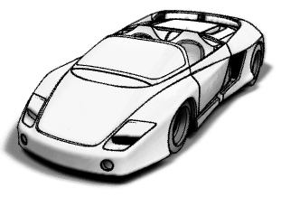
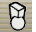{: #artistic} [Artistic](view-displaymodes-artistic.html) {: #kanchor1067}{: #kanchor1068}
Uses an image background and soft lines to create a pencil drawing effect.

{: #pen} [Pen](view-displaymodes-pen.html) {: #kanchor1069}{: #kanchor1070}
Uses white with black lines to simulate a pen drawing.

 **New** 
Create a new custom display mode.
{: #copy} **Copy** 
Copy a display mode.
 **Delete** 
Delete a custom display mode.
 **Import** 
Import a display mode (.ini) file.
To set up a display mode from an ini file
In the [Options](options.html) dialog box, clickView, and then clickDisplay Modes.Click **Import** .Browseto the.inifile you want to use.In the list on the left, click the new display mode created by importing the ini file.Revise the options if needed.This may be necessary if the display option includes an image background. **Export** 
Export a display mode.
 **Restore Defaults** 
Restores the default system values. All custom display mode settings will be lost.

## Settings
Not all of the settings described below are available for all display modes.

## Display Modes

### Display mode options
{: #name}Name
Name of display mode.

### Viewport settings
Background{: #kanchor1071}
Specifies the viewport background color.
Use application settings
Use settings specified in [Appearance&#160;&gt; Color Options](appearance-colors.html).
Solid color
To select a color
Click the color swatch.Image file
Specifies an image for the viewport background.
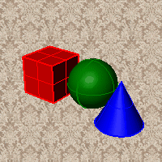
Image file name
Type or browse for the file name.Gradient 2 colors
Blends between a top and bottom color.
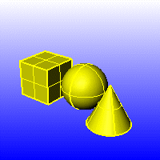
Top color / Bottom color
To select a color
Click the color swatch.Gradient 4 colors
Blends between four colors starting from the corners of the viewport.
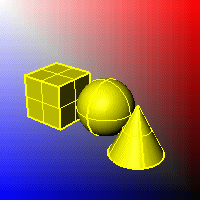
Top left color / Top right color / Bottom left color / Bottom right color
To select a color
Click the color swatch.Use render settings
Displays the colors and lighting used by the settings for background specified by the current renderer.
Transparent
Renders viewport backgrounds using black and a 0.0% alpha value. This works for [rendered](render.html) output and for [ViewCaptureToFile](viewcapture.html#viewcapturetofile).
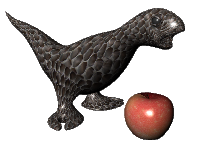

### Shading settings
Shade objects
Sets the viewport to opaque shaded mode.
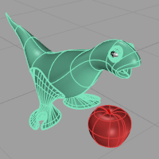
X-Ray all wires
Shades with isocurves not obscured by objects in front.
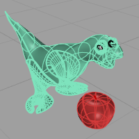
Flat shading
Shades the current viewport with no smoothing so the individual render mesh faces are visible.
See: [FlatShade](flatshade.html).

Shade vertex colors
Shades using an object's vertex colors.
See: [ComputeVertexColors](computevertexcolors.html).
Color and material usage
Object's color
Use the color specified in the object's [properties](properties.html#displaycolor).
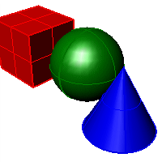
Gloss
Sets the [gloss](materialeditor.html#glossfinish) for the backface material. This can be different from the front face material.
Transparency
Sets the [transparency](materialeditor.html#transparency) for the backface material. This can be different from the front face material.
Single color for all objects
Ignores object colors and uses a single color for the shading.
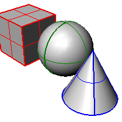
Gloss
Sets the [gloss](materialeditor.html#glossfinish) for the backface material. This can be different from the front face material.
Transparency
Sets the [transparency](materialeditor.html#transparency) for the backface material. This can be different from the front face material.
Single object color
To select a color
Click the color swatch.Rendering material
Shades using rendering [material](materialeditor.html).
Custom material for all objects
Click **Customize** to specify the custom material.
 **Customize** 
Opens the [Custom Object Attributes Settings](view-displaymode-custom-object-attributes.html) dialog box.
Backface settings
Changes the color of the backface (the side opposite of the [surface normal](dir.html#normaldirection) ).
Use front face settings
No color change.
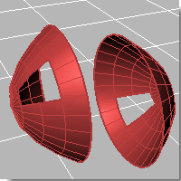
Cull backfaces
Surfaces viewed from the back will be transparent.
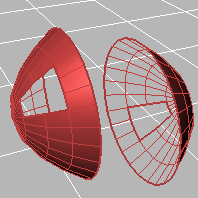
Use object's color
Surfaces viewed from the back use the color specified in the object's [Properties](properties.html#displaycolor).
Gloss
Sets the [gloss](materialeditor.html#glossfinish) for the backface material. This can be different from the front face material.
Transparency
Sets the [transparency](materialeditor.html#transparency) for the backface material. This can be different from the front face material.
Single color for all backfaces
All backfaces display a specified color regardless of the object color.
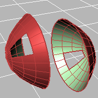
Gloss
Sets the [gloss](materialeditor.html#glossfinish) for the backface material. This can be different from the front face material.
Transparency
Sets the [transparency](materialeditor.html#transparency) for the backface material. This can be different from the front face material.
Single backface color
To select a color
Click the color swatch.Rendering material
Shades using rendering [material](materialeditor.html).
Custom material for all backfaces
Click **Customize** to specify the custom material.
 **Customize** 
Opens the [Custom Object Attributes Settings](view-displaymode-custom-object-attributes.html) dialog box.
Shading effects
Standard shading
Uses normal solid shading.
Parallel lines
Uses parallel lines for shading.
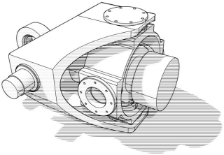
Width (in pixels)
Width of the lines.
Separation (in lines)
Distance between lines.
Rotation (in degrees)
Rotation angle of lines.

### Visibility
{: #visibility}
Specifies which elements will be visible in the display mode.
Show isocurves
Shows object [isocurves](properties.html#isocurvedensity).
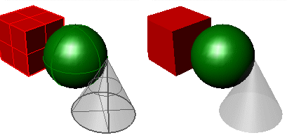
Isocurves on (left) and off (right).
Show mesh wires
Shows [mesh wires](sak-mesh.html).
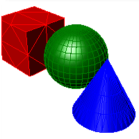
Show curves
Shows [curves](sak-curve.html) objects.
Show hidden lines
Displays hidden lines as [dashed lines](properties.html#linetype).
Show edges
Displays surface and polysurface [clipping planes](clippingplane.html).
Show silhouettes
Shows surface [silhouettes](silhouette.html).
Show creases
Displays [creases](creasesplitting.html) in surfaces.
Show seams
Displays surface [seams](srfseam.html).
Show intersections
Displays [intersections](intersect.html) between surfaces.
Show lights
Shows [lights](lights.html) objects
Show text
Shows [text](sak-textanddimensions.html) blocks.
Show annotations
Shows [annotations](sak-textanddimensions.html) objects.
Show points
Shows [points](sak-point.html) objects.
Show pointclouds
Shows [pointclouds](sak-point.html) objects

### Surface edge settings
{: #surfaceedgesettings}
Edge thickness
Sets the thickness in pixels for [surface edges](#surfaceedgesettings).
Color reduction %
Sets the "fade" effect for surface edges.

### Light objects
Use lights on layers that are off
This setting applies to lights that are on turned-off [layers](layer.html) and lights that are [hidden](hide.html).
Draw lights using light color
Draws lights using the [color of the light](light.html#color) rather than the color of the [light object](properties.html#displaycolor).

### Lighting scheme
The lighting used by the display mode.
Lighting method
No lighting
No shading occurs when there is no light sources added to the scene.
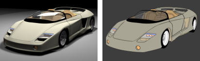
Scene lighting (left), No lighting (right).
Default lighting
Uses a single "head lamp" light.
Scene lighting
Uses the light objects that exist in the current model/scene.
Custom lighting
Sets up to eight custom lights.
 **Customize** 
Set an x, y, and z&#160;direction and color for each light.

### Custom Lighting Setup
Light #
Up to eight lights are available.
Direction
Setting the directional value to 0,0,0 disables the light.
Color
The color the light shines on objects.
Specular
The highlight color the light creates on glossy objects.
 **Use current scene lights** 
Identifies any lights in the scene that are [Directional](directionallight.html) lights, and uses up to eight lights to populate the fields in the dialog.
Note
This option deletes all current values in the dialog, even if there were no directional lights found in the scene.The directional lights are converted to camera-directional lights using world coordinates. **Apply** 
Applies the lighting to the model.
Ambient color
To select a color
Click the color swatch.Use advanced GPU lighting
With normal, per-vertex lighting, calculations only occur for each vertex in a mesh. Everything else in between is interpolated (invented).
This has major limitations for shading, lighting, and texturing, especially when a mesh has very few vertices. For example, a plane with four vertices, has nothing to interpolate over the plane surface. When only vertices are used, there is very little data.
With Advanced GPU (per-pixel) lighting, calculations occur for every pixel within the viewport, no matter how many vertices there are. This gives more data, and the larger the frame buffer, the more detail and data you get. The result is that you can now light the entire plane and see how light falls across the entire surface independent of how many vertices there are.
In order to display [bump mapping](materialeditor.html#bump) in Rendered mode, the [Use Advanced GPU lighting setting](#use-per-pixel-lighting) must be checked.H
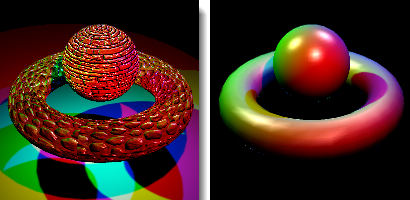
Advanced GPU lighting on (left) and off (right).
See: [Wikipedia: Per-pixel lighting](http://en.wikipedia.org/wiki/Per-pixel_lighting).

### Clipping plane objects
Specifies how clipping plane objects appear in the display mode.
Show fills(shaded modes only)
When a clipping plane intersects a 3-D object, the object is filled.

Fills off (left) and on (right).
Color usage
Specifies how the color for the clipping plane object fill is determined.
Viewport
Uses the viewport background color.
Render material
Uses the clipping plane's [render material](materialeditor.html).
Plane's material
Uses the clipping plane's color or layer color [property](properties.html).
Solid color
To select a color
Click the color swatch.Show edges
Shows the edges between the clipping plane and clipped objects.

Edges off (left) and on (right).
Color usage
Plane's color
Uses the clipping plane's [color](properties.html#displaycolor) (object or layer).
Solid color
To select a color
Click the color swatch.Edge thickness
Edge thickness in pixels.
Shade selected plane
Shades the selected clipping plane.
Color usage
Plane's color
Uses the clipping plane's [color](properties.html#displaycolor) (object or layer).
Plane's material
Uses the plane's [render material](material.html) (object or layer).
Solid color
To select a color
Click the color swatch.Transparency %
Specifies the clipping plane transparency.
Clip selection highlight
Clips the highlight wires. Shaded selections always clip.
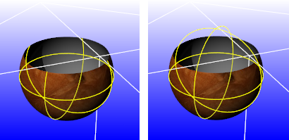
Selection highlight clipped (left) and not clipped (right).

# Grid

### Grid settings
Grid usage{: #kanchor1072}{: #kanchor1073}{: #kanchor1074}
Use document settings
Use settings specified in [Grid Document Properties](grid.html).
Use mode-specific settings
Specify the settings in individual modes.
Show [grid](grid.html#grid-visibility) 
Show [grid axes](grid.html#grid-axes-visibility) 
Show [world axis icon](grid.html#world-icon-visibility) 

### World axes settings
World axis icon color usage{: #kanchor1075}
Application settings
Use default setting.
Same as grid axis colors
Set colors for grid axes in [Appearance: Colors Options](appearance-colors.html).
Use specified custom colors
To select a color
Click the color swatch.
### Advanced Grid Settings
Show z&#160;axis{: #kanchor1076}
Display construction plane z&#160;axis.
Axes size (grid extent %)
Set size of axes as a percentage of the grid extents.
Grid appearance
Show grid behind / on top of all objects
Shows the grid behind all objects or allows the grid to pass through objects.
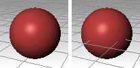
Grid behind (left) and on top of objects (right).
Use transparent grid{: #kanchor1077}
Displays the grid lines with transparency.
Transparency is not available when the [Pipeline](#pipeline) setting isWindows.
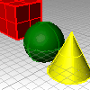
Transparency %
Grid plane usage{: #kanchor1078}
Do not use / use transparent plane
Displays the grid as lines or as a transparent plane with lines.
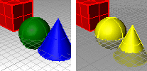
Do not use transparent plane (left) and Use transparent plane (right).
Transparency is not available when the [Pipeline](#pipeline) setting isWindows.
Plane color
To select a color
Click the color swatch.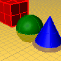
Plane transparency %
Plane visibility
Show only when grid is on
Show always

## Objects

### Selection
Shaded modes only
Shade-highlight selected surfaces and polysurfaces{: #kanchor1079}{: #kanchor1080}
Shades entire object with highlight color.
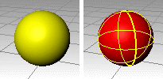
Shade highlight on (left) and off (right).
Shade-highlight selected meshes{: #kanchor1081}{: #kanchor1082}
Shades entire object with highlight color.
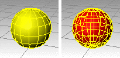
Shade highlight mesh on (left) and off (right).

### Control points
Control polygon usage{: #kanchor1083}{: #kanchor1084}
Use dotted / solid lines
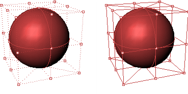
Dotted (left) and solid control polygon ( right).
Line thickness{: #kanchor1085}{: #kanchor1086}
The width of the control polygon in pixels.
Control polygon color
Specifies a color for the control polygon.
Use object color
Use the color specified in the object's [Properties](properties.html#displaycolor).
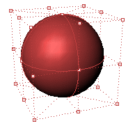
Use fixed color
Use a specified color for all control polygons.
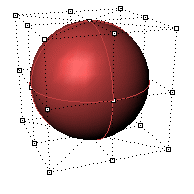
Polygon color
To select a color
Click the color swatch.Visibility
Hide control points
Hides the control points while the control polygon is displayed.
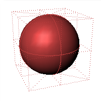
Hide object
Hides the object while the control polygon is displayed.
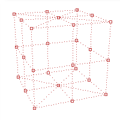
Hide control polygon
Hides the control polygon and only shows the control points.
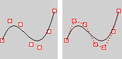
Hide control polygon on (left) and off (right).
Highlight control polygon
Highlights the segments of the control polygon on either side of the control points.
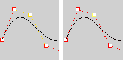
Highlight control polygon on (left) and off (right).
Control point style
Square with white center
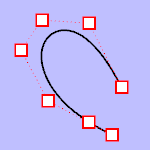
Round with white center
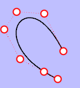
Solid square
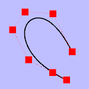
Solid circle
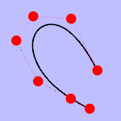
Control point size
The control point size in pixels.
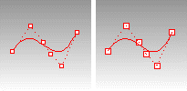
Size = 2 (left), size = 3 (right).

### Locked objects
Locked object usage
Use application settings
Use settings specified in [Appearance: Colors Options](appearance-colors.html).
Use specified lock color
To select a color
Click the color swatch.Use object's display attributes
Uses the [object's specified attributes](view-displaymode-custom-object-attributes.html).
Locked object appearance
Locked objects appear solid
Locked objects appear transparent
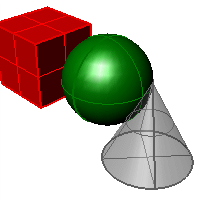
Gray locked object transparent.
Transparency %
Sets the amount of transparency as a percentage.
Draw objects behind all others
Draws locked objects behind all other objects.
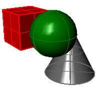
Gray locked object displayed behind others.
Apply these settings to layers
Applies the settings for locked objects to locked layers.

### Dynamic display
Dynamic display usage
Sets the appearance of objects in the display
Use application settings
Use system default settings.
Display object's bounding box
Reduces the display of objects to their bounding boxes. This can speed up the display on large models.
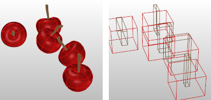
Bounding box display off (left) and on (right).
Always display
Always display objects as bounding boxes.
Only display during view changes
Change objects to bounding boxes only when zooming or panning.

## Points

### Point object settings
Point style
Specifies the appearance of [point](points.html) objects.
Square with white center
Displays point objects as squares with a white center.
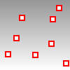
Size
Point object size in pixels.
Solid square
Displays point objects as a solid squares.
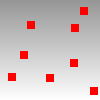
Size
Point size in pixels.

### PointCloud object settings
PointCloud style
Specifies the appearance of [point cloud](pointcloud.html) objects.
Square with white center
Displays point cloud objects as squares with a white center.

Size
Point cloud point size in pixels.
Solid square
Displays point cloud objects as a solid squares.

Size
Point cloud point size in pixels.
PointCloud control point style
Specifies the appearance of [point cloud](pointcloud.html)  [control points](pointson.html).
Square with white center
Displays point cloud control points as squares with a white center.

Size
Point cloud point control point size in pixels.
Solid square
Displays point cloud control points as a solid squares.

Size
Point cloud point size in pixels.

## Curves

### Curve settings
Curve color usage
Specifies a color for all curves.
Use object's color
Use the color specified in the curve's [Properties](properties.html#displaycolor).
Use single color for all curves
Use the specified [color](select-color.html) for all curves.
Curve color
To select a color
Click the color swatch.Curve width
Specify the curve width in pixels.

## Surfaces

### Surface edge settings
Edge color usage
Specifies a color for surface edges.
Use object's color
Use the [color](select-color.html) specified in the object's [Properties](properties.html#displaycolor).
Use isocurve color
Use a [color](select-color.html) specified for isocurves.
Use single color for all edges
Use the [color](select-color.html) specified for all surface edges.
Edge color
To select a color
Click the color swatch.Naked Edge usage
Specifies a color for [naked](showedges.html) (unjoined) surface edges.
Use edge settings
Use the same color as specified for edges.
Use separate settings for naked edges
Use a specified color for all naked edges.
Edge thickness
The edge width in pixels.
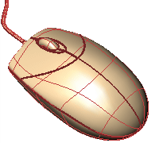
Edge thickness = 3 pixels.
Color reduction %
Lightens the color by a percentage.

Edge color reduction 50%.
Edge color usage
Specifies a color for surface edges
Use object's color
Use the color specified in the object's [Properties](properties.html#displaycolor).
Use isocurve color
Use the color specified for the [isocurves](#surfaceisocurvecolor).
Use single color for all naked edges
Specifies a [color](select-color.html) for all naked surface edges.
Naked edge color
To select a color
Click the color swatch.
### Surface isocurve settings
Isocurve color usage
Specifies a color for surface isocurves.
Use object's color
Use the color specified in the object's [Properties](properties.html#displaycolor).
Use single color for all isocurves
Specifies a [color](select-color.html) for all isocurves.
Isocurve color
To select a color
Click the color swatch.Use specified UV colors
Use separate colors for u and v&#160;isocurves.
U Color/V Color
To select a color
Click the color swatch.Isocurve width
Specifies a width for surface isocurves.
Use single width for all isocurves
Specifies a width for all surface isocurves.
Isocurve width
Specifies a width for surface isocurves in pixels.
Use specified UV widths
Use separate widths for u and v&#160;isocurves.
U width/V width
Specifies the width for u and v&#160;isocurves in pixels.

## Meshes

### Mesh settings
Wireframe color usage
Specifies a color of the mesh wires.
Use object's color
Use the color specified in the object's [Properties](properties.html#displaycolor).
 *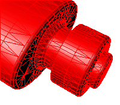* 
Use single color for all meshes
Specifies a color for all mesh wires.
 ** 
Wireframe color
To select a color
Click the color swatch.Wireframe thickness
Mesh wire width in pixels.
Vertex size
Mesh [vertex](meshvertex.html) size in pixels.

### Mesh edge settings
Edge color usage
Specifies a color for mesh edges.
Use object's color
Use the color specified in the object's [Properties](properties.html#displaycolor).
Use single color for all edges
Specifies a color for all mesh edges.
Edge color
To select a color
Click the color swatch.Edge thickness
Mesh edge width in pixels.
Color reduction %
Make the color lighter by a percentage.

### Naked edge settings
Edge color usage
Specify a color for all naked mesh edges.
Use object's color
Use the color specified in the object's [Properties](properties.html#displaycolor).
Use single color for all naked edges
Specify the color for all naked mesh edges.
Edge color
To select a color
Click the color swatch.Edge thickness
Naked mesh edge width in pixels.
Color reduction %
Make the color lighter by a percentage.

### Nonmanifold edge settings
Edge color usage
Specify a color for non-manifold mesh edges.
Use object's color
Use the color specified in the object's [Properties](properties.html#displaycolor).
Use single color for all non-manifold edges
Specify the color for all non-manifold mesh edges.
Edge color
To select a color
Click the color swatch.Edge thickness
Non-manifold mesh edge width in pixels.
Color reduction %
Make the color lighter by a percentage.

## Lines

### Technical line type settings
Hidden line color usage
Specifies a color for all hidden lines.
Use object's color
Use the color specified in the hidden line's [Properties](properties.html#displaycolor).
Use single color for all hidden lines
To select a color
Click the color swatch.Hidden line width
Specify the hidden line width in pixels.
Edge line color usage
Specifies a color for all edge lines.
Use object's color
Use the color specified in the edge line's [Properties](properties.html#displaycolor).
Use single color for all edge lines
To select a color
Click the color swatch.Edge line width
Specify the edge line width in pixels.
Silhouette line color usage
Specifies a color for all silhouette lines.
Use object's color
Use the color specified in the silhouette line's [Properties](properties.html#displaycolor).
Use single color for all silhouette lines
To select a color
Click the color swatch.Silhouette line width
Specify the silhouette line width in pixels.
Intersection line color usage
Specifies a color for all intersection lines.
Use object's color
Use the color specified in the intersection line's [Properties](properties.html#displaycolor).
Use single color for all intersection lines
To select a color
Click the color swatch.Intersection line width
Specify the intersection line width in pixels.

## Shadows

### Shadows
Shadows On
Video memory usage / shadow size
Minimum (grainy shadows)Maximum (sharper shadows)
Soft edge quality / speed
None / fasterSofter / slower
Edge blurring
No blurringMaximum blurring
Self shadowing artifacts
DirtyCleaner
Transparent objects
Never cast shadowsAlways cast shadows
Camera based clipping bubble
NoneMaximum radius
Shadow color
To select a color
Click the color swatch.Shadows ignore user-defined clipping planes

## Other Settings
 [User interface options](javascript:void(0);) Include in View's display menu
Displays the custom display mode in the [viewport title](rhino-window.html#viewport-title-menu) and View menus.
Include in Shade command modes
Offers the custom display mode as an option for the [Shade](shade.html) command.
Allow assignment to individual objects
Allows applying this display mode to objects with the [SetObjectDisplayMode](setobjectdisplaymode.html) command.

### View Scaling
Horizontal scale
Expands the view and grid horizontally.
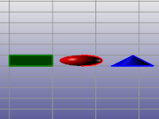
Vertical scale
Expands the view and grid vertically.
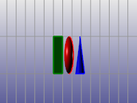

### Display pipeline assignment
{: #pipeline}Pipeline
The display pipeline handles all the drawing of viewports - wireframe, shaded, ghosted, etc. The drawing is either handled by Windows or by OpenGL graphics cards.
Windows(Wireframe modes only)
OpenGL

### Stereo mode settings
Stereo viewing is display-mode specific. Once a display mode is configured to operate in stereo mode, all views that are in that mode will also be viewed in stereo.
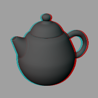
Stereo modes use what is called *asymmetry* stereo.
It is best to make a copy of an Advanced Display mode and turn on the Stereo mode settings for this copied view.
Note
To see if a system supports 3-D shutter glasses, select a stereo display mode.This should cause your view to have two rapidly flickering images. The view will appear almost blurry because of the two slightly offset copies of the viewport image. If you do not see this, and the view looks the same as any other view, then either the refresh rate is not set high enough or the video card does not support it.Video cards designed for games may support hardware stereo mode in DirectX, but not in OpenGL.Stereo usage
Stereo mode disabled
Use hardware 3D shutter glasses
Requires three forms of special hardware:
A video card and drivers that support OpenGL stereo modesA monitor that can support a refresh rate of 100hz or higherA pair of 3-D shutter glasses that can plug in to the back of your special video card.Separation
Parallax
Use anaglyph glasses
A pair of red/blue anaglyph glasses like those that you get at a 3-D movie is required.
Separation
Parallax
Color usage
Use black and white imaging
Use full-color imaging
Glasses configuration
Red and Cyan glasses
Red and Blue glasses
Red and Green glasses
Amber and Blue glasses
Flip left and right lenses
To save options for use on other computers
 [OptionsExport](optionsexport.html) 
Save [Options](options.html) settings to a file.
 [OptionsImport](optionsexport.html#optionsimport) 
Restore [Options](options.html) settings from a file.
See also
 [Viewport display modes](sak-displaymodes.html) 
&#160;
&#160;
Rhinoceros 6 © 2010-2015 Robert McNeel &amp; Associates.11-Nov-2015
 [Open topic with navigation](view-displaymode-options.html) 

