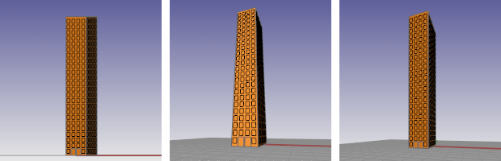
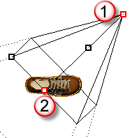

---
---

{: #kanchor2587}{: #kanchor2588}{: #kanchor2589}{: #kanchor2590}{: #kanchor2591}{: #kanchor2592}{: #kanchor2593}{: #kanchor2594}{: #kanchor2595}{: #kanchor2596}{: #kanchor2597}{: #kanchor2598}{: #kanchor2599}{: #kanchor2600}{: #kanchor2601}
# Viewport Properties
 [Where can I find this command?](javascript:void(0);) Toolbars
 [Popup](popup-toolbar.html)  [Properties](properties-toolbar.html)  [Standard](standard-toolbar.html) 
Menus
Edit
Panels
Object Properties
Shortcut
F3
TheViewport Propertiespanel manages [viewport](rhino-window.html#appwindow-viewports) properties.
Three viewport pages (model viewports, page viewports, and detail viewports) contain information and controls that are relative to that viewport.
Viewport properties
{: #title}Title
The [viewport title](rhino-window.html#appwindow-viewporttitle) displays in the top left corner of a [viewport](rhino-window.html#appwindow-viewports).
Width
The [viewport](rhino-window.html) width in pixels.
Height
The [viewport](rhino-window.html) height in pixels.
{: #projection-parallel-perspective}Projection
Parallel
Sets the viewport to a parallel projection.
Parallel views are also called orthogonal views in some systems. In a parallel view, all the grid lines are parallel to each other, and identical objects look the same size, regardless of where they are in the view.
Perspective
Sets the viewport to a three-point perspective projection.
In a perspective view, grid lines converge to a vanishing point. This provides the illusion of depth in the viewport. Perspective projection makes objects farther away look smaller. All three directions converge to a point.
{: #two-point-perspective}Two-point perspective
Sets the viewport to a two-point perspective projection. This means that the z&#160;direction will not converge to a vanishing point.

Parallel projection (left), 3-point perspective projection (center), 2-point perspective projection (right).
{: #cameraandtarget}{: #camera-location}Camera
The camera is the x,y,z position of the viewpoint or eye point.
The target is the x,y,z position in space that is at the center of the viewport and about which the view rotates.
Each viewport has its own camera.

Camera (1) and Target (2) shown with [Camera](camera.html) command.
{: #lens-length}Lens Length
When the projection is set to perspective, you can change the lens length of the camera. A "normal" lens length for a 35 mm camera is 43 to 50 mm.
Rotation
Sets the rotation of the camera about the camera axis (the line between the camera and target).
X Location
The camera x&#160;location in world coordinates.
Y Location
The camera y&#160;location in world coordinates
Z Location
The camera z&#160;location in world coordinates
Distance to Target
The distance from the camera to the target. The target point is projected along the camera axis (the line between the camera and target).
Location
 **Place** 
To pick a location for the camera
Click or type [coordinates.](cursor-constraints.html#coordinate-entry) 
{: #target-location}Target
X Location
The target x&#160;location in world coordinates.
Y Location
The target y&#160;location in world coordinates
Z Location
The target z&#160;location in world coordinates
Location
 **Place** 
To pick a location for the target
Click or type [coordinates.](cursor-constraints.html#coordinate-entry) {: #wallpaper}Wallpaper
Wallpaper is a bitmap that displays behind the grid in a viewport. It does not change when you zoom, pan, or rotate your view.
Filename
Displays the wallpaper file name.
ClickBrowseto select a file.
Show
Shows or hides the wallpaper.
Gray
Displays the wallpaper as a gray image rather than color.
Rhino stores the wallpaper bitmap image in the Rhino document file.

## Layout Viewport Properties
When the active viewport is a layout page, a different set of options is available.
Layout
Title
The layout viewport name.
Layout Settings
Printer
Select the target printer from the list of configured printers.
Layout Width
Sets the width of the paper as well as the width (x length) of the layout. If the paper size not support by the selected printer, thePrintersetting will be disabled.
Layout Height
Sets the height of the paper as well as the height (y length) of the layout. If the paper size not support by the selected printer, thePrintersetting will be disabled.
 **Edit** 
Opens the [Modify Layout](layout.html#new-layout) dialog box.

## Detail viewport properties
When the active viewport is a detail, a different set of options is available.
Detail
Title
Locked
Locks the detail so the view cannot be panned or zoomed.
Projection
Scale
Sets the scale factor for the detail scaling.
Layout: Model
___ *&lt;units&gt;* on layout
___ *&lt;units&gt;* in model
 **Edit** 
Opens the [Modify Layout](layout.html#new-layout) dialog box.
Camera
Lens Length
Rotation
X Location
Y Location
Location
 **Place** 
Target
X Target
Y Target
Z Target
Location
 **Place** 
See also
 [Camera](camera.html) 
Show, hide, or toggle the visibility of the viewport camera.
 [ViewportProperties](#) 
Title, size, projection, camera and target, lens length, wallpaper.
 [Manage viewports](sak-viewports.html) 
 [Manage views](sak-view.html) 
&#160;
&#160;
Rhinoceros 6 © 2010-2015 Robert McNeel &amp; Associates.11-Nov-2015
 [Open topic with navigation](viewport.html) 

