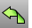
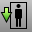

---
---

{: #kanchor2399}
# WalkAbout toolbar
 [To open a toolbar](javascript:void(0);) Toolbars can be opened as a free-standing group or added to the current group.
To open a toolbar as a free-standing group
Click theOptionsicon in any toolbar group.On the menu, clickShow Toolbar, and then select the toolbar name from the list.To open a toolbar as a new tab in the current group
Click theOptionsicon in the toolbar group where you want to add the new tab.On the menu, clickShow or Hide Tabs, and then select the toolbar name from the list. [Lens Length](walkabout.html) 
Link to [Lens Length toolbar](lens-length-toolbar.html) 
 [Step Size](walkabout.html) 
Link to [Step Size toolbar](step-size-toolbar.html) 
 [WalkAbout](walkabout.html) 
Link to [LookAbout toolbar](lookabout-toolbar.html) 
 [WalkAbout,Elevator down](walkabout.html) 
Move camera and target down.
 [WalkAbout,Elevator up](walkabout.html) 
Move camera and target up.
 [WalkAbout,Walk back](walkabout.html) 
Move camera and target back.
 [WalkAbout,Walk forward](walkabout.html) 
Move both camera and target forward.
 [WalkAbout,Walk left](walkabout.html) 
Move camera and target left.
 [WalkAbout,Walk right](walkabout.html) 
Move camera and target right.
&#160;
&#160;
Rhinoceros 6 © 2010-2015 Robert McNeel &amp; Associates.11-Nov-2015
 [Open topic with navigation](walkabout-toolbar.html) 

