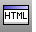

---
---

{: #kanchor2671}
# Web Browser
 [Where can I find this command?](javascript:void(0);) Toolbars
 [File](file-toolbar.html)  [Properties](properties-toolbar.html)  [Standard](standard-toolbar.html) 
Menus
File
Properties
Web Browser properties manage the HTML file or web addresses attached to a 3DM file.
The Web Browser automatically displays associated web addresses in an "always on top" dialog box.
To associate a document with a web page
In theDocument Propertiesdialog box, on theWeb Browserpage, type a web address.Options
Automatically open web address when document is opened
Opens web page when Rhino starts.
Use internal display window
If this control is not checked, the web page opens your web browser separately.
To open a web page
Start the [WebBrowser](webbrowser.html) command.At theChoose web browser optionprompt, clickOpen.See also
 [WebBrowser](webbrowser.html) 
Opens the Web Browser panel.
 [Hyperlink](hyperlink.html) 
Manage URL addresses attached to an object.
 [Manage document properties](sak-documentproperties.html) 
 [Utility functions](sak-utilities.html) 
&#160;
&#160;
Rhinoceros 6 © 2010-2015 Robert McNeel &amp; Associates.11-Nov-2015
 [Open topic with navigation](webbrowser.html) 

