---
---

{: #kanchor2224}{: #kanchor2225}{: #kanchor2226}{: #kanchor2227}{: #kanchor2228}{: #kanchor2229}
# Weld
 [Where can I find this command?](javascript:void(0);) Toolbars
 [Mesh Tools](mesh-tools-toolbar.html)  [STL Tools](stl-tools-toolbar.html)  [Welding](welding-toolbar.html) 
Menus
Mesh
Mesh Edit Tools
Weld
The Weld command removes creases from a mesh by merging coincident [mesh vertices](meshvertex.html).
Individual texture mapping, color, and normal vector data is averaged/created/destroyed for the affected vertices.
Weld will create new vertex normals at each welded vertex that is the average of the adjacent face normals. One vertex is shared by more than one face after welding.
Steps
 [Select](select-objects.html) a mesh.Specify the angle tolerance value.Command-line options
Angle tolerance
If two naked mesh edge points of a selected mesh are coincident, and their neighboring faces are within the angle tolerance of each other, they will be replaced by a single mesh point. If the two points are from different "sub-meshes" of a joined mesh, the meshes become one mesh that cannot explode.
As you change the tolerance, the mesh edges that are within the tolerance, and will therefore be welded, are highlighted.
Your browser does not support the video tag.
# Related commands

## WeldEdge
{: #weldedge}
 [Where can I find this command?](javascript:void(0);) Toolbars
 [Welding](welding-toolbar.html) 
Menus
 [Not on menus.](menuwhattodo.html) 
The WeldEdge command removes creases from a mesh by merging coincident [mesh vertices](meshvertex.html) along selected edges.
Steps
 [Select](select-objects.html) a mesh.Select edges in the selected mesh.Command-line options
Undo
Removes the last selected edge.

## WeldVertices
{: #weldvertices}
 [Where can I find this command?](javascript:void(0);) Toolbars
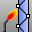 [Mesh Tools](mesh-tools-toolbar.html)  [Welding](welding-toolbar.html) 
Menus
Mesh
Mesh Edit Tools
Weld Selected Vertices
The WeldVertices command removes creases from a mesh by merging all selected [mesh vertices](meshvertex.html).
The WeldVertices command lets you select [mesh vertices](meshvertex.html) to weld, rather than the entire mesh. It does not, however, give you a tolerance angle between faces to weld, like the [Weld](#) command does. You can window select by turning mesh points on and selecting the points prior to the command or you can run the command and then select multiple individual points.
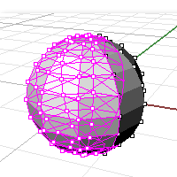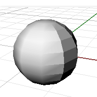
Steps
 [Select](select-objects.html) mesh vertices, and press [Enter](enter-key.html).
## Why Weld?
Welding polygon meshes affect rendering, texture mapping on mesh objects, and file export for stereolithography.

### Smoother Rendering
In wireframe these two meshes look the same.
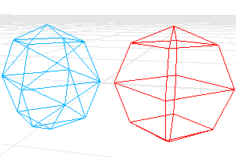
When shaded, the red mesh looks smooth and the blue mesh looks chunky.
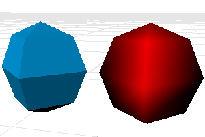
Each triangle vertex in the red mesh is welded to its neighbors. This causes the vertices in the red mesh to look smooth. No points in the blue mesh are welded. This causes the vertices in the blue mesh to look sharp.
Suppose you want the blue mesh to look smoother.
First you have to determine the angle tolerance. The shaded creases of this angle should look sharp.

### Texture Mapping
Texture mapping coordinates control how a texture wraps around the object. These are two-dimensional coordinates that are attached to a polygon vertex, and they determine which point on the texture bitmap maps to this vertex. The points between the vertices interpolate from the vertex values.
The bottom left corner of the bitmap is the origin, the bottom right is (1,0), top left is (0,1) and top right is (1,1). The texture mapping coordinates are always between these values.
Only one pair of texture mapping coordinates can attach to a single vertex. That is why if you weld vertices, thus removing the overlapping duplicates, you throw away all but one pair of texture mapping coordinates.
The loss of texture mapping coordinates is irreversible. You cannot recover the mapping coordinates from the remaining mesh information.
To remove welding (and to also lose the texture mapping coordinates), use the [UnWeld](#unweld) or the [UnWeldEdge](#unweldedge) command.

### STL Mesh Export Diagnostics
In some rapid prototyping machines, STL files must contain completely closed (watertight) polygon mesh objects.
You might want to use the [Join](join.html) command, thenWeld(angle=180), then [UnifyMeshNormals](unifymeshnormals.html) to turn a group of meshes into a single watertight mesh object, and use [SelNakedMeshEdgePt](selection-commands.html#selnakedmeshedgept) to find the open (naked) edges. Following this procedure will ensure that the meshes really do fit together before exporting them for use in an expensive STL job.
See: [Stereolithography (.stl) Import/Export](stereolithography-stl-import-export.html).

## Unweld
{: #unweld}
 [Where can I find this command?](javascript:void(0);) Toolbars
 [Welding](welding-toolbar.html) 
Menus
Mesh
Mesh Edit Tools
Unweld
The Unweld command adds creases to a smooth mesh by creating coincident vertices.
Steps
 [Select](select-objects.html) a mesh.Specify the angle tolerance value.Command-line options
ModifyNormals
Yes
The vertex normals on each side of the edge take the same value as the face to which they belong, giving the mesh a hard edge look.
No
Each of the vertex normals on either side of the edge is assigned the same value as the original normal that the pair is replacing, keeping a smooth look.

## UnweldEdge
{: #unweldedge}
 [Where can I find this command?](javascript:void(0);) Toolbars
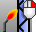 [Welding](welding-toolbar.html) 
Menus
Mesh
Mesh Edit Tools
Unweld Selected Edges
TheUnweldEdgecommand adds creases to a smooth mesh by creating coincident [vertices](meshvertex.html) along selected edges.
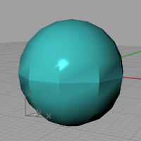
Steps
 [Select](select-objects.html) a mesh.Select edges in the selected mesh.Command-line option
ModifyNormals
Yes
The vertex normals on each side of the edge take the same value as the face to which they belong, giving the mesh a hard edge look.
No
Each of the vertex normals on either side of the edge is assigned the same value as the original normal that the pair is replacing, keeping a smooth look.

## What welding means
Internally, a mesh is defined by two lists:
A list of vertices and their attributes (position, normal, texture coordinates, vertex-color).A list of face definitions describing how these vertices are connected to form faces.
## Examples
Quadrangular mesh
This two-part definition describes two quadrangular faces that do not share vertices as shown in the illustration.
Vertex list
The vertex list is half of the mesh definition, describing the vertices.
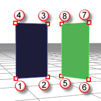
In this example texture coordinates and vertex colors are left out, but those are per-vertex attributes as well.
vertex 1 : location, normal
vertex 2 : location, normal
vertex 3 : location, normal
vertex 4 : location, normal
vertex 5 : location, normal
vertex 6 : location, normal
vertex 7 : location, normal
vertex 8 : location, normal
Face definitions
This list describes how these vertices are connected to form faces.
face 1 : vertex 1, vertex 2, vertex 3, vertex 4
face 2 : vertex 5, vertex 6, vertex 7, vertex 8
Triangular mesh example 1
A mesh with a list like the following example describes two separate triangular faces, not touching each other, as shown in the illustration.
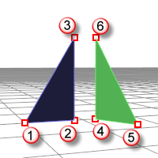
vertex 1 : location, normal
vertex 2 : location, normal
vertex 3 : location, normal
vertex 4 : location, normal
vertex 5 : location, normal
vertex 6 : location, normal
face 1 : vertex 1, vertex 2, vertex 3
face 2 : vertex 4, vertex 5, vertex 6
Triangular mesh example 2
In the next example, imagine two of those six vertices share the same position:
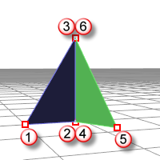
vertex 1 : location, normal
vertex 2 : location, normal
vertex 3 : location, normal
vertex 4 : location, normal
vertex 5 : location, normal
vertex 6 : location, normal
face 1 : vertex 1, vertex 2, vertex 3
face 2 : vertex 4, vertex 5, vertex 6
Here vertices 2 and 4 are at the same position and 3 and 6 are at the same position.
So we have a mesh consisting of two faces that share one edge, but vertices 2, 3, 4 and 6 all have their own individual attributes. So their normals can be different.
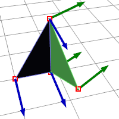
Joined mesh
When you [Join](join.html) a mesh, the vertices and faces are in no way merged; the lists are simply appended. The face normals retain their direction.
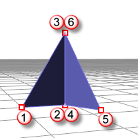

Welded mesh
When you [Weld](#) a mesh and the angle between the faces is below the threshold the common edge will be welded.
The two common vertices are replaced by a new vertex with new attributes:
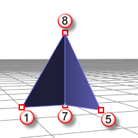
vertex 1 : location, normal
vertex 5 : location, normal
vertex 7 : location, normal
vertex 8 : location, normal
face 1 : vertex 1, vertex 7, vertex 8
face 2 : vertex 7, vertex 5, vertex 8
New normal attributes for vertices 7 and 8 are averaged based on the normals of the faces they are part of, so there is no way to get the previous (pre-weld) normals back.
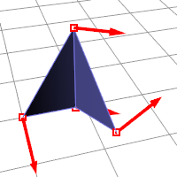
Summary
 [Joining](join.html) does not destroy any vertex attributes. [Welding](#) "merges" vertices on common edges below the angle threshold.The resulting new vertex has it's normal calculated based on the average of the faces it belongs to.See also
 [Edit mesh objects](sak-meshtools.html) 
&#160;
&#160;
Rhinoceros 6 © 2010-2015 Robert McNeel &amp; Associates.11-Nov-2015
 [Open topic with navigation](weld.html) 

