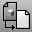

---
---

{: #kanchor1297}{: #kanchor1298}{: #kanchor1299}{: #kanchor1300}{: #kanchor1301}{: #kanchor1302}
# Worksession
 [Where can I find this command?](javascript:void(0);) Toolbars
 [File](file-toolbar.html)  [Worksession](worksession-toolbar.html) 
Menus
File
Worksession
Open
Save
Save As
Attach
Limit
Manage
The Worksession command manages a list of models that are being used as reference geometry.
Note
TheWorksessioncommand lets more than one user work on a large project. By breaking the project down into many files, one user can edit a part of the project while another user edits a different file. Only one user can have a file open for editing, but many users can see it.The attached file can be inany formatthat Rhino can [import](-index-of-import-export-file-types.html), not just Rhino models. Attached geometry cannot be edited (for example, [Move](move.html), [Scale](scale.html) ), but it can be used for input to creation commands (for example, [Copy](copy.html), [ExtrudeCrv](extrudecrv.html) ).When a worksession object is dragged, it snaps back into place.Each user maintains his own worksession (.rws) file. These are not meant to be shared. The Rhino files used as reference geometry are shared, but the .rws files are not.Worksessions cannot be used as [layout](layout.html) elements.Objects can be copied from a worksession file and pasted into the active file.For a description of the process Rhino 5.0 uses to locate files used by worksessions and linked instance definitions, see [Rhino Wiki: File finding](http://wiki.mcneel.com/rhino/rhinov5status_filefinding#searching_for_files).
Layer settings
The attached file geometry appears on a unique set of layers under a parent layer with the name of the attached file, and the attached file layers as sub-layers of the parent.
You can change the layer state of reference layers ( [Color](layer.html#displaycolor), [On/Off](layer.html#on), [Locked](layer.html#lock), [Print Color](layer.html#printcolor), [Print Width](layer.html#printwidth), [Linetype](layer.html#linetype) ), but you cannot add new layers to or delete layers from the attached file. The list of attached files are not saved in the current model file, but are saved in the worksession file (.rws).
Steps
In theWorksession Managerdialog box, clickAttach.Select files to attach.To save the worksession for future use, clickSaveorSave As.The current worksession name appears in the dialog box title.
When you open a worksession file:
Your current model closes. You are prompted to save changes.Your current worksession is cleared.The files listed in the worksession file are opened. The active file is open for editing and the others are attached for reference.The layer states for the files are set.The [Undo](undo.html) command has no affect on worksession actions.Worksession Manager
Status
Marks the file that is currently open for editing.
Locked
Displays the locked/unlocked status of the attached files. A tooltip on the lock icon shows information about who has the file open.
Alias
The attached model name.
Path
The path to the attached file.
Attachments
{: #attach}Attach
Attaches an external file to the worksession list.
Detach
Removes the external file from the worksession list.
Active
The selected model is open for editing.
The current model closes and becomes an attached model. You are prompted to save changes in the currently active model.
{: #update}Update
Refreshes the selected attached files.
Lock Info
Displays the locked/unlocked status of the attached files and information about who has the file open.
Session
Open
Opens a worksession file.
Save
Saves a worksession file.
Save As
Saves a worksession file as another name.
Close
Closes the Worksession Manager.

# Related commands

## LimitReferenceModel
{: #limitreferencemodel}
 [Where can I find this command?](javascript:void(0);) Toolbars
 [Not on toolbars.](toolbarwhattodo.html) 
Menus
File
Worksession
Limit
The LimitReferenceModel command limits the amount of reference geometry that is available to work on by purging the reference geometry that is not needed in the area of interest.
This can make Rhino's display more responsive or simply cull unwanted visual clutter.
Steps
Draw a crossing [sphere](sphere.html) that defines the area of interest.Objects not enclosed or touched by the sphere will be purged from memory.Command-line options
ApplyLimit
Sets the limits of the model.
RemoveLimits
For models with previously applied limits, reloads the current worksession file, restoring the purged objects.

## PurgeRefObjects
{: #purgerefobjects}
 [Where can I find this command?](javascript:void(0);) Toolbars
 [Not on toolbars.](toolbarwhattodo.html) 
Menus
 [Not on menus.](menuwhattodo.html) 
The PurgeRefObjects command deletes selected worksession reference objects from Rhino.
This command is useful for hiding unwanted worksession geometry during the work session.
Steps
 [Select](select-objects.html) the worksession reference objects.Warning
The [Undo](undo.html) command does not work for thePurgeRefObjectscommand. To recover the purged objects, activate another attached file or click **Refresh All** in the Worksession Manager dialog to reload the worksession model.
See also
 [Work with files](sak-file.html) 
 [Manage views](sak-view.html) 
 [Rhino Wiki: File finding](http://wiki.mcneel.com/rhino/rhinov5status_filefinding#searching_for_files) 
&#160;
&#160;
Rhinoceros 6 © 2010-2015 Robert McNeel &amp; Associates.11-Nov-2015
 [Open topic with navigation](worksession.html) 

