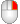
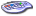
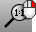
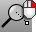

---
---

{: #kanchor1965}{: #kanchor1966}{: #kanchor1967}{: #kanchor1968}{: #kanchor1969}{: #kanchor1970}{: #kanchor1971}{: #kanchor1972}{: #kanchor1973}{: #kanchor1974}
# Zoom
 [Where can I find this command?](javascript:void(0);) Toolbars
 [Standard](standard-toolbar.html)  [View](view-toolbar.html)  [Set View](set-view-toolbar.html) 
Menus
View
 [Viewport title](rhino-window.html#viewport-title-menu) 
Pan, Zoom, Rotate
View and Layout title
Zoom
Shortcut
 [Ctrl](ctrl-key.html) +W
 [Ctrl](ctrl-key.html) +
(Mouse scroll with wheel)
The Zoom command moves the viewport [camera](viewport.html#camera-location) point toward and away from the [target](viewport.html#target-location) point.
Your browser does not support the video tag.Command-line options
Window (default)
Draws a window to define the view
Hold down the [left mouse button](mouse-buttons.html) and drag a rectangle in a viewport to define the view.All{: #all}
Zooms all viewports.
Options
{: #all-extents}Extents
Zooms all viewports to show all objects.
Shortcut
 [Ctrl](ctrl-key.html) + [Alt](alt-key.html) +E
{: #all-selected}Selected
Zooms all viewports to show all selected objects.
1to1
Zooms all viewports so that the views are full scale.
{: #dynamic}Dynamic
Zooms the view as you drag the mouse.
Hold down the [left mouse button](mouse-buttons.html) and drag the mouse up and down to zoom in and out.{: #extents}Extents
Zooms the view to show all objects.
Shortcut
 [Ctrl](ctrl-key.html) + [Shift](shift-key.html) +E
{: #factor}Factor
Zooms the view in or out the specified amount. Values greater than 1 zoom in; values between 0 and 1 zoom out.
In
Zooms the view in.
Out
Zooms the view out.
{: #selected}Selected
Zooms the view to show all selected objects.
{: #target}Target
Zooms the view by specifying a target and window.
 [Pick](pick-location.html) a location for the view center.A rectangular window forms to define the zoom with the [target](viewport.html#cameraandtarget) as the view center.When you rotate a view after Zoom Target, the scene will rotate about the target. This is particularly useful in perspective views.{: #zoom-1to1}1To1
Zooms the active viewport so that the view is full scale.
The command must be [calibrated](#zoom1to1calibrate) for this command to work properly.
In [perspective](viewport.html#projection-parallel-perspective) views, only objects on the target plane will be displayed full scale; in [parallel](viewport.html#projection-parallel-perspective) views objects on any plane perpendicular to the camera axis are displayed full scale.
The model must have [units](unit-systems.html) set.
MouseorKeys
Shortcut
Zoom Action

 [Mouse wheel](mouse-buttons.html) 
Zoom In and Out
 [Ctrl](ctrl-key.html) + [Right-mouse](mouse-buttons.html) 
Zoom Dynamic [Ctrl](ctrl-key.html) + [Shift](shift-key.html) + [Alt](alt-key.html) + [Right-mouse](mouse-buttons.html) 
ZoomLens
Z
Zoom

Page Up
Zoom In

Page Down
Zoom Out

 [Ctrl](ctrl-key.html) +W
Zoom Window

 [Ctrl](ctrl-key.html) + [Shift](shift-key.html) +E
Zoom Extents

 [Ctrl](ctrl-key.html) + [Shift](shift-key.html) + [Alt](alt-key.html) +E
Zoom Extents All Viewports

# Related commands

## DollyZoom
{: #kanchor1977}
{: #kanchor1976}
{: #kanchor1975}
{: #dollyzoom}
 [Where can I find this command?](javascript:void(0);) Toolbars
 [Lens Length](lens-length-toolbar.html)  [Set View](set-view-toolbar.html)  [View](view-toolbar.html) 
Menus
View
 [Viewport title](rhino-window.html#viewport-title-menu) 
Set Camera
Adjust Lens Length and Dolly
The DollyZoom command moves the camera location and changes the lens length at the same time, keeping the objects at the target plane about the same size.
DollyZoom is effective in Perspective viewports only.
Steps
Click the [left mouse button](mouse-buttons.html) in the viewport and drag.When the cursor moves near the viewport corners, a snapping mode is enabled. The Lens length of the view camera snaps in 5 mm increments.Your browser does not support the video tag.
## Zoom1To1Calibrate
{: #zoom1to1calibrate}
 [Where can I find this command?](javascript:void(0);) Toolbars
 [Set View](set-view-toolbar.html) 
Menus
View
 [Viewport title](rhino-window.html#viewport-title-menu) 
Zoom One to One Calibration
The Zoom1To1Calibrate command calibrates the screen for the Zoom command, [1To1](#zoom-1to1) option.
Steps
Measure the bar on the screen with a ruler.Type the length and unit system in the calibration box.
## ZoomLens
{: #zoomlens}
 [Where can I find this command?](javascript:void(0);) Toolbars
 [Set View](set-view-toolbar.html)  [View](view-toolbar.html) 
Menus
View
 [Viewport title](rhino-window.html#viewport-title-menu) 
Set Camera
Adjust Lens Length
Shortcut
 [Ctrl](ctrl-key.html) + [Shift](shift-key.html) + [Alt](alt-key.html) +
The ZoomLens command adjusts the lens length of the viewport camera in a perspective view.
Command-line options
In
Makes the lens length longer.
Out
Makes the lens length shorter.

## SetZoomExtentsBorder
{: #setzoomextentsborder}
 [Where can I find this command?](javascript:void(0);) Toolbars
 [Not on toolbars.](toolbarwhattodo.html) 
Menus
 [Not on menus.](menuwhattodo.html) 
The SetZoomExtentsBorder command sets the amount of blank space between objects and the viewport edges when the Zoom command, Extents option is used.
After the object extents bounding box is calculated, this box is scaled based on the scale factors set by this command, increasing the space between objects and the viewport borders.
Command-line options
Specify a scale for the view border.
Scale factor
Greater than 1
Increases the space between objects and the viewport borders.
Less than 1
Decreases the space between objects and the viewport borders.
ParallelView
Sets the border size for parallel views.
PerspectiveView
Sets the border size for perspective views.
See also
 [Navigate in the viewports](sak-navigate.html) 
&#160;
&#160;
Rhinoceros 6 © 2010-2015 Robert McNeel &amp; Associates.11-Nov-2015
 [Open topic with navigation](zoom.html) 

