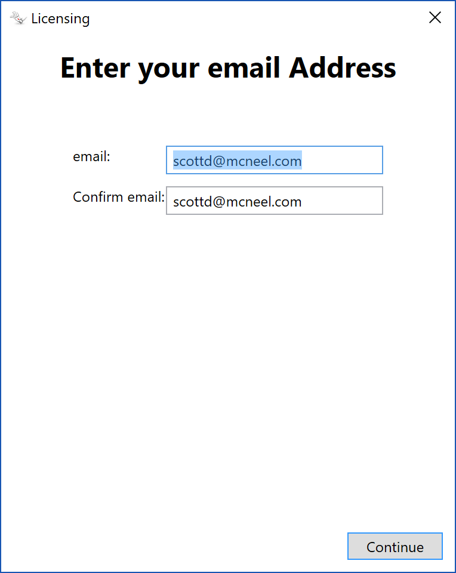
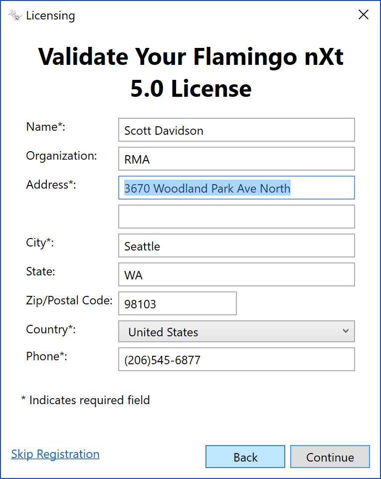
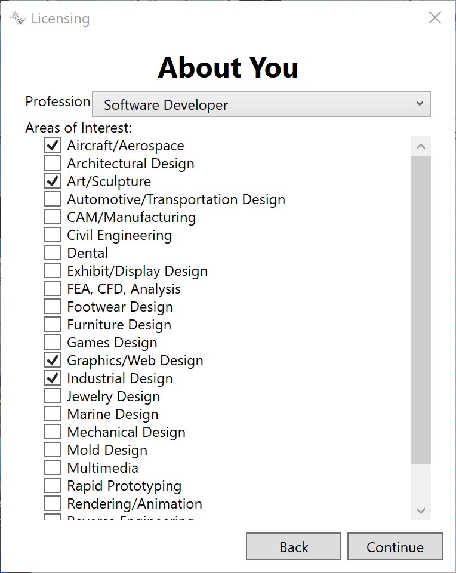
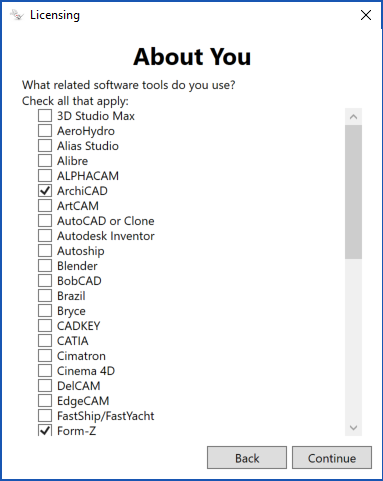
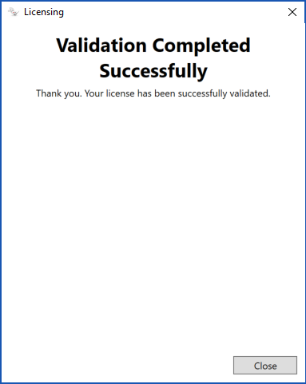
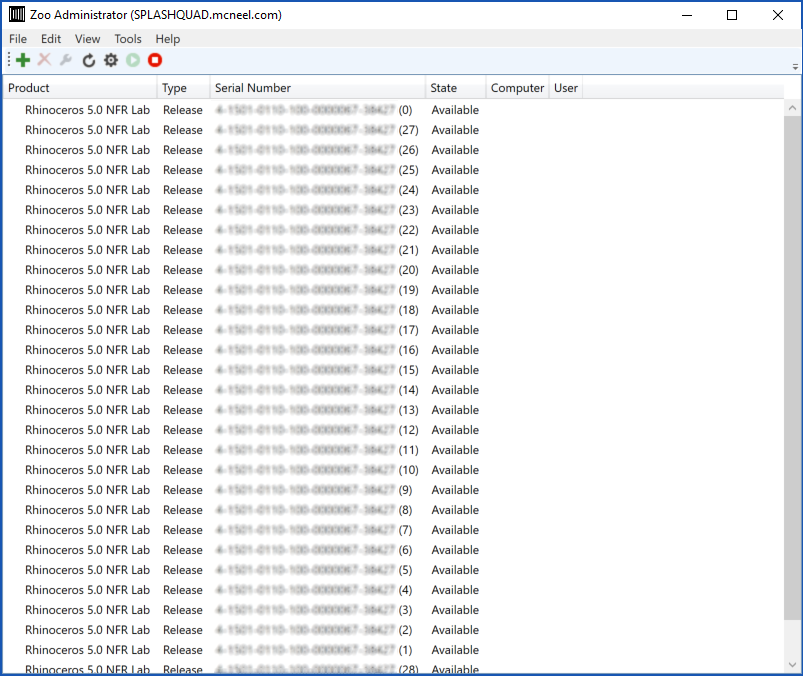
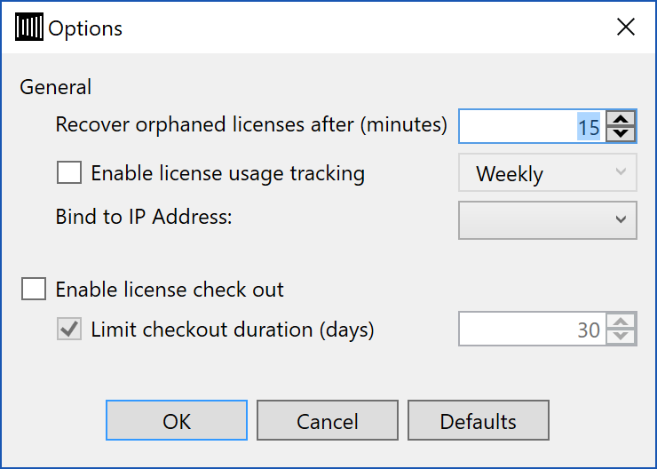

## Installation

To begin using the Zoo:

- The Zoo requires the Microsoft .NET Framework 4.
- [Download](http://wiki.mcneel.com/zoo/home) and install the Zoo on a Windows-based server or workstation.
- Make sure **TCP Port 80 (HTTP)** is open on any firewall software that is running on the server or workstation.
- Run the **Zoo Administrator (ZooAdmin.exe)** and add the license keys for Rhino or your Rhino-based products.
- Install Rhino or your Rhino-based products. During the installation, select **Network Node** as your license type and specify either the host name or IP address of your Zoo server.

If you already have Rhino installed, then launch Rhino and click **Tools → Options → Licenses**. Select your Rhino license and click **Convert**. Then, close Rhino and restart. At startup, select **Network Node** as your license type and specify either the host name or IP address of your Zoo server.

## Adding Licenses

When you add a Rhino 5 license to the Zoo, you will be asked to validate the license online. Rhino 5 licenses must be validated before they can be used.

> Critical: if you are upgrading to Rhino 5, you need to keep track of which previous version CD-Key you used to upgrade. You can only use each previous version CD-Key once.

The only piece of information used during license verification is your CD-Key, which is included when you buy Rhino.

Registration is not required, nor is any personal information. No computer-specific information, or information derived from your computer is sent to Robert McNeel & Associates.
  
To add licenses to the Zoo, run the **Zoo Administrator (ZooAdmin.exe)**, and then click **Edit → Add**.

{:width="300px"}

1. Select your product type from the drop down list.
1. Enter the registered owner and organization of the product.
1. Enter your licence code or CD key.
1. Click **OK** begin license validation.
1. Enter your E-mail Address  {:width="300px"}
1. Enter Previous Version CD-Key (Upgrade Only) {:width="300px"}
1. Enter Registration Information (Optional) {:width="300px"}  {:width="300px"}
1. Validation Complete ![rhinovalidate4.png] {:width="300px"}

## Managing Licenses

Licenses can be managed by running the **Zoo Administrator (ZooAdmin.exe)**.

{:width="600px"}

Zoo licenses have three states, check can be viewed in the Zoo Administrator:

1. **Available** - the license is not in use.
2. **In use** - the license is loaned out, or in use.
3. **Checked out** - the license has been checked out on a semi-permanent basis.

#### Recovering Licenses

The Zoo will automatically recover loaned licenses due to either network interruption or abnormal product shut down.

There may be an occasion where you will be required to do this manually. To recover an "in use" license, select the license from the list and then click **Edit → Recover**.

Note, recovering licenses that are still in use can lead to license conflicts.

#### Checking In Licenses

The Zoo can allow licenses be checked out, on a semi-permanent basis, so laptop users can disconnect from the network. The licenses can be checked in again when the laptop is reconnected to the network.

There may be an occasion where you will be required to do this manually. To check in a checked out license, select the license from the list and then click **Edit → Recover**.

Note, checking in licenses that are still checked out can lead to license conflicts.

#### Remote License Monitoring

The Zoo allows administrators and users to monitor license usage from the convenience of their web browser. Just visit the "status" page provide by your Zoo server by entering:

```
http://<zoo_server_host_name>/status
```

into your favorite web browser. For example, if your Zoo server's host name is **zooserver.mycorp.com**, then you'd enter:

```
http://zooserver.mycorp.com/status
```

#### Exporting Serial Numbers

The Zoo can export a comma-separated-value (.CSV) file that contains the serial numbers (not CD keys) of all licenses maintained by the Zoo. This can be useful if you have difficulties in locating all of your product CD keys. You can export the serial number and then e-mail them to McNeel, who in turn can look up your misplaced license information. To export serial numbers, click **File → Export**.

#### Zoo License Files

The Zoo stores licenses in the following folder:

```
%PROGRAMDATA%\McNeel\Zoo\5.0\Licenses
```

Note, Zoo license files cannot be moved from Zoo server to another Zoo server.

Also note, it is not possible to recover lost product license codes or CD keys from the Zoo. So, make sure to store your product license codes and CD keys in a safe location.

#### Zoo Usage Tracking Files

The Zoo stores usage tracking files in the following folder:

```
%PROGRAMDATA%\McNeel\Zoo\5.0\Usage
```

## Zoo Options

To configure Zoo options, run the **Zoo Administrator (ZooAdmin.exe)**, and then click Tools → Options.

{:width="600px"}

#### License Recovery

Rhino and Rhino-based products update their license status, with the Zoo, every 5 minutes. If a license fails to be updated for the specified duration, because of either network interruption or abnormal product shut down, then the license will be considered orphaned and automatically recovered so other users can access it.

#### Recover orphaned licenses after <minutes> minutes.

This parameter specifies how long the Zoo will wait before recovering orphaned licenses.
The default value is 15 minutes.

#### License Check Out

The license check out feature allows licenses can be checked out, on a semi-permanent basis, so laptop users can disconnect from the network. The licenses can be checked in again when the laptop is reconnected to the network.

If a license is checked out, it cannot be used by another system until it is checked back in.

To check out a license, launch Rhino, click Tools → Options → Licenses.

#### Enable License Check Out

Enables or disabled license check out.

The default value is to have license check out disabled (unchecked).

#### Enable Limited License Check Out

When a license is checked out, it is done so on an unlimited basis unless limited license check out is enabled. The advantage of limited license check out is that checked out licenses will automatically checked in after the specified duration has elapsed.
The default value is to have limited license check out disabled (unchecked).

#### Limit license check out to <days> days.

This parameter specifies how long the Zoo will wait before automatically checking in checked out licenses.
The default value is 30 days.

#### Usage Tracking

The Zoo is capable of recording licensing activities for the purpose of tracking product usage. These records can then be used to generate statistics for accounting or billing purposes.

The Zoo records license activities in Comma-Separated-Value, or CSV, text files. These files can be viewed with any text editor, such as Windows Notepad, or imported in products such as Microsoft Excel for sorting and analysis.

Zoo usage tracking files contain the following information:

- Date - The date and time of the transaction.
- Type - The type of transaction:
  - License loaned out - A license was loaned out.
  - License returned - A loaned out license was returned.
  - License checked out - A license was checked out.
  - License checked in - A checked out license was checked in.
  - License recovered - An orphaned license was automatically recovered.
  - License check out expired - A checked out license was automatically checked in because the check out duration expired.
  - License expired - An existing license has expired and had been deleted.
  - License added - A new license was added using the Zoo Administrator.
  - License deleted - An existing license was deleted using the Zoo Administrator.
  - Administrator returned - A loaned out license was returned using the Zoo Administrator.
  - Administrator checked in - A checked out license was checked in using the Zoo Administrator.
  - License status updated - The status of a license was updated.
  - Unknown - An unknown event has occurred.
- Computer - The system involved in the transaction.
- User - The user logged into the system during the transaction.
- Product - The product used for the transaction.
- Total - The total number of licenses maintained by the Zoo for that product.
- Used - The total number of licenses for that product that are in use after the transaction.

To view the usage tracking files, from the Zoo Administrator, click Tools → View Tracking.

#### Enable license usage tracking

Enables or disabled license usage tracking.

The default value is to have usage tracking disabled (unchecked).

#### Usage Tracking File Rotation

Allows you to specify the period of the usage tracking. That is, how often you want the usage tracking files rotated; either on a daily, weekly, or monthly basis.

Note, usage tracking files are named by the date in which the tracking file was created in a <YEAR><MONTH><DAY>.CSV format.

The default value is to track usage on a weekly basis.

# Advanced Topics

## Finding the Zoo

When Rhino 5 needs a license from a Zoo 5 server, it determines the name of the Zoo 5 server by looking in the following locations in order:

1. Looks in the Current User hive of the Windows Registry for the host name or IP address of your Zoo server.
2. Looks in the Local Machine hive of the Windows Registry for the host name or IP address of your Zoo server.
3. Queries your Domain Name System (DNS) server for the default Zoo server name.

#### Registry Key - Current User

When searching in HKEY_CURRENT_USER, of the Windows Registry, for the host name or IP address of your Zoo server, both Rhino 5 32-bit and Rhino 5 64-bit will look in this location:

```
Hive:HKEY_CURRENT_USER
Key:   Software\McNeel\Rhinoceros\5.0\License Manager
Name:  Server
Type:  REG_SZ
Value: <host name or IP address>
```

#### Registry Key - Local Machine

If you are using a 32-bit version of Windows, then when searching in HKEY_LOCAL_MACHINE, of the Windows Registry, for the host name or IP address of your Zoo server, Rhino 5 32-bit will look in this location:

```
Hive:  HKEY_LOCAL_MACHINE
Key:   Software\McNeel\Rhinoceros\5.0\License Manager
Name:  Server
Type:  REG_SZ
Value: <host name or IP address>
```

If you are using a 64-bit version of Windows, then when searching in HKEY_LOCAL_MACHINE, of the Windows Registry, for the host name or IP address of your Zoo server, both Rhino 5 32-bit and Rhino 5 64-bit will look in this location:

```
Hive:  HKEY_LOCAL_MACHINE
Key:   SOFTWARE\Wow6432Node\McNeel\Rhinoceros\5.0\License Manager
Name:  Server
Type:  REG_SZ
Value: <host name or IP address>
```

#### DNS

If a host name or IP address is not found in the above locations, then the license manager will query the system's default DNS server using the default Zoo server host name.

The default Zoo server host name is:

`__mcneel.__zoo5.<your second-level domain>`

For example, of your organization's second-level domain name is **mycorp.com**, then Rhino's license manager will query the system's default DNS server for a host named **__mcneel.__zoo5.mycorp.com**.

To make it easier to deploy Rhino and Rhino-based products on your network, you might consider adding a **CNAME**, or Canonical Name, record to your organization's DNS server. A CNAME record specifies that the domain name is an alias of another, canonical domain name.

## Moving the Zoo

Moving the Zoo license manager software from one server to another is really no different than installing the Zoo software from scratch.

Note, there is no way to “move” or “copy” McNeel product CD-Keys from one Zoo server to another. Product CD-Keys must be added to the new Zoo server just as you did with your original Zoo server.