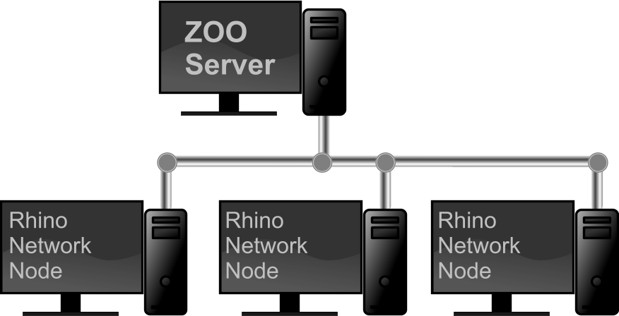

# Overview

The Zoo lets you share, or float, the licenses of Rhino and Rhino-based products among users on the same network. When one of these products is installed as a **Network Node**, instead of as a Standalone Node, it will work like this:

- When a Network Node starts, it requests a license from the Zoo.
- An unused license is assigned to the Network Node.
- When a Network Node shuts down, the license is returned to the Zoo's license pool.

### Is the Zoo right for you?

The Zoo is right for you only if:

- You are using [compatible products](https://wiki.mcneel.com/zoo/products). **\*Note:** If you have Rhino 4, you need [Zoo 4](https://wiki.mcneel.com/zoo4/home).*
- You have more users than licenses.
- You want to manage many licenses in one place.
- You are **not** an individual with multiple computers. *[See the license agreement...](http://files.na.mcneel.com/rhino/5.0/docs/rh50_eula.pdf)*

### Zoo network architecture

{:width="600px"}

1. Chose one Windows computer on your network to host the Zoo utility.  This is normally a computer that is on all the time.
2. Install Rhino on all the computers that might run Rhino.  During installation use the Network Node option
3. Everytime Rhino starts, it will request a license from the Zoo.  If a license is available, the Zoo will grant a license to Rhino.
4. If there are no licenses available for Rhino, Rhino will display a message that no license are available.

For more details, see the [Zoo overview video](https://vimeo.com/89968285)

### Features

The Zoo had a number of unique features:

- **Free** - The Zoo is a free [download](http://wiki.mcneel.com/zoo/home).

- **No extra costs** - Special versions of Rhino and Rhino-based products are not needed.

- **No special hardware is needed** - The Zoo will run on any system on your network.

- **Simple setup** - Install the Zoo on any system on your network, and then enter the license keys into the Zoo instead of the individual systems.

- **Routable** - The Zoo works on both single-segments networks, or networks where systems are separated by routers.

- **Multiple server** - You can have more than one Zoo server running at a time, with each serving different clients.

- **Mixed environment** - A mixture of Network Nodes and Standalone Nodes on the same network is supported.

- **Check out** - License keys can be checked out so laptop users can disconnect from the network. The key can be checked in again when the laptop is reconnected to the network.

- **Robust** - Network nodes will keep working even if the network connection or server is down, but Network Nodes cannot start up without access to the Zoo.

- **Runs as a service** - The Zoo is a Windows Service. If you reboot the system with the Zoo, you do not have to log onto the computer to start the Zoo.

### What's New?

  Zoo 5 is a brand new version of the Zoo. Completely rewritten, Zoo 5 provides a number of new features not found in prior Zoo versions, including:

  - **Standard Internet Protocol Support** - Clients communicate with Zoo 5 using TCP Port 80 (HTTP). This makes it much easier for system administrators to route Zoo requests on complex networks or even over the Internet.
  - **Firewall Friendly** - Zoo 5 requires the client to periodically check with the server, but never initiates connections back to the client. Administrators no longer need to open additional firewall ports on client machines.
  - **Limited License Check Out** - Prior Zoo version allows for license check out to support laptop users or for business travel. But there was no limit to the check out duration. Zoo 5 allows the administrator to specify the license check out duration.
  - **Remote License Monitoring** - Zoo 5 allows users and administrators to monitor license usage from the convenience of their web browser.
  - **3rd Party Plug-in Support** - Prior Zoo version only maintained licenses for McNeel product (e.g. Rhino. Flamingo, Bongo, Brazil, and Penguin). Zoo 5 allows 3rd party plug-in developers to add support for their products to the Zoo.

## System Requirements

- A Windows-based system that supports .NET Framework 4.5:
  - Windows 7 SP1 or newer
  - Supported operating systems
  - (Windows XP not supported.)
- Microsoft .NET Framework 4.5
- A network connection configured for TCP/IP.

> Note, the Zoo communicates using TCP Port 80. So, the Windows-based system you choose to install Zoo 5 on should not already have other software running that uses TCP Port 80, including:

- Internet Information Services (IIS) for Windows® Services
- Apache HTTP Server
- Skype

## Supported Products

The following McNeel products are supported by Zoo 6:

| Product             |   Commercial    |      | Educational |      | Educational Lab |
| :------------------ | :-------------: | ---- | :---------: | ---- | :-------------: |
| Rhino 5 for Windows |       Yes       |      |     No      |      |       Yes       |
| Rhino 5 for Mac     |       Yes       |      |     No      |      |       Yes       |
| Bongo 2.0           |       Yes       |      |     No      |      |       Yes       |
| Brazil 2.0          | Yes1 |      |     No      |      | Yes1 |
| Flamingo nXt 3.0    | Yes1 |      |     No      |      | Yes1 |
| Flamingo nXt 5.0    |       Yes       |      |     No      |      |       Yes       |
| Penguin 2.0         | Yes1 |      |     No      |      | Yes1 |

1. *Requires Rhino 5 SR6 or greater, and Zoo 5 SR6 or greater.*

Products supported by the legacy Zoo 4:

| Product          | Commercial |      | Educational |      | Educational Lab |
| :--------------- | :--------: | ---- | :---------: | ---- | :-------------: |
| Rhino 2.0        |    Yes     |      |     Yes     |      |       No        |
| Rhino 3.0        |    Yes     |      |     Yes     |      |       No        |
| Rhino 4.0        |    Yes     |      |     Yes     |      |       Yes       |
| Bongo 1.0        |    Yes     |      |     Yes     |      |       No        |
| Brazil 2.0       |    Yes     |      |     Yes     |      |       Yes       |
| Flamingo 1.0     |    Yes     |      |     Yes     |      |       No        |
| Flamingo 1.1     |    Yes     |      |     Yes     |      |       No        |
| Flamingo 2.0     |    Yes     |      |     Yes     |      |       Yes       |
| Flamingo nXt 3.0 |    Yes     |      |     Yes     |      |       Yes       |
| Penguin 1.0      |    Yes     |      |     Yes     |      |       No        |
| Penguin 2.0      |    Yes     |      |     Yes     |      |       Yes       |

## Technical support

Please contact us with any support questions:

- Help http://docs.mcneel.com/zoo/5/en/index.html
- Wiki http://wiki.mcneel.com/zoo/zoo5
- 24/7 Forum Support http://discourse.mcneel.com/category/zoo
- Email tech@mcneel.com
- Development http://wiki.mcneel.com/developer/zoo