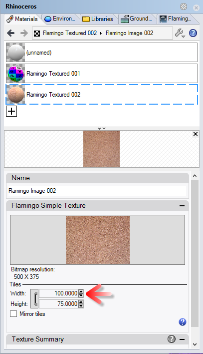
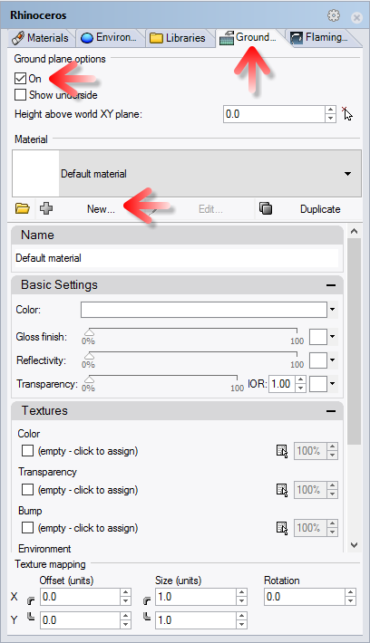

<!-- TODO: Make sure to update this page and get working in the guides section of the documentation. -->

# {{page.title}}
Este tutorial muestra cómo renderizar un modelo estándar de Rhino con nXt. Este tutorial describe los siguientes pasos básicos de renderizado con nXt:

1. Abrir un modelo
1. Crear materiales
1. Editar materiales
1. Agregar un plano de suelo

El primer paso es descargar y descomprimir los archivos del tutorial. Para descargar el archivo zip, haga clic en el enlace [Fishing Reel.zip](files/nxt5%20fishing.zip). Descomprima estos archivos en la misma carpeta en un lugar que recuerde en su ordenador. Abra el archivo Fishing Reel.3dm en Rhino. Compruebe que Flamingo nXt sea el renderizador actual en menú Renderizado.

## Comprobar el motor de renderizado actual
{: #check-current}
Rhino puede tener varios motores de renderizado instalados. Para comprobar que Flamingo nXt 5 es el motor de renderizado actual, vaya al menú Renderizado > Renderizador actual > Flamingo nXt 5.  Si hay una marca de verificación junto a Flamingo nXt 5, significa que es el motor de renderizado actual.

## Proceso de renderizado
{: #render_controls}
{: .float-img-right} Para el primer renderizado del modelo, haga clic en el botón para renderizar. La imagen se verá como la imagen de la derecha. nXt funciona de diferente manera que las versiones anteriores de Flamingo. Un nuevo modelo incluirá una configuración de iluminación HDRI predeterminada.  Los nuevos modelos usarán un material blanco predeterminado para todos los objetos. Además, verá que las sombras son muy definidas y lineales. Con cada pase, las sombras se suavizarán y se mezclarán. Hay muchos otros efectos que también mejorarán con cada pase de renderizado.

Algunos de los efectos que mejoran en cada pase son

* Iluminación (como la iluminación global, si está activada)
* Sombras suaves
* Reflejos (desenfoque)
* Refracción
* Antialias
* Profundidad de campo

De este modo, un renderizado de nXt nunca está "acabado"; es el usuario quien decide cuándo quiere detenerlo. Este sistema permite ir mejorando imágenes que ya se ven bien. Pero también puede detener una imagen en cualquier momento, por si desea cambiar o guardar cualquier cosa. Puede detener el renderizado de varias maneras:
{: .clear-img}

* Haga clic en el botón Detener trazado de rayos para detener el renderizado al final del pase actual.
* Haga doble clic en Detener trazado de rayos para detener el renderizado inmediatamente.
* Haga clic en el botón "X" en la parte superior de la ventana de renderizado para detener el renderizado inmediatamente y cerrar la ventana de renderizado.

## Asignar materiales desde la librería
{: #materials}
La iluminación básica ya está integrada en nXt, de modo que crear los materiales correctos es donde empieza la configuración de los renderizados. Los materiales se guardan directamente en cada modelo. Para crear un conjunto de materiales, se pueden utilizar las plantillas de material que le ayudarán a crear nuevos materiales con rapidez.

  1. Abra el panel de control de Flamingo nXt desde el menú desplegable de Flamingo nXt en Rhino.
  1. Para asignar un material existente. Vaya a la ficha Librería en el Panel de control.
  1. Los materiales se organizan en carpetas. Ir a la carpeta Materiales de Flamingo.
  
  1. Vaya a la carpeta Materiales de Flamingo > Metales.
  {: .wide-img}
  1. Arrastre y coloque el material de Cromo a la capa Handle and Metal Parts.
  1. Renderice los resultados. Las partes de la capa Handle and Metal Parts ahora se renderizarán con un acabado de cromo.
  
  1. Ahora asigne el resto de estos materiales a estas capas:

 | Librería | Material | Capa |
 |:-------|:------|:------|
 | Naval | Goma negra | Bushing & Washer |
 | Naval | Goma negra | Grips |
 | Naval | Goma negra | Rod Grips |
 | Pintura de coche | Pintura de coche roja | External Body |
 | Metales > Oro | Oro - Satinado, plano | Internal Body |
 | Metal > Anodizado | Aluminio - Anodizado rojo | Spool |
 | Plástico > Negro > Suave | Plástico negro - Suave | Rod |
 | Plástico > Negro > Suave | Plástico negro - Suave | Rod Handle |
 | Plástico > Negro > Suave | Plástico negro - Suave | Wire Guide |
{: .grided-table}

##### Renderice para ver estos resultados:
 

## Crear un nuevo material
{: #new-material}
En ocasiones, necesitará un material que está predefinido en la Librería. Por ejemplo, el mango de la caña de pescar debe cubrirse con corcho. La única opción es crear un nuevo material. Para el material de corcho, crearemos un nuevo tipo de material texturizado.

 1. Vaya a la ficha Materiales.
 1. Desplácese hasta la parte inferior de la lista de materiales.
 1. Seleccione el botón Nuevo material (signo más).
  
 1. Seleccione un nuevo material Texturizado de Flamingo.
 1. Se le solicitará designar una textura.
 1. Navegue hasta el directorio creado al descomprimir los archivos de los tutoriales, seleccione Cork.jpg y haga clic en Abrir.
 1. Podrá ver que ha creado un material texturizado simple. El tamaño de loseta del bitmap a menudo es importante. Para cambiar tamaño de loseta, haga clic en el nombre del bitmap.

 1. Ajuste el tamaño de loseta a 100 de anchura.

 1. En el campo de nombre, escriba "Corcho" y pulse Aceptar.

 1. Una vez creado, asigne el material de Corcho a la capa Cork Handle arrastándolo sobre la capa.

## Activar el Plano de suelo
{: #groundplane}
Agregar un plano de suelo puede ayudar a colocar el objeto en la escena.

1. Abra el panel de Plano de suelo.  Si no está visible, haga clic en otra pestaña del panel y seleccione Plano de suelo.
1. Haga clic en Activar para activar el plano de suelo.  En este caso, usaremos la altura del plano de suelo predeterminada.
1. Será necesario crear un nuevo material para el plano de suelo. Desplácese hasta la parte inferior de la lista de materiales y haga clic en el icono símbolo más.

1. Seleccione un nuevo material Texturizado de Flamingo.
1. Se le solicitará designar una textura.
1. Navegue hasta el directorio creado al descomprimir los archivos de los tutoriales, seleccione Deckwood.jpg y haga clic en Abrir.
1. Podrá ver que ha creado un material texturizado simple. El tamaño de loseta del bitmap a menudo es importante. Para cambiar tamaño de loseta, haga clic en el nombre del bitmap.
1. Ajuste el tamaño de loseta a 125 de anchura.
1. En el campo de nombre, escriba "Suelo" y pulse Aceptar.
1. El renderizado debería quedar así:

## Ajuste de la imagen renderizada
{: #image-adjust}
El ajuste de la imagen renderizada después del renderizado es muy importante para sacar el máximo provecho de Flamingo. Se puede realizar en tiempo real antes de guardar la imagen. Muchas veces se recomienda añadir un poco de sobreexposición y quizás algo de brillo.

1. En la ventana de renderizado, vaya a la ficha Flamingo.
1. Asegúrese de que el renderizado se ha detenido haciendo clic en el icono Detener.
1. En Ajustar imagen, cambie el valor de Sobreexposición a 0.1.
1. En Ajustar imagen, cambie el valor de Brillo a 0.1.

1. El resultado debería quedar así:

*Observe los blancos más brillantes (Sobreexposición) y el brillo general (Brillo) de la imagen.  La sobreexposición es especialmente efectiva para generar una imagen más dinámica.*

Aquí termina el tutorial. Esperemos que les sea útil.