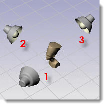
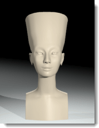

---
---
<!-- TODO: Make sure to update this page and get working in the guides section of the documentation. -->

# Conceptos básicos sobre iluminación de estudio
{: #studio-lighting-bascis}
La iluminación de estudio debe ser definida de manera similar a la que se da en un estudio de fotografía. Para obtener mayor control, utilice fuentes de luz para iluminar la escena.

Al iluminar una configuración de estudio, es importante una iluminación portentosa. Se puede crear una iluminación portentosa agregando mucho contraste. Las áreas oscuras son tan importantes como las áreas claras. Este tipo de iluminación requiere un número de fuentes de luz ubicadas de una manera que produzcan unas áreas muy claras y otras muy oscuras.
La iluminación de estudio más básica emplea una luz principal (1), una luz de relleno (2) y una contraluz (3). Esta es la configuración de iluminación más frecuente para los objetos independientes del estudio. Una configuración de tres puntos dará buenos resultados en seguida y es un punto de inicio excelente para crear efectos especiales. Los focos de luz son útiles porque permiten controlar su dirección y puntos de incidencia para proporcionar dramatismo a la escena.

## Ángulo de cámara
{: #cameraangle}
Los ajustes de iluminación dependen siempre del ángulo de la cámara hacia el sujeto. Es conveniente iniciar la iluminación determinando el ángulo de la cámara. Utilice el comando **Cámara** o **VistaGuardada** para configurar la posición y el ángulo de la cámara. Esto ayudará a determinar la posición de las luces.

## Configuración básica de tres luces
{: basic-three-light-setup}
Una configuración de iluminación de estudio básica incluye tres luces, una luz principal, una luz de relleno y una contraluz.

### Luz principal
{: #keylight}
La luz principal es la luz dominante de la escena. Establece el ambiente, proporciona la dirección, muestra la dimensión y la textura, y crea las sombras más oscuras. Normalmente una luz principal se coloca entre 30 y 45 grados al lado y por encima del objeto, según lo que esté iluminando.
Cuanto más cerca a la cámara esté la luz clave, producirá menos modelado y textura. Una luz clave suele estar más alta que la lente y proyecta sombras hacia abajo. A medida que la luz principal se mueve hacia un lado, aumentamos la propiedad tridimensional del objeto. En la configuración de un retrato clásico, la luz principal se coloca a 45 grados de ángulo entre el sujeto y la cámara, y lo bastante elevada para que proyecte sombras hacia abajo, pero sin que se ensombrezcan los ojos del sujeto.
Si la luz clave es una luz clara, puede que es relleno sea muy poco o nada necesario. También es una solución básica para iluminar pequeños estudios.
La proyección de sombras de la luz clave será visible en el sujeto. En imágenes de caras, este efecto aparece a menudo como una potente sombra proyectada por la nariz.

### Luz de relleno
{: #filllight}
La luz de relleno se coloca justo encima de la lente en el lado opuesto de la luz clave. Su finalidad es reducir el contraste y proporcionar detalle en las sombras mediante la simulación de luz reflejada en los objetos cercanos. La luz clave y la luz de relleno pueden ser de igual intensidad para obtener un resultado de bajo contraste, pero normalmente la luz clave es más brillante e intensa que la de relleno. La luz de relleno es la luz secundaria de la escena. No introduce más sombras oscuras en la escena.
En la imagen, observe que la sombra de la izquierda de la nariz y de la parte izquierda es más clara y suave que la imagen con sólo la luz principal.

### Contraluz
{: #backlight}
El efecto contraluz es sutil pero puede definir los bordes de los objetos de la escena y añadir profundidad evitando que los objetos se mezclen con el fondo. Las contraluces se suelen colocar detrás y encima del objeto, y están orientadas hacia la cámara.
La efectividad de las contraluces depende en parte de la reflectividad de las superficies que iluminan.
En la imagen, la luz de la parte superior de los hombros ayuda a separar el sujeto del fondo. La contraluz también suaviza las sombras y da claridad a la superficie sobre la que se encuentra el objeto.

## Cualidades de las luces
{: #lightquality}
Las imágenes se pueden crear con sombras precisas, brillos y reflejos, pero sin la iluminación adecuada, se perderá el objetivo de la imagen. Al configurar la iluminación, tenga en cuenta cuál es el objetivo. Las imágenes buenas son gráficas y simples. Demasiado brillo en el cristal o muchas sombras en los objetos puede agregar una complejidad innecesaria en una escena y desmejorar la esencia de lo que se intenta destacar.
Algunas de las cualidades a tener en cuenta son:

>El intervalo de contraste de la escena
>La profundidad de la escena (su calidad tridimensional)
>Separación de los objetos del fondo
>Si la iluminación debe ser intensa o suave
>Si la iluminación debe ser de color cálido o frío

### Intervalo de contraste
{: #contrastrange}
El contraste es la diferencia en detalle entre las zonas más brillantes y las más oscuras de una escena determinada. El ojo humano es capaz de emplear un mayor contraste que una película y puede compensar localmente para ver detalles en las zonas extremas. Este efecto se puede apreciar en fotos tomadas en un día soleado.
Originalmente, el lado iluminado es demasiado brillante o el lado de sombra es demasiado oscuro; sin embargo, no tuvo problema en visualizar detalles en ambas partes. El contraste es demasiado grande para que una película lo pueda registrar. Lo mismo sucede con las imágenes renderizadas, ya que el ordenador tiene un límite de colores que puede mostrar.

Una imagen de contraste bajo evita que algunos detalles se oscurezcan en las áreas de brillo o de sombras.

### Tridimensionalidad
{: #three-dimensional}
Para representar tres dimensiones en un espacio bidimensional, es necesario crear una impresión de profundidad. Un objeto opaco iluminado por un lado implica profundidad porque queda un lado iluminado y otro lado más oscuro con sombras. Una caja que muestra tres lados tendrá más dimensión si cada lado tiene un valor diferente. Muchas veces el plano superior será el más iluminado porque normalmente la luz viene de arriba en situaciones reales.

### Separación del fondo
{: #separation}
Para que un producto se separe de la página, además de tridimensionalidad y de usar el máximo contraste, tiene que haber una buena separación. Es decir, los bordes del objeto tienen que ser más claros o más oscuros que el fondo. Sin separación, el objeto se mezclará con el fondo.
En la imagen, el brillo de la parte superior del objeto ayuda a separarlo del fondo.
La sombra del objeto puede hacer unas veces que se separare del fondo y, otras veces, que los objetos se fusionen con el fondo. Una contraluz puede facilitar la separación creando un borde iluminado alrededor del objeto.

### Luz dura o suave
{: #hard-soft}
La luz se puede clasificar en dos tipos: luz dura (directa) o suave (difusa).
Una luz dura proyecta una sombra claramente definida.

Una luz difusa proyecta una sombre suave apenas distinguible.
La luz difusa suele producir una imagen más atractiva que la luz dura debido a sus sombras suaves. Cuanto más grande sea la luz y más cerca esté del objeto, más claro quedará. Una luz suave grande puede simular la luz desde una ventana.

La iluminación difusa puede ser conveniente para objetos de plástico oscuro, porque produce una amplia luz que ayuda a definir la forma de los objetos negros brillantes.

En la iluminación de estudio, es importante una luz potente y de alto contraste. Las áreas oscuras son tan importantes como las áreas claras. Una iluminación potente requiere un número de fuentes de luz ubicadas de manera que produzcan unas áreas muy claras y otras muy oscuras.
Normalmente, las técnicas de iluminación para fotografía son las mismas que para renderizado, así que una buena manera de aprender es con uno de los muchos libros que tratan el tema de iluminación fotográfica.
Flamingo nXt incluye [esquemas de iluminación](lighting-tab.html#lighting-presets) predefinidos que ayudan a empezar con la iluminación del modelo. Las opciones de la [ficha Avanzadas](lighting-advanced-tab.html) están optimizadas para cada método de iluminación.