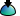

# {: .inline} {{page.title}}
{: #environment-tab}
Los entornos no son solo lo que se ve en el fondo de un renderizado, sino que controlan una esfera infinita que rodea al modelo. Los objetos de la escena reflejarán y refractarán el entorno. La esfera del entorno no es un objeto que pueda seleccionar, sino una superficie de referencia para los efectos del fondo.

El entorno repercute en la parte visible del fondo y los reflejos.  Para obtener más información sobre los efectos que afectan a la iluminación de la escena, consulte el tema [Cielo](sun-and-sky.html) de la Ayuda.

Flamingo viene con un entorno especial denominado *[Entorno predeterminado de Flamingo](environment.html)*.  Este entorno se sincronizará con el actual [Preajuste de iluminación](lighting-tab.html). Al utilizar los [Preajustes de iluminación](lighting-tab.html), tanto la Iluminación como el entorno usarán las opciones predeterminadas de escena apropiadas.

{:  #panel_map height="600px" style="float: right"}

##### ¿Dónde puedo encontrar este comando?
 1. {: .inline} Ficha Entorno
 1. {: .inline} Barras de herramientas de Herramientas de renderizado >  Editor de entornos
 1. {: .inline} Menús > Renderizado > Editor de entornos
 1. Comando > EditorDeEntorno

El panel Editor de entorno se divide en secciones.  Según el tipo de entorno, los paneles avanzados pueden variar.

Los colores y las texturas pueden arrastrarse desde el selector de color y colocarse en cualquier otro selector de color o control del Editor de materiales, la [Paleta de texturas](texturepalette.html) o el [Editor de entorno](environmenteditor.html).
Panel de entorno

 1. [Tipo de fondo](#type)
 1. [Barra de configuración](#settings)
 1. [Lista de entornos](#environment-list)
 1. [Divisor de ventanas](#divider)
 1. [Sección de propiedades de entorno](#properties)
 1. [Nombre](#name)
 1. [Paneles de propiedades de entorno](#panels)

## [Background Type](#panel_map) {: .inline}
{: #type style="clear: both;"}
Seleccione el tipo de fondo para el modelo.  [Entorno](#flamingo-environment) es un entorno de renderizado completo y debería ser la opción predeterminada de Flamingo.  Las otras tres opciones presentan un conjunto mucho más simplificado de opciones que muestran otros modos de definir fondos. Para obtener más información, consulte el tema [Fondo simple de Rhinoceros](http://docs.mcneel.com/rhino/5/help/es-es/commands/environmenteditor.htm#Basic_settings)

Este tema trata del tipo de Entorno.

## [Settings Bar](#panel_map) {: .inline}
{: #settings}
Utilice esta barra para navegar por la lista de entornos.

#### {: .inline} Flecha atrás
Vuelve al entorno actual o a los entornos previamente seleccionados.  Por ejemplo, un entorno con capas reflectantes o refractivas.  Utilice esta flecha para volver al entorno principal desde los detalles de reflexión o refracción.

####  {: .inline} Flecha adelante
Avanza hacia los entornos previamente seleccionados.  Por ejemplo, un entorno con capas reflectantes o refractivas.  Utilice esta flecha para avanzar al entorno principal desde los detalles de reflexión o refracción.

#### {: .inline}  Nombre de entorno actualmente seleccionado
Muestra el nombre del entorno actual y el nivel de edición.  Por ejemplo, si hay un nivel reflectante o refractivo, se muestra ">". Es un buen lugar para ver si el entorno es actual.

#### {: .inline} Menú Herramientas
Muestra el [menú Herramientas](#tools-menu).  Este amplio menú contiene los comandos, las opciones y las utilidades relacionadas con los entornos.

#### {: .inline} Ayuda

## [Environment List](#panel_map) {: .inline}
{: #environment_list}
Lista todos los entornos que contiene el modelo. Un entorno se seleccionará como entorno actual. El entorno actual se usa en el renderizado. Aparecerán esquinas amarillas alrededor del entorno actual.

De esta lista:

* Haga clic en un entorno para hacerlo actual. Una vez seleccionado, las propiedades del entorno se mostrarán en los paneles. Consulte [Propiedades de materiales de renderizado](#properties) para obtener más información
* Desplácese hacia arriba y hacia abajo en la lista para ver todos los entornos del modelo.
* Añada un nuevo entorno utilizando el botón Añadir nuevo {: .inline} que aparece en la parte inferior de la lista.
* Haga clic con el botón derecho en una miniatura par ver el menú contextual de entorno
* Haga clic con el botón derecho en el área en blanco para ver el menú contextual de nuevo entorno

###  {: .inline} Añadir nuevo entorno
{: #add_environment}
Desplácese hasta la parte inferior de la lista de entornos para ver el icono de agregar.

Abre la [librería](libraries.html) de entornos de Contenido de renderizado.
Los entornos de la librería pueden utilizarse como plantillas para crear entornos en el modelo.

### Menú contextual de Entorno
{: environment_context}
Este menú está disponible haciendo clic con el botón derecho en una lista de entornos.  Consulte el [menú Herramientas](#tools_menu) para obtener más información sobre las distintas opciones del menú.

### Menú contextual de Nuevo entorno
{: new_envrionment_context}
Este menú está disponible haciendo clic con el botón derecho en el area en blanco de la lista de entornos.

#### {: .inline} Crear nuevo entorno
Crea un nuevo entorno de Flamingo.

#### {: .inline} Importar entorno desde archivo...
Utilice este comando para seleccionar un entorno previamente exportado.

#### {: .inline} Pegar
Crea un nuevo entorno basado en el contenido del portapapeles.

#### {: .inline} Pegar como instancia
Crea un nuevo entorno basado en el contenido del portapapeles vinculado al original a través de instancias.

#### {: .inline} Cuadrícula
Muestra las vistas previas como rejilla de miniaturas.

#### {: .inline} Lista
Muestra las vistas previas como lista de miniaturas.

#### {: .inline} Árbol
Muestra las vistas previas en forma de árbol anidado.

#### {: .inline} Disposición horizontal
Muestra las vistas previas a la izquierda de los controles.

#### {: .inline} Panel de vista previa
Muestra las propiedades de vista previa de la miniatura seleccionada. Define la geometría, el tamaño, el fondo y el comportamiento de rotación de la vista previa.

#### {: .inline} Flotante
Pone flotante la imagen de vista previa en una ventana de tamaño ajustable.

#### Miniaturas

##### {: .inline} Pequeño
Define el tamaño de las miniaturas al tamaño más pequeño.

##### {: .inline} Mediano
Define el tamaño de las miniaturas al tamaño mediano.

##### {: .inline} Grande
Define el tamaño de las miniaturas al tamaño grande.

##### {: .inline} Mostrar etiquetas
Muestra las etiquetas de los nombres de las miniaturas en el modo Rejilla.
El modo Lista siempre muestra las etiquetas.

##### {: .inline} Mostrar unidades
Muestra el tamaño en unidades del modelo.

##### {: .inline} Actualización automática de vista previa
Actualiza automáticamente todas las vistas previas cuando cambia la configuración.

##### {: .inline} Actualizar todas las vistas previas
Actualiza las vistas previas manualmente cuando la Actualización automática de vista previa está desactivada.

## [Divisor de ventanas](#panel_map){: .inline} {: .inline}
{: #divider}
Arrastre este divisor para cambiar la longitud de la Lista de entornos frente a la longitud de la sección de Propiedades de entorno.

## [Sección de propiedades de entorno](#panel_map) {: .inline}
{: #properties}

### [Nombre de entorno](#panel_map) {: .inline}
{: #name}
Nombre del entorno. El nombre de entorno también se guarda como nombre de archivo al exportar el entorno a la biblioteca. **Nota:** Los entornos se guardan en el modelo de Rhino, los entornos únicos pueden tener el mismo nombre en diferentes modelos de Rhino.

### [Paneles de entorno](#panel_map) {: .inline}
{: #panels}
La sección Propiedades de entorno contiene varios paneles de Entorno. Al hacer clic en la barra de título gris se repliega el panel de Entorno y se oculta el contenido de ese panel.  Vuelva a hacer clic en el título de la barra para mostrar el contenido.

Los paneles de entorno varían en función del tipo de entorno y el nivel del entorno actualmente activo. Para objeto más información sobre paneles de entorno específicos, consulte [Entorno de Flamingo](environment.html)

## Menú Herramientas {: .inline}
{: tools_menu}
Estas opciones también aparecen al hacer clic con el botón derecho en los menús contextuales de las previsualizaciones de miniaturas y el fondo de miniatura.

#### {: .inline} Definir como entorno actual
Define el entorno de destino como actual.  El entorno es actual se utilizará en el siguiente renderizado.

#### {: .inline} Crear nuevo entorno
Crea un nuevo entorno de Flamingo.
<!-- This comes from the page http://docs.mcneel.com/rhino/5/help/en-us/popup_moreinformation/materialthumbnail_contextmenu.htm -->
Estas opciones también aparecen al hacer clic con el botón derecho en los menús contextuales de las previsualizaciones de miniaturas y el fondo de miniatura.

#### {: .inline} Importar entorno desde archivo
Importa entornos desde un archivo .renv de Rhino guardado.

#### {: .inline} Guardar en archivo
Guarda una entorno como archivo .renv de Rhino.

#### {: .inline} Cambiar tipo
Cambia el tipo de entorno.

#### {: .inline} Cambiar tipo (Copiar opciones similares)
Cambia el tipo de entorno.
El comportamiento predeterminado depende del estado actual de la casilla [Opciones: Renderizado](http://docs.mcneel.com/rhino/5/help/es-es/options/rendering.htm) >  [Copiar configuración similar cuando se modifica el tipo de contenido](http://docs.mcneel.com/rhino/5/help/en-us/options/rendering.htm#Copy_similar_settings_when_content_type_is_changed). Si esta opción está activada, la configuración compatible del contenido antiguo se copiará a la nueva.

#### {: .inline} Restaurar valores predeterminados
Cambia todas las opciones de entorno a los valores predeterminados de Fondo de color sólido (Negro), Fondo reflejado, Cielo y Fondo refractado visible.

#### {: .inline} Copiar
Copia el entorno seleccionado al portapapeles de Windows. El contenido del portapapeles puede pegarse en el editor para crear un nuevo entorno o directamente en una carpeta para crear un archivo de [librería] (libraries.html).

#### {: .inline} Pegar
Crea un nuevo entorno basado en el contenido del portapapeles.

#### {: .inline} Pegar como instancia
Crea un nuevo entorno basado en el contenido del portapapeles vinculado al original a través de instancias.

#### {: .inline} Eliminar
Elimina el entorno seleccionado.

#### {: .inline} Cambiar nombre...
Cambia el nombre del entorno seleccionado.

#### {: .inline} Duplicar
Copia el entorno seleccionado a un nuevo entorno con la misma configuración.

#### {: .inline} Quitar referencias
Quita la conexión entre los entornos [referenciados](#paste-as-instance).



#### {: .inline} Filtro de contenido
Abre el  cuadro de diálogo [Filtros de contenido](content_filters.html).

#### {: .inline} Propiedades
Abre el cuadro de diálogo [Propiedades de vista previa](previewproperties.html).