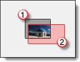
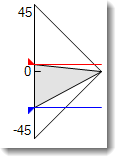
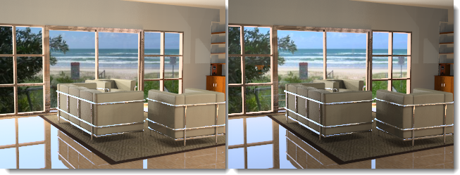

# {: .inline} {{page.title}}
Hay muchos tipos de [entornos en Rhino](http://docs.mcneel.com/rhino/5/help/es-es/commands/environmenteditor.htm). Este tema describe el tipo de Entorno de Flamingo.

El entorno repercute en la parte visible del fondo y los reflejos.  Para obtener más información sobre los efectos que afectan a la iluminación de la escena, consulte el tema [Cielo](sun-and-sky-tabs.html) de la Ayuda.

Flamingo viene con un entorno especial denominado **Entorno predeterminado de Flamingo**.  Este entorno se sincronizará con el actual [Preajuste de iluminación](lighting-tab.html). Al utilizar los [Preajustes de iluminación](lighting-tab.html), tanto la Iluminación como el entorno usarán las opciones predeterminadas de escena apropiadas.

El conjunto completo de grupos de propiedades del Entorno de Flamingo son:

  * [Nombre](#name)
  * [Entorno de Flamingo](#environment)
  * [Color de fondo](#color-backgrounds)
  * [Fondo avanzado](#advanced-background-reflected-sky)

## Nombre de entorno
{: #name}
Es el nombre del entorno del modelo de Rhino.  Los entornos se guardan en el modelo de Rhino. Eso significa un modelo con el mismo nombre en la librería no se verá afectado por los cambios en el entorno en el modelo actual. Para utilizar cualquier entorno en otro modelo, debe exportarse a la [Librería](libraries.html) primero. El nombre del entorno también servirá como nombre de archivo exportado.

## Entorno de Flamingo
{: #environment}
Hay tres efectos principales de entorno en un renderizado:

  1. Fondo visible
  1. [Fondo reflectante](#advanced-background-reflected-sky)
  1. [Fondo refractivo](#advanced-background-refracted-sky)

El Fondo es visible es el color de fondo básico de la escena.  El Fondo visible se encuentra en el panel de propiedades generales. Los fondos [Reflectante](#advanced-background-reflected-sky) y [Refractivo](#advanced-background-refracted-sky) pueden ser diferentes y se encuentran en la sección Fondo avanzado.

#### Intensidad
{: #background-intensity}
Modifica la luminosidad relativa del fondo. El valor de Intensidad se usa para multiplicar los colores del fondo y dan como resultado un valor de iluminación.  El rango de colores oscila entre el 0 y el 255 por canal. La intensidad multiplicará esos valores.  Esto es importante si el fondo se ve muy oscuro en comparación con el modelo renderizado.

#### Tipo de fondo
{: #background-type}
Especifica el esquema de color que rellenará el fondo de la imagen renderizada. Los fondos pueden ser de los siguientes tipos:

* [Cielo](#environment-sky)
* [Color sólido y gradiente](#color-backgrounds)
* [Imagen](#environment-image)
* [Imágenes HDR y HDR plano](#hdr-background)

## Fondo del cielo
{: #environment-sky}
El entorno de Cielo utiliza las opciones de sol y cielo de las fichas de [Iluminación](lighting-tab.html) para realizar la configuración.  Es la opción predeterminada de los renderizados incluyen el cielo.

*Cielo automático (izquierda) e imagen HDR y sol (derecha).*

## Color de fondo
{: #color-backgrounds}
Los controles del color de fondo siempre están presentes. Siempre hay un fondo de color, incluso si el color está completamente oculto por una imagen, HDRI o fondo de cielo.

#### Color sólido
{: #solid-color}
Un fondo de color sólido es un único color que rellena el fondo.

*Fondo de color sólido.*
Consulte los [Controles de color](#enviroment-sky-color-controls) para obtener más información sobre el Color sólido.

#### Gradiente de dos colores
{: #two-color-gradient}
Los fondos de gradiente de dos y tres colores solo se aplican a las vistas perspectivas. Los fondos gradientes de dos colores interpolan el color de fondo entre dos colores seleccionados.

*Fondo gradiente de dos colores: azul y amarillo.*
Consulte los [Controles de color](#enviroment-sky-color-controls) para obtener más información sobre cómo editar un gradiente de dos colores.

#### Gradiente de tres colores
{: #three-color-gradient}
Las opciones de fondo gradiente de tres colores interpolan el color de fondo entre tres colores seleccionados.

*Fondo con gradiente de tres colores: azul, blanco y amarillo.*
Consulte los [Controles de color](#enviroment-sky-color-controls) para obtener más información sobre cómo editar un gradiente de tres colores.

### Controles de color
{: #enviroment-sky-color-controls}
El número de controles disponibles puede cambiar según el tipo de color de fondo seleccionado. Los fondos gradientes tendrán hasta tres selectores de color que pueden incluir un color superior, medio e inferior.



#### Intercambiar colores
Utilice este botón para reorganizar el color en el gradiente desde la parte superior a la inferior.

#### Control de mapeado gradiente
{: #gradient-mapping}
Los colores de un fondo de color gradiente tienen que estar mapeados en la esfera del entorno. Para ello, utilice el mapeador de gradientes.  Los controles de mapeado gradiente se activarán solo cuando se seleccione un gradiente de dos o tres colores. Los gradientes solo se mapean en las vistas perspectivas.

#### Ángulos desde vista
{: #angle-from-views}
Si se activa la opción Ángulos de vista, el gradiente de color actual se sincroniza con la vista en perspectiva renderizada actual.  El color superior se mapeará en la parte superior de la vista y el color inferior se mapeará en la parte inferior de la vista.  Todos los demás colores se distribuirán uniformemente entre esos extremos.

#### Mapeador de altitud de vista
{: #colorrange}
Si la vista actual es una proyección en perspectiva, se pueden controlar los colores de la parte superior e inferior y la extensión del gradiente respecto a la vista.

{: style="float: left; padding-right: 25px;padding-bottom: 15px;padding-top:15px;"}

* El control muestra el entorno en la vista de sección.  El marcador de 90 grados es la coordenada Z-arriba. La coordenada 0 representa el plano de suelo horizontal. El marcador de 90 grados es la coordenada Z-abajo.
* El cono de visión gris muestra las últimas coordenadas de la vista perspectiva actual.
* La flecha roja representa la ubicación del color superior. En este ángulo y por encima se encuentra el color superior.
* La doble flecha de color verde representa la zona media de la mezcla gradiente entre los colores superior e inferior.  Si es un gradiente de tres colores, esta es también la ubicación del color del medio.
* La flecha azul representa la ubicación del color inferior.  Debajo de este ángulo se encuentra el color inferior.

####  Obtener ángulos desde vista
Utilice este botón para restablecer el control de mapeado gradiente a las coordenadas de la vista perspectiva actual.

#### Ángulos superior/medio/inferior
Son los ángulos de los colores Superior, Medio e Inferior de los gradientes actuales.  Se corresponden con la ubicación de las flechas Rojo, Verde y Azul del Mapeador de altitud de vista.

## Imagen de fondo
{: #environment-image}

Una imagen de fondo puede proyectarse sobre el fondo. Muchas veces se utiliza para colocar un modelo en un contexto existente o para definir una vista en algunas ventanas. Para la imagen se pueden utilizar fotografías, obras de arte escaneadas o imágenes creadas con software de dibujo. Para obtener mejores resultados, utilice imágenes de alta resolución para imágenes de fondo. También es una buena idea difuminar y reducir la definición de las imágenes para simular un enfoque natural y una perspectiva aérea. La imagen de fondo se puede mapear al fondo en una proyección plana, cilíndrica o esférica en la escena.

*Imagen plana establecida como fondo.*

### Archivo de imagen
{: #image-properties}
Defina la imagen de fondo haciendo clic en el botón *(vacío - haga clic aquí para asignar)* y, a continuación, seleccione un bitmap.  Para asignar una imagen diferente, haga clic en el botón de la imagen en miniatura.

### Proyección
{: #backgroud-image-projection}
Seleccione una de las tres proyecciones de imagen desde el control desplegable:

* [Plana](#planar)
* [Cilíndrica](#cylindrical)
* [Esférica](#spherical)

Cada método de proyección tiene sus propias opciones de configuración para posicionar la imagen.

### Proyección plana
{: #planar}
Proyecta la imagen en un fondo plano en la vista activa. Las coordenadas de proyección plana siempre son relativas a la vista actual.

#### Ángulo desde vista
La casilla Ángulo desde vista mantiene la imagen sincronizada con la vista activa.  La imagen se estirará para ajustarla a la vista activa.

#### Control de colocación de imagen
Utilice el control de colocación para colocar la imagen relativa a la vista activa. La forma de la vista se muestra como un rectángulo gris oscuro. Arrastre el rectángulo rosa o utilice los controles numéricos para mover o escalar la imagen de fondo relativa a la vista.

*Área de vista activa (1), tamaño de imagen y forma (2).*

#### Escala X / Escala Y
Especifica el tamaño de la imagen de fondo en la escala de 0-1.0 de la anchura y la altura de la vista. Por ejemplo, un valor 1.0 es el 100% del tamaño de la vista, un valor 0.5 es el 50% de la anchura de la vista, etc...

#### Desfase X / Desfase Y
Especifica el desfase de la imagen de fondo desde la esquina inferior izquierda de la vista en una escala de 0-1.0 de la anchura y la altura de la vista. Por ejemplo, un valor 0.25 es un 25% de desfase del tamaño de la vista, un valor 0.5 es un 50% de desfase de la anchura de la vista, etc...

#### Control de colocación de imagen
Utilice el control de colocación para colocar la imagen en relación con la vista activa. La forma de la vista se muestra como un rectángulo gris oscuro. Arrastre el rectángulo rosa o utilice los controles numéricos para mover o escalar la imagen de fondo relativa a la vista.

*Área de vista activa (1), tamaño de imagen y forma (2).*

<!-- TODO: The next two sections are repeated. Maybe they belong to the "Cylindrical Projection" below? -->

#### Escala X / Escala Y
Especifica el tamaño de la imagen de fondo en la escala de 0-1.0 de la anchura y la altura de la vista. Por ejemplo, un valor 1.0 es el 100% del tamaño de la vista, un valor 0.5 es el 50% de la anchura de la vista, etc...

#### Desfase X / Desfase Y
Especifica el desfase de la imagen de fondo desde la esquina inferior izquierda de la vista en una escala de 0-1.0 de la anchura y la altura de la vista. Por ejemplo, un valor 0.25 es un 25% de desfase del tamaño de la vista, un valor 0.5 es un 50% de desfase de la anchura de la vista, etc...

### Proyección cilíndrica
{: #cylindrical}
La proyección cilíndrica mapea la imagen en un cilindro imaginario que delimita el modelo. Aunque esta proyección funciona mejor en imágenes cilíndricas verdaderas, también se puede usar eficazmente con panoramas estándar creados a partir de fotografías.

Especifique el tamaño y la posición del mapa de imagen en ángulos de altura y anchura. Utilice las herramientas gráficas y el ratón para posicionar y ajustar el tamaño de la imagen. El cono de visión actual se muestra en el gráfico con una zona sombreada en gris claro.

#### Ángulo desde vista
La casilla Ángulo desde vista mantiene la imagen sincronizada con la vista activa.  La imagen se estirará para ajustarla a la vista activa.

#### Control de plano
Especifica la anchura angular del mapa de imagen. Introduzca un ángulo o arrastre las banderas del widget de control para definir la anchura. El área azul indica la extensión de la anchura angular.

{: .float-img-left}

* El control muestra el entorno en la vista en planta.
* El cono de visión oscuro muestra las últimas coordenadas en la vista perspectiva actual.
* El cono azul muestra el intervalo de ángulos en que la imagen estará visible.
* La flecha azul representa la coordenada izquierda del mapa de imagen.
* El punto rojo representa el centro de la imagen de fondo.
* La flecha morada representa la coordenada derecha del mapa de imagen.

#### Control vertical
{: .clear-img}
Especifica la extensión vertical de la proyección cilíndrica. Introduzca un ángulo o arrastre las banderas del widget de control para definir los ángulos superior e inferior. La proyección cilíndrica está limitada a 45 grados por encima o por debajo del horizonte.

{: .float-img-left}

* El control muestra el cilindro en la vista de sección.
* El cono de visión gris muestra las últimas coordenadas en la vista perspectiva actual.
* La flecha azul representa el borde inferior del mapa de imagen.
* La flecha roja representa el borde superior del mapa de imagen.

#### Rotación
{: .clear-img}
Especifica la rotación de la imagen. El punto rojo indica el centro del imagen.

#### Anchura
Especifica la anchura de la imagen en grados en relación con la vista en planta.

#### Superior/Inferior
Especifica los ángulos verticales de la imagen en base a la dirección horizontal del plano de suelo en el modelo.

####  Obtener ángulos desde vista
Define el ángulo de rotación para que coincida con la vista perspectiva actual.  Sirve para restablecer los valores de la proyección.

### Proyección esférica
{: #spherical}
La proyección esférica mapea la imagen en una esfera completa. Normalmente este método produce buenos resultados solo si se usa con una imagen esférica equirectangular.  Una imagen equirectangular tiene una relación de aspecto de un rectángulo 2:1.

#### Ángulo desde vista
La casilla Ángulo desde vista mantiene la imagen sincronizada con la vista activa.  La imagen se estirará para ajustarla a la vista activa.

#### Control esférico
Especifica la dirección del mapa de imagen. Introduzca un ángulo o arrastre la bandera del widget de control para definir la anchura. El punto rojo representa el centro de la imagen de fondo.

#### Rotación
{: .clear-img}
Especifica la rotación de la imagen. El punto rojo indica el centro del imagen.

####  Obtener ángulos desde vista
Define el ángulo de rotación para que coincida con la vista perspectiva actual.  Sirve para restablecer los valores de la proyección.

## Fondo HDRi
{: #hdr-background}
El uso de una imagen HDR como entorno permite más control de la relación entre la luz del fondo y otras luces de la imagen. Esta opción es especialmente útil para describir un espacio interior con un espacio exterior luminoso que se vea a través de una ventana. Una imagen de entorno HDR tiene más rango de claridad que una imagen bitmap normal y se le puede asignar un canal para poder gestionar el contraste entre el interior y el exterior en un renderizado de [varios canales](lights-tab.html#channel).

#### Archivo de imagen
{: #hdri-image}
Defina la imagen de fondo HDRI haciendo clic en el botón *(vacío - haga clic aquí para asignar)* y, a continuación, seleccione un bitmap.  Para asignar una imagen diferente, haga clic en el botón de la imagen en miniatura.






## Opciones de HDRI plano
{: #planar-hdr-options}

Las imágenes de alto rango dinámico planas se utilizan muy poco, pero pueden ser muy útiles.  Un HDRI ofrece una amplia gama de posibilidades de color. Un buen uso de los archivos HDRI planos es fuera de las ventanas en los renderizados arquitectónicos donde el fondo puede ser demasiado claro o demasiado oscuro.  Los archivos HDRI planos siempre son mapeados planos.

*La imagen de fondo (izquierda) y el HDR plano (derecha) muestran una sutil diferencia de iluminación en el fondo.*

#### Archivo de imagen
{: #hdri-planar-image}
Defina la imagen de fondo HDRI haciendo clic en el botón *(vacío - haga clic aquí para asignar)* y, a continuación, seleccione un bitmap.  Para asignar una imagen diferente, haga clic en el botón de la imagen en miniatura.



## Fondo avanzado
{: #advanced-background}
Las opciones de Fondo avanzado controlan los entornos que no están visibles en el renderizado, pero que se muestran en los reflejos y las refracciones de los objetos. Esto permite que el entorno visible se muestre en una dirección, mientras que los reflejos y las refracciones podrían reaccionar a un entorno diferente.  Por ejemplo, en la imagen el fondo es negro, pero el entorno reflejado es una imagen HDR del interior de un edificio.

*Entorno normal (izquierda) y entorno de cielo HDR reflejado (derecha).*

### Reflejado
{: #advanced-background-reflected-sky}
Un entorno reflejado no es visible en la imagen renderizada, pero se refleja en objetos con brillo.

#### Cielo
Los objetos reflejan el cielo, como se especifica en las opciones de [Iluminación: sol y cielo](sun-and-sky-tabs.html)

#### Personalizado
Los objetos reflejan un fondo de [Color o gradiente](#color-backgrounds), [Imagen](#environment-image) o [HDR](#hdr-background).

#### Fondo visible
Los objetos reflejan el fondo visible, como se especifica en las opciones de [Entorno](environment-tab.html).

### Refractado
{: #advanced-background-refracted-sky}

#### Cielo
Los objetos refractan el cielo, como se especifica en las opciones de [Iluminación: sol y cielo](sun-and-sky-tabs.html).

#### Personalizado
Los objetos refractan un fondo de [Color o gradiente](#color-and-gradient-backgrounds), [Imagen](#image) o [HDRI](#hdr-background).

#### Fondo visible
Los objetos refractan el fondo visible, como se especifica en las opciones de [Entorno](environment-tab.html).

#### Objetos alfa no transparentes
{: #no-transparent-alpha-objects}
Impide ver el canal alfa a través de los objetos transparentes y evita la composición de canal alfa a través de objetos transparentes.
Si las imágenes se van a pegar en el canal alfa, desactive esta opción.