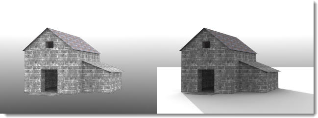
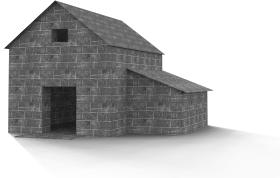

---
---

# Plano de suelo
{: #ground-plane}

El plano de suelo crea una plataforma horizontal infinita en la imagen que estira el horizonte en todas las direcciones y se posiciona en una elevación definida. El plano de suelo se renderiza más rápidamente que utilizando una superficie plana grande como base.

### Activado
{: #groundplane-enabled}
Activa el plano de suelo.

*Plano de suelo desactivado (izquierda) y activado (derecha).*

### Alfa
{: #groundplane-alpha}
Aplica un canal alfa transparente al plano de suelo para que la imagen pueda componerse con la sombra proyectada en otra imagen. Véase: [Artículo de Wikipedia: Composición alfa](http://es.wikipedia.org/wiki/Composición_alfa).

 *El plano de suelo muestra una sombra, pero es transparente en la imagen.*

### Elevación
{: #groundplane-elevation}
Especifica la altura del plano de suelo por encima de cero.

*Elevación de plano de suelo por encima de cero.*

### Material
{: #groundplane-material}
Asigna un [material](simple-material-properties.html) al plano de suelo.

*Plano de suelo con elevación y material de agua.*