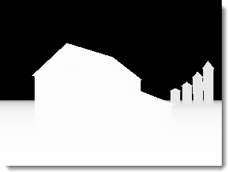
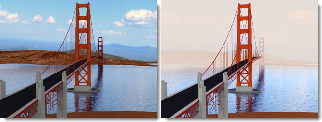

# {{page.title}}
El Editor de imágenes de nXt permite editar archivos de imagen nativos (.nXtImage) producidos por cualquiera de las plataformas de nXt. Estos archivos nativos conservan toda la información recopilada durante el renderizado.
Con el Editor de imágenes de nXt puede:

* Ajustar la configuración del [indicador de tono](image-editor.html#tone-mapping).
* Cambiar la intensidad de cualquier canal de iluminación.
* Agregar efectos especiales basados en la imagen: [Neblina](image-editor.html#haze), [Desenfoque de profundidad](image-editor.html#depth-blur) y [Resplandor](image-editor.html#glare).
* [Guardar](image-editor.html#save-tonemapped-image-as) una imagen de mapa de tonos en un formato de bitmap, como .jpg o .png.
* Guardar la información de luminancia en [formato HDR](image-editor.html#save-hdr-image-as).
* Ver y guardar canales de máscara adicionales ([alfa](image-editor.html#alpha-channel), [distancia](image-editor.html#distance-channel), [material](image-editor.html#material-channel) para usar en la composición avanzada.
* Guardar en formato de archivo de  [Piranesi©](http://www.piranesi.co.uk/) (*.epx), que puede utilizarse para crear renderizados no fotorrealistas.
* Utilizar la [aritmética](image-editor.html#arithmetic) de imagen para tareas como la unión de una imagen generada por distintos nodos en el Render Farm.
* Guardar la [configuración de iluminación](image-editor.html#save-lighting-settings-as) utilizada para generar este renderizado. Esta configuración de iluminación puede utilizarse posteriormente para generar más renderizados.

Para ejecutar el editor

> En el menú **Flamingo nXt 5.0**, haga clic en **Más herramientas > Editor de imágenes de Flamingo nXt**.

## Menú Archivo
{: #file-menu}

### Abrir
Abre un archivo guardado en formato nXtImage para su edición.

### Guardar imagen original
Guarda el archivo nXtImage.

### Guardar imagen original como
Guarda el archivo nXtImage con otro nombre.

### Guardar imagen de mapa de tonos como
{: #save-tonemapped-image-as}
Guarda la imagen editada como archivo de imagen bitmap.

 * JPEG (*.jpg)
 * TIFF (.tif)
 * TIFF con canal alfa (.tif)
 * PNG (*.png)
 * PNG con canal alfa (.png)
 * [Archivo EPix de Piranesi (.epx)](http://www.piranesi.co.uk/)

Piranesi es una herramienta de dibujo 3D que crea imágenes con un aspecto pintado a mano.

### Guardar imagen HDR como
{: #save-hdr-image-as}

 * Archivo HDR (.hdr)
 * Archivo EXR (.exr)
 * EXR con canal alfa (.exr)

### Guardar máscara
{: #save-mask}
Los archivos nXtImage contienen tres canales adicionales que pueden utilizarse como máscaras para la composición avanzada en la mayoría de editores de bitmaps. Estos canales llevan información de alfa, distancia y material de cada píxel, codificada en una imagen en escala de grises. Cada canal se puede ver y guardar en un archivo .png.

##### Notas:

 1. El canal alfa puede incluirse con una imagen de mapa de tonos seleccionando un formato de archivo con alfa al guardar una imagen de mapa de tonos.
 1. Los canales de distancia y materiales no están suavizados y pueden mostrar algunos artefactos de bordes duros. Agregar una pequeña cantidad de desenfoque gaussiano a una máscara antes de usarla puede ayudar a suavizar estos bordes.
 1. El canal de materiales solo codificará únicamente 255 materiales diferentes. Si el modelo contiene más materiales, algunos colores de máscara se repetirán.

#### Canal de materiales
{: #material-channel}
Guarda la máscara del canal de material.

#### Canal alfa
{: #alpha-channel}
Guarda la máscara del canal alfa.

#### Canal de distancia
{: #distance-channel}
Guarda la máscara del canal de distancia.

### Guardar configuración de iluminación como
{: #save-lighting-settings-as}
Guarda el [esquema de iluminación](lighting-tab.html#open-lighting-scheme).

## Menú Imagen
{: #renderwindowimage}

### Info
{: #info}
Muestra información sobre la imagen.

### Aritméticos
{: #arithmetic}
Permite juntar o superponer segmentos de imágenes renderizadas utilizando la función [Una imagen de Render Farm](automate-rendering.html#single-images).

##### Para juntar segmentos de imagen:

 1. El el menú **Archivo**, haga clic en **Abrir**.
 1. Seleccione la primera imagen de la secuencia, por ejemplo, 000000.nXtImage.
 1. En el menú **Imagen**, haga clic en **Aritmético** y luego en **Agregar**.
 1. Seleccione todas las demás imágenes de la secuencia.

**Nota:** No vuelva a seleccionar la primera imagen (000000.nXtImage) o se agregará dos veces.

#### Añadir
Suma los valores de píxel de una capa en los de otra. Cuando los valores son superiores a 255 (en el caso de RGB), se muestra el color blanco.

#### Restar
Resta los valores de píxel de una capa de los de otra. Cuando los valores son negativos, se muestra el color negro.

#### Diferencia
Resta la capa superior de la capa inferior o viceversa para obtener siempre un valor positivo. La mezcla con negro no produce cambios, ya que los valores de todos los colores son de 0. La mezcla con blanco invierte la imagen.

#### Agregar máscara
Tiene en máscara de canal alfa transparente al realizar la mezcla.

#### Combinar trazados de trayectoria
Combina imágenes renderizadas utilizando el motor de Path Tracer para que, por ejemplo, combinando 10 imágenes con 20 pases cada una se obtenga el equivalente de una imagen renderizada con 200 pases.

*Renderizado con 20 pases (izquierda), 200 imágenes de 10 pases combinadas para crear una imagen de 200 pases (derecha).*

### Aplicar parche
{: #apply-patch}
Inserta una imagen renderizada como parte seleccionada en la imagen renderizada

### Animación
Se puede animar cambiando la información de la imagen.

##### Para animar efectos de imagen

 1. Configure la primera imagen. Haga clic en el botón del signo **Más (+)** junto al cuadro de edición de **Fotograma**.
 1. Edite la imagen y agregue fotogramas.
 1. Haga clic en **Imagen > Animación** y, en el cuadro de diálogo, haga clic en **Vista previa**.
 1. Si todo está bien, haga clic en **Animar**.

### Cree una carpeta.
Se creará una secuencia de imágenes que puede utilizarse para crear una animación utilizando el software diseñado para este fin.

## Menú Vista
{: #view-menu}
Especifica qué se mostrará en la imagen.

### Imagen
Muestra la imagen renderizada original.

### Imagen y máscara alfa
Muestra la imagen y la máscara de canal alfa conjuntamente.

### Máscara de material
Muestra la [máscara de material](image-editor.html#material-channel).

### Máscara de distancia
Muestra la [máscara de distancia](image-editor.html#distance-channel).

## Uso del Editor de imágenes

##### Cargar una imagen

 1.  [Guarde](render-window.html#export-to-nxtimage) los resultados del renderizado con el formato **.nXtImage**.
 1. En el menú **Flamingo nXt**, haga clic en **Utilidades > Editor de imágenes de Flamingo nXt**.
 1. En Editor de imágenes de nXt, en menú Archivo, haga clic en **Abrir** para cargar la imagen en el editor.

## Mapeo de tonos
{: #tone-mapping}
El mapeo de tonos es el proceso de convertir los datos de luminancia utilizados por Flamingo nXt en píxeles RGB que se pueden visualizar o imprimir.

#### Brillo
{: #brightness}
Véase [Ventana de renderizado: Brillo](render-window.html#brightness).


#### Sobreexposición
Véase [Ventana de renderizado: Sobreexposición](render-window.html#burn).

#### Saturación
Véase [Ventana de renderizado: Saturación](render-window.html#saturation).

#### Histograma
Véase [Ventana de renderizado: Histograma](render-window.html#histogram).

## Campos de estado
Los campos de estado están situados en la parte inferior de la pantalla. Al mover el cursor sobre la imagen, estos campos muestran información sobre cada píxel.

#### Píxel
{: #pixel}
Coordenada del píxel, calculada desde la esquina inferior izquierda.

#### Color
{: #color}
Los tres primeros campos muestran los colores RGB que se muestran en la imagen después del mapeo de tonos. El cuarto campo muestra el canal alfa (transparencia), que se utiliza para la composición.

#### Valor
{: #value}
Valor de luminancia de cada uno de los subcanales de rojo, verde y azul.

#### Lum
{: #lum}
Promedio ponderado de los valores de luminancia almacenados en cada píxel.

#### Profundidad
{: #depth}
Distancia de cada píxel desde el visor en metros. Los valores negativos indican un píxel del fondo.

#### Material
{: #material}
Nombre del material usado para renderizar el píxel.

## Configuración de efectos
Se pueden agregar efectos especiales a una imagen.  Muchos de estos efectos usan la información extra que guarda el formato de imagen de nXt.  Por ejemplo, el resplandor utiliza el espacio de luminancia trabajando con valores de iluminación reales y la neblina utiliza la distancia en la imagen.

### Neblina
{: #haze}
Añade color a los píxeles más alejados de la cámara. Este efecto se puede utilizar para añadir un efecto de neblina o niebla a una escena o para enmascarar un fondo con color o cambiar el color del fondo.

*Imagen original (izquierda) y con desenfoque de profundidad (derecha).*

#### Intensidad
Especifica la intensidad del color de la neblina.

#### Cerca
Distancia desde la cámara donde la neblina empezará a añadir color a cada píxel.

#### Designar
Designe un punto en la imagen para especificar la distancia.

#### Lejos
Distancia a la que el efecto de neblina se encuentra en su nivel máximo. Todos los píxeles más allá de este punto tendrán el efecto máximo de neblina.
Los píxeles entre cerca y lejos tendrán una neblina lineal desde los píxeles cercanos hasta los más lejanos.

#### Designar
Designe un punto en la imagen para especificar la distancia.

#### Color
Color de la neblina.

#### Designar
Designe un punto en la imagen para especificar el color.

### Desenfoque de profundidad
{: #depth-blur}
Puesto que cada píxel de la imagen contiene un valor de distancia, este puede utilizarse para desenfocar la imagen entre las distancias especificadas.

*Imagen original (izquierda) y con desenfoque de profundidad (derecha).*

#### Intensidad
Especifica la cantidad de desenfoque.

#### Foco
{: #depthblurfocus}
Especifica una distancia en la imagen que estará enfocada.

#### Designar
Designe un punto en la imagen para especificar la distancia focal.

#### Zona enfocada
{: #in-focus-zone}
Es la distancia alrededor del punto de profundidad de campo en el que los objetos estarán **enfocados**. Este valor es en metros. Todos los píxeles dentro de esta distancia se verán nítidos y serán ignorados por el  de desenfoque. Los píxeles más allá de esta distancia se desenfocarán progresivamente con los píxeles adyacentes para generar la ilusión de profundidad de campo.

#### Difuminado
Controla la dirección en la que se aplicará el filtro de desenfoque. El valor predeterminado es **Fondo**. Esto significa que todos los píxeles más lejos de la cámara que la **Zona enfocada** se desenfocarán progresivamente.

*Desenfoque de primer plano (izquierda) y de fondo (derecha).*

#### Fondo
Desenfoca los píxeles más lejos de la cámara que el intervalo de la **Zona enfocada**.

#### Primer plano
Desenfoca los píxeles más cerca de la cámara que el intervalo de la **Zona enfocada**.

#### Ambos
Desenfoca los píxeles por delante y por detrás del intervalo de la **Zona enfocada**. Es una manera rápida de conseguir un  de profundidad de campo. No es tan precisa como utilizar la [Profundidad de campo](render-tab.html#depthoffieldoption) integrada antes del renderizado.

### Resplandor
{: #glare}
El resplandor afecta a los píxeles que son más brillantes que el umbral en lúmenes creando de un efecto de halo en los píxeles adyacentes. Solo se verán afectados los píxeles más brillantes de la imagen.
Mantenga el cursor sobre los píxeles para ver el resplandor y lea los lúmenes totales de ese píxel.

*Imagen original (izquierda) y con resplandor (derecha).*

#### Intensidad
Ajusta la cantidad de halo que afecta a los píxeles adyacentes.

#### Umbral
Límite inferior del valor afectado por el filtro de resplandor. Se verán afectados todos píxeles más brillantes que este valor.

#### Designar
Designe un punto en la imagen para especificar el valor de brillo.

### Viñeta
{: #vignette}
Desenfoca y mezcla los colores en los bordes de la imagen para crear un efecto de halo.

*Imagen original (izquierda) y con viñeta (derecha).*