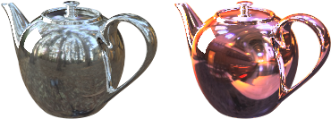

---
---

# {:height="75px" width="75px"} Lighting Presets
La iluminación es el factor más importante y más descuidado en la creación de imágenes. No se trata solamente de un modo de iluminar el modelo. La iluminación determina el ambiente y es un factor clave para definir la composición.

*Imagen de Christopher Soto Gutiérrez.*

#### ¿Dónde se encuentra el control de iluminación de Flamingo?

* Menús > Flamingo nXt 5.0 > Mostrar panel de control > Editor de entornos.
* Haga clic con el botón derecho en cualquier ficha y seleccione Flamingo nXt.

Utilice las siguientes indicaciones para la iluminación de su modelo:

* Empiece con un preajuste de iluminación.
* Puesto que Flamingo nXt simula iluminación real, ofrezca información precisa siempre que sea posible.
* Evite el uso de niveles de intensidad no realistas en las fuentes de luz.
* Defina las unidades correctamente en su modelo. La iluminación no será correcta si las unidades no son correctas. Por ejemplo, si el modelo está en milímetros, defina las unidades del modelo a milímetros.
* Ajuste el brillo general del renderizado utilizando el control de [Brillo](render-window.html#brightness) en la visualización del renderizado. No intente ajustar el brillo general de la escena cambiando la intensidad de todas las fuentes de luz; el ajuste de [exposición](render-window.html#brightness) anula esta opción.

Para mejorar las técnicas de iluminación, tenga en cuenta cómo repercute la luz en varias superficies. Los materiales pueden enmascarar algunos de los efectos de sombras y reflejos, por lo que algunos expertos en renderizado aplican la iluminación a sus modelos antes de aplicar los materiales. Intente ver la luz objetivamente, como lo hace una cámara.

## Preajustes de iluminación
{: #lighting-presets}
Un buen punto de partida para la iluminación son los preajustes de iluminación incluidos que corresponden a situaciones de iluminación reales. Flamingo nXt incluye preajustes de iluminación que pueden ayudarle a empezar con la iluminación de su modelo. Hay muchas más opciones de iluminación disponibles, pero los preajustes suelen bastar en muchas situaciones diferentes de renderizado. Elija el preajuste que más se asemeje a la escena.

La iluminación en Flamingo nXt utiliza cuatro categorías de métodos predefinidos:

> [Iluminación de estudio](lighting-tab.html#studio-lighting)
> [Luz diurna exterior](lighting-tab.html#exterior-daylight)
> [Luz diurna interior](lighting-tab.html#interior-daylight)
> [Iluminación artificial](lighting-tab.html#artificial-lighting)

### Iluminación de estudio
{: #studio-lighting}
Este esquema simula la iluminación de un estudio fotográfico. Es muy útil para renderizar objetos pequeños y medianos de forma aislada.  También se puede utilizar para cualquier escena que esté bien iluminada a través de un entorno HDRI.

{: .float-img-left} Un archivo de imagen de alto rango dinámico (HDR) proporciona la iluminación principal. La luz de la imagen HDR se parece a los niveles de iluminación interior del estudio. Las opciones de HDR se encuentran en la ficha [Cielo](sun-and-sky-tabs.html#sky). También puede agregar luces artificiales a la escena mediante la ficha Luces. El fondo visible en el preajuste Estudio es de color negro.

La iluminación de estudio está optimizada para la exposición de artículos pequeños, tales como diseños de joyas y de productos. En el esquema del preajuste, el sol está desactivado y un cielo de una imagen HDR permite el reflejo en los objetos brillantes.

Para obtener mayor control, utilice fuentes de luz para iluminar la escena. Al iluminar una configuración de estudio, es importante una iluminación portentosa. Se puede crear una iluminación portentosa agregando mucho contraste. Las áreas oscuras son tan importantes como las áreas claras. Este tipo de iluminación requiere varias fuentes de luz ubicadas de una manera que produzcan unas áreas muy claras y otras muy oscuras.

Las técnicas de iluminación para fotografía generalmente son las mismas que para renderizado. Una buena manera de aprender es con uno de los muchos libros que tratan el tema de iluminación fotográfica. Para obtener más información sobre la configuración de iluminación de estudio, consulte [Información básica sobre iluminación de estudio](../guides/studio-lighting-basics.html).

### Luz diurna exterior
{: #exterior-daylight .clear-img}
Este esquema simula luz diurna en exteriores de arquitectura que utilizan el sol y el cielo natural.

{: .float-img-right} Especifique las opciones en las fichas [Sol](sun-and-sky-tabs.html#sun) y [Cielo](sun-and-sky-tabs.html#sky). Defina directamente los [ángulos del sol](sun-and-sky-tabs.html#set-azimuth-and-altitude) o utilice una [ubicación geográfica](sun-and-sky-tabs.html#set-location-on-earth), la fecha y la hora. El fondo visible de manera predeterminada en este preajuste es el cielo simulado.

La iluminación de un exterior de edificio es el modelo de iluminación más sencillo. La mayoría de iluminaciones exteriores sólo necesitarán la fuente de luz del [sol](sun-and-sky-tabs.html#sun) predeterminada.

Cuando el [sol](sun-and-sky-tabs.html#sun) está activado, la escena debe designarse como [interior](#interior) o [exterior](#exterior). Esto se debe a que la contribución de la luz del cielo, la luz reflejada desde el suelo y la luz que se refleja desde otras superficies es muy diferente en el interior que en el exterior. Usar los ajustes correctos en [Interior/Exterior](#indirect) da como resultado una iluminación muy efectiva y realista.

Algunas veces es fácil determinar si una escena es interior o exterior. Si el punto de vista está fuera de un edificio, es una escena exterior. Si el punto de vista está en una habitación o sala, es interior. Algunos tipos de escena no son tan claros. Por ejemplo, patios, miradores, vistas descompuestas y secciones. Si un patio es mucho más ancho que alto, consecuentemente recibe mucha luz del cielo; intente iluminarlo como si se tratara de una escena exterior. Si es más alto que ancho, intente iluminar la escena si se tratara de una escena interior. En este caso, uno de los trucos es añadir entradas de luz diurna encima del patio como ayuda directa para que la luz del cielo entre en escena.

Las luces también pueden simular iluminación en paisajismo. Utilice focos para realzar características arquitectónicas y árboles. Este procedimiento es adecuado para escenas nocturnas o a media luz. Durante el día, el sol normalmente se sobrepondrá a cualquier iluminación artificial en una escena exterior, tal y como pasa en la vida real.

Las vistas de composición, las secciones y los dibujos axonométricos desde arriba también suponen un reto especial. La decisión depende de los resultados deseados. Para una escena exterior con el renderizado más rápido, utilice el método de renderizado exterior. Si ese método no produce una imagen lo suficientemente interesante, intente usar un renderizado interior. Esto podría hacer el interior más interesante, pero tarda más tiempo en definir la iluminación.

### Luz diurna interior
{: #interior-daylight .clear-img}
Este esquema simula un interior iluminado con luz natural.

{: .float-img-left} Está formado por dos componentes: luz solar directa transmitida por el [Sol](sun-and-sky-tabs.html#sun) y luz solar indirecta transmitida por el [Cielo](sun-and-sky-tabs.html#sky), el suelo y otros objetos exteriores.

Las opciones de [Sol](sun-and-sky-tabs.html#sun) y [Cielo](sun-and-sky-tabs.html#sky) son similares al preajuste de [Exterior](lighting-tab.html#exterior-daylight).
El componente de luz solar directa de la iluminación diurna requiere un cálculo simple; normalmente sólo tiene que activar el sol, configurar la hora y la fecha y definir la posición para asegurar precisión.

Notas sobre los renderizados de interior:
{: .clear-img}

* Utilizar valores precisos para las [luces](lights-tab.html) y las [opciones de cielo](sun-and-sky-tabs.html#sky), y materiales de vidrio en las ventanas, si es posible.
* Debido a que el sol y el cielo son mucho más luminosos que otras luces, puede que no aprecie demasiado el efecto de agregar iluminación artificial cuando el sol esté activado. Es normal. Evite aumentar artificialmente la potencia de las fuentes de luz.
* Puede definir la intensidad del [Sol(sun-and-sky-tabs.html#sun-intensity) o el [Cielo(sun-and-sky-tabs.html#sky-intensity) a un valor más bajo. Puesto que estas opciones simulan un cielo claro, al reducir la intensidad se simulan condiciones de luz diurna más oscuras o nubosas.
* Un renderizado de [varios canales](lights-tab.html#channel) puede ayudarle a obtener la escena que desee, sin dejar de mantener los datos exactos.

### Iluminación artificial
{: #artificial-lighting}
{: style="float: right; padding-left: 25px;"} Este esquema ofrece una simulación de un interior de arquitectura nocturno, iluminado por lámparas. Utilice la ficha [Luces](lights-tab.html) o los [comandos de iluminación de Rhino](lights-tab.html#rhino-light-commands) para insertar y administrar los objetos de luz en el modelo.

La iluminación indirecta, la luz reflejada por las superficies, está activada cuando se selecciona uno de los dos preajustes de iluminación interior y está desactivada para la iluminación de estudio y de exterior. Este tipo de iluminación es un componente importante en una simulación de interior. Para exteriores y modelos de estudio, los efectos de la iluminación indirecta son más sutiles y, por tanto, están desactivados de manera predeterminada.

### Iluminación personalizada
{: #custom  style="clear:both;"}
La ficha Personalizada sirve para mezclar e igualar partes de los preajustes de iluminación.  Por ejemplo, si la escena es Luz diurna exterior, pero se ha añadido un entorno HDRI, utilice la ficha Personalizada para activar y desactivar partes del modelo de iluminación.  Cuando se cambian los valores predeterminados por los preajustes, el sistema se convierte en un esquema personalizado.

####  [Sol](sun-and-sky-tabs.html#sun)
{: #sun}
Activa y desactiva la ficha Sol en el menú desplegable. La ficha [Sol](sun-and-sky-tabs.html#sun) contiene los controles para modificar los parámetros del cielo automático.

*Sol activado y desactivado.*
El sol es una fuente de luz direccional muy luminosa que está infinitamente lejos del modelo. Los controles del sol especifican su dirección utilizando coordenadas esféricas. Para obtener más información, consulte el tema de la ficha [Sol](sun-and-sky-tabs.html#sun).

####  [Cielo](sun-and-sky-tabs.html#sky)
{: #sky}
Para el canal de Cielo, seleccione una de estas cuatro opciones:

> Auto
> HDRI
> Color
> Imagen

Las opciones de HDR se encuentran en la ficha [Cielo](sun-and-sky-tabs.html#sky).
Define una fuente de luz hemisférica que está infinitamente lejos del modelo.

#### Desactivar
{: #off}
Desactiva el cielo.

#### Auto
{: #auto}
Ofrece un modelo analítico basado en condiciones de cielo en tiempo real. La configuración de la ficha [Sol](sun-and-sky-tabs.html) controla la apariencia y las características de la luz del cielo.

#### HDRI
{: #hdri}
Una imagen HDR permite que los objetos puedan reflejarse.

#### Color
{: #color}
Define el cielo a un color sólido o a un gradiente de dos o tres colores utilizando controles similares a [Entorno: Fondos de color y gradientes](environment-tab.html#color-and-gradient-backgrounds).

#### Imagen
{: #image}
Utiliza una imagen de fondo con una proyección plana, cilíndrica o esférica similar a [Entorno: Imagen](environment-tab.html#image).

### Brillo de estudio
{: #studio-brightness}
Reduce el brillo del [sol](sun-and-sky-tabs.html) y el cielo simulando los niveles de iluminación interior de un estudio fotográfico.

*Brillo de estudio desactivado (izquierda) y activado (derecha).*

### Luces
{: #lights}
Activa y desactiva las luces artificiales.

*Luces activadas (izquierda) y desactivadas (derecha).*

### Indirecta
{: #indirect}
Define la iluminación reflejada de las superficies. De manera predeterminada, está activada para la iluminación interior y desactivada para los esquemas predefinidos de iluminación exterior y de estudio. Se puede activar la iluminación indirecta para renderizados exteriores.

#### Método
Define el método de cálculo para la iluminación indirecta.

#### Desactivar
Desactiva el cálculo de iluminación indirecta.

#### Interior
{: #interior}
Optimiza la iluminación indirecta para escenas de interior.

#### Exterior
{: #exterior}
Optimiza la iluminación indirecta para escenas de interior.

La iluminación indirecta reflejada desde otras superficies puede agregar sutileza y realismo al renderizado exterior. En particular, las caras inferiores de partes salientes, como aleros o balcones, se renderizan con más precisión cuando se utiliza la con iluminación indirecta.

#### Rebotes
{: #bounces}
Especifica el número de reflejos causados por una luz indirecta.

### Ambiente
{: #ambient}
La luz ambiental es una luz constante que se añade al renderizado. Estas opciones controlan intensidad de la luz ambiental como porcentaje de la luz ambiental total estimada de la escena.
La disminución de la cantidad de luz ambiental produce generalmente imágenes con más contraste. Demasiada luz ambiental puede hacer que una imagen renderizada parezca poco interesante; demasiada poca luz puede causar un contraste excesivo.

#### Ninguna
Sin luz ambiental.

#### Exterior
Optimiza la luz ambiental para escenas exteriores.

#### Interior
Optimiza la luz ambiental en escenas interiores.

#### Estudio
Optimiza la luz ambiental en escenas de estudio.

## Guardar iluminación personalizada

### Guardar esquema de iluminación
{: #save-lighting-scheme}
 Guarda el esquema de iluminación actual.

### Abrir esquema de iluminación
{: #open-lighting-scheme}
 Abre un esquema de iluminación guardado.